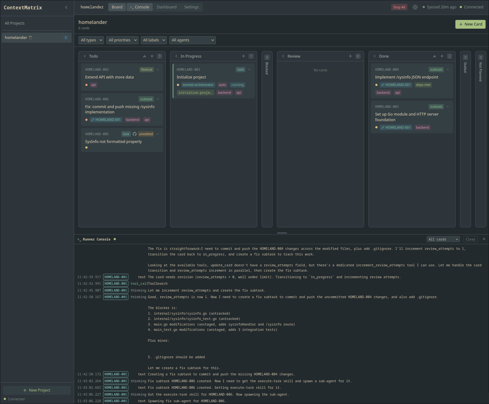
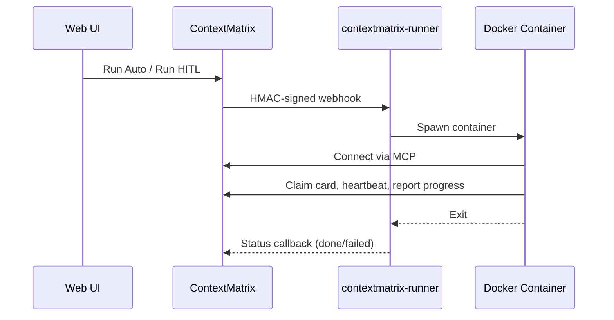

# ContextMatrix

Kanban-style task coordination for AI agents and humans. Cards are markdown
files with YAML frontmatter, stored in a git repository. Every mutation is
auto-committed, giving you a full audit trail.

ContextMatrix is a coordination layer — it tracks tasks but never touches your
project code repositories. Claude Code agents claim tasks, execute them in their
own repos, and report progress back through the board.



## Features

- **Kanban web UI** — drag-and-drop columns, real-time SSE updates, collapsible
  columns and cards, filter bar, and an Everforest dark/light theme.
- **Markdown-native cards** — plain files with YAML frontmatter, human-readable
  and diffable. No database required.
- **Git audit trail** — every card mutation is auto-committed. Optional deferred
  batching groups an agent's entire work session into a single commit.
- **AI agent coordination** — exclusive card claims, heartbeat monitoring,
  automatic stall detection, and dependency enforcement keep parallel agents
  from stepping on each other.
- **MCP-first interface** — 24 MCP tools and 7 slash commands give Claude Code
  agents structured access to the board.
- **Autonomous execution** — cards marked `autonomous: true` run the full
  plan-execute-document-review lifecycle without human gates. The `simple` label
  triggers a fast path that skips planning and review entirely.
- **Remote execution + HITL** — the **Autonomous mode** checkbox controls the
  execution mode. Click **"Run Auto"** to launch a fully autonomous run in a
  sandboxed Docker container, or uncheck the checkbox and click **"Run HITL"**
  for a Human-in-the-Loop session: chat with the agent in real time via a
  per-card chat pane, then promote to fully autonomous with a single button.
- **GitHub issue import** — periodically fetches open issues from GitHub and
  creates cards automatically. Imported cards show a GitHub icon badge and
  trigger a toast notification in the web UI.
- **Cost tracking** — per-model token usage reporting with USD cost estimates,
  broken down by agent and card on the dashboard.
- **Customizable workflow** — define your own states, types, priorities, and
  transition rules per project via `.board.yaml`.
- **Single binary** — the React frontend is embedded via Go's `embed.FS`. Build
  once, deploy anywhere.

## Quick Start

```bash
# Build (requires Go 1.26+ and Node.js 18+)
make install-frontend
make build

# Install config and skills into ~/.config/contextmatrix/
make install-config

# Initialize a boards repo (a separate git repo for task data)
mkdir -p ~/boards/contextmatrix
cd ~/boards/contextmatrix && git init

# Edit boards.dir in ~/.config/contextmatrix/config.yaml, then run
./contextmatrix
```

Open `http://localhost:8080` for the web UI.

## Web UI

- **Board view** — drag-and-drop kanban columns per project, with card detail
  panel. Columns can be collapsed to a narrow vertical strip by clicking the
  left-arrow button in the column header. Individual cards can be collapsed to a
  single header row (ID, type badge, and truncated title) using the chevron
  button on each card. Both collapsed column and collapsed card sets are
  persisted per-project in `localStorage`.
- **Dashboard** — per-project or all state counts, active agents, and token cost
  breakdown
- **Theme toggle** — sun/moon icon in the header switches between Everforest
  dark and light palettes. The preference is persisted in `localStorage` and
  defaults to your system's `prefers-color-scheme` setting if no preference is
  stored.

## Creating a Board

Each project lives in a subdirectory of the boards repo with a `.board.yaml`.
You can create projects via the `/contextmatrix:init-project` slash command in
Claude Code, the API (`POST /api/projects`), or manually:

```bash
mkdir -p ~/boards/contextmatrix/my-project/tasks
mkdir -p ~/boards/contextmatrix/my-project/templates
```

```yaml
# ~/boards/contextmatrix/my-project/.board.yaml
name: my-project
prefix: MYPROJ
next_id: 1
repo: git@github.com:org/my-project.git
states: [todo, in_progress, blocked, review, done, stalled, not_planned]
types: [task, bug, feature]
priorities: [low, medium, high, critical]
transitions:
  todo: [in_progress, not_planned]
  in_progress: [blocked, review, todo]
  blocked: [in_progress, todo]
  review: [done, in_progress]
  done: [todo]
  stalled: [todo, in_progress]
  not_planned: [todo]
```

Optionally add templates in `templates/task.md`, `templates/bug.md`, etc.
Templates are plain markdown (no YAML frontmatter). The filename (without `.md`)
must match the card type exactly. Each template is scoped to its type:

- When creating a card, the body editor is pre-filled with the template for the
  selected type (if one exists).
- Changing the type in the "Create Card" form loads the new type's template
  automatically, as long as the user has not yet edited the body.
- If the new type has no template and the body is unedited, the editor clears.
- If the user has already typed in the body, changing types never overwrites
  their content. Switching to a type that has a template prompts for
  confirmation before replacing the body.
- Templates are returned to agents via `get_task_context`.

```markdown
<!-- templates/task.md -->

## Objective

<!-- What this task should accomplish -->

## Acceptance Criteria

- [ ] ...

## Notes

<!-- Implementation hints, links, constraints -->
```

## Installation

The install script copies the configuration template and agent skill files into
your user config directory.

```bash
# Fresh install: create config dir, copy config.yaml from template, copy skills/
make install-config
# or equivalently:
scripts/install.sh

# Only update the skills/ directory — config.yaml is not touched
scripts/install.sh --update-skills

# Overwrite config.yaml even if it already exists (re-install)
scripts/install.sh --force
```

**Config directory** is resolved via the XDG Base Directory spec:

- `$XDG_CONFIG_HOME/contextmatrix` — if `XDG_CONFIG_HOME` is set
- `~/.config/contextmatrix` — otherwise

**What gets installed:**

- `config.yaml` — copied from `config.yaml.example` (skipped if it already
  exists, unless `--force`)
- `skills/` — the agent skill files from the repo's `skills/` directory (always
  refreshed)

After a fresh install, edit `boards.dir` in
`~/.config/contextmatrix/config.yaml` before starting the server. The
`skills_dir` defaults to the `skills/` directory next to the config file, so no
manual path update is needed.

## MCP Integration

ContextMatrix exposes an MCP server on `POST /mcp` (Streamable HTTP transport).
Connect Claude Code by adding this to your MCP config (`~/claude.json` or
project `.claude/claude.json`):

```json
{
  "mcpServers": {
    "contextmatrix": {
      "type": "http",
      "url": "http://localhost:8080/mcp"
    }
  }
}
```

### MCP Tools

| Tool                        | Description                                                 |
| --------------------------- | ----------------------------------------------------------- |
| `add_log`                   | Append an activity log entry                                |
| `check_agent_health`        | Check health of subtask agents for a parent card            |
| `claim_card`                | Claim exclusive ownership of a card                         |
| `complete_task`             | Atomically log + transition to done + release               |
| `create_card`               | Create a card (returns generated ID)                        |
| `create_project`            | Create a new project board                                  |
| `delete_project`            | Delete a project (must have zero cards)                     |
| `get_card`                  | Get a single card                                           |
| `get_ready_tasks`           | Get unclaimed todo cards with all dependencies met          |
| `get_skill`                 | Get a skill prompt with injected card/project context       |
| `get_subtask_summary`       | Get subtask counts by state for a parent card               |
| `get_task_context`          | Get card + parent + siblings + project config in one call   |
| `heartbeat`                 | Update heartbeat timestamp (prevents stalling)              |
| `increment_review_attempts` | Increment the review attempt counter on a card              |
| `list_cards`                | List cards with filters (state, type, label, agent, parent) |
| `list_projects`             | List all projects with configs                              |
| `recalculate_costs`         | Recalculate token costs for cards with missing cost data    |
| `release_card`              | Release a claim                                             |
| `report_push`               | Report a git push for a card                                |
| `report_usage`              | Report token usage and estimated cost                       |
| `transition_card`           | Change card state (validated against state machine)         |
| `update_card`               | Update card fields                                          |
| `update_project`            | Update project configuration                                |

### Slash Commands

Skill files in `skills/` are served as MCP prompts, available as Claude Code
slash commands:

| Command                         | Argument      | Description                               |
| ------------------------------- | ------------- | ----------------------------------------- |
| `/contextmatrix:create-task`    | `description` | Guided task creation with human interview |
| `/contextmatrix:create-plan`    | `card_id`     | Break a task into executable subtasks     |
| `/contextmatrix:execute-task`   | `card_id`     | Claim and execute a task (for sub-agents) |
| `/contextmatrix:review-task`    | `card_id`     | Devils-advocate review of completed work  |
| `/contextmatrix:document-task`  | `card_id`     | Write external documentation for a task   |
| `/contextmatrix:init-project`   | `name`        | Initialize a new project board            |
| `/contextmatrix:run-autonomous` | `card_id`     | Run full autonomous lifecycle for a card  |

## Agent Workflow

Claude Code acts as the main orchestrator, spawning sub-agents via the `Agent`
tool. The typical workflow:

1. **Create** — `/contextmatrix:create-task` interviews the human and creates a
   card
2. **Plan** — `/contextmatrix:create-plan` breaks it into subtasks with
   dependencies
3. **Execute** — `/contextmatrix:execute-task` runs in parallel sub-agents,
   each:
   - Calls `claim_card` for exclusive ownership
   - Works the task, calling `heartbeat` after each significant step (30min
     timeout)
   - Calls `complete_task` when done
4. **Document** — `/contextmatrix:document-task` writes docs after execution
   completes (parent stays in `in_progress`)
5. **Review** — `/contextmatrix:review-task` provides a devils-advocate
   assessment of both code and documentation

Cards with `depends_on` relationships are enforced — a card cannot transition to
`in_progress` until all its dependencies are `done`. The `get_ready_tasks` tool
returns only cards eligible for execution.

## States, Transitions, and Skills

The state machine is fully customizable per project via `.board.yaml`. You can
define any states, any allowed transitions, and any card types to match your
team's workflow.

However, the built-in skill files installed by `make install-config` /
`scripts/install.sh` are written against the **default** states and transitions:

| Default state | Role                                              |
| ------------- | ------------------------------------------------- |
| `todo`        | Ready to be claimed                               |
| `in_progress` | Actively being worked                             |
| `blocked`     | Waiting on an external dependency                 |
| `review`      | Work complete, awaiting review                    |
| `done`        | Accepted and finished                             |
| `stalled`     | Heartbeat timed out; claim released automatically |
| `not_planned` | Deprioritized; excluded from active counts        |

Skill dependencies on specific states:

- **`execute-task`** — expects `in_progress`, `blocked`, and `done` states. It
  transitions the card to `in_progress` on claim and to `done` on completion.
- **`review-task`** — requires a `review` state to transition into and out of.
  Without it the skill cannot function.
- **`create-plan`** and **`document-task`** — rely on `done` as the terminal
  state.

If you remove or rename states (e.g. drop `review`), the default skills will
break. In that case:

1. Copy the `skills/` directory to a custom location.
2. Edit the relevant skill files to match your state names.
3. Set `skills_dir` in `config.yaml` to point to your custom directory.

The default skills are always refreshed from the repo by `scripts/install.sh`;
your custom directory is never touched by the install script.

## Autonomous Mode

Cards with `autonomous: true` run through the full lifecycle without human
approval gates. The `/contextmatrix:run-autonomous` slash command drives the
entire workflow for a single card:

```
plan → subtask creation → execute (parallel) → document → review → done
```

The orchestrator agent handles each phase in sequence, spawning sub-agents via
the `Agent` tool for execution, documentation, and review.

### Fast Path (`simple` label)

Cards with the label `simple` — and no existing subtasks — skip planning,
subtask creation, review, and documentation. The agent claims the card, executes
the work directly, runs tests, and transitions straight to `done`.

The fast path still enforces card claims, heartbeats, tests, branch protection,
and release. It only removes the orchestration overhead for small,
self-contained changes. See [`docs/data-model.md`](docs/data-model.md) §
Reserved labels for details.

### Guardrails

- **Branch protection** — agents operating in autonomous mode must never push to
  `main` or `master`. The `report_push` MCP tool enforces this and returns a
  hard error if the branch name is `main` or `master`.
- **Maximum review cycles** — after 3 review cycles without passing review, the
  workflow halts and requires human intervention. The
  `increment_review_attempts` tool tracks the counter; the orchestrator checks
  it before spawning another review sub-agent.
- **Heartbeat-based stall detection** — if a sub-agent's heartbeat times out,
  the service layer marks the card `stalled` and releases the claim. The
  orchestrator uses `check_agent_health` to detect stalled sub-agents and
  respawn them automatically.

## Remote Execution

Remote execution lets you trigger tasks from the web UI. When runner integration
is enabled, cards in `todo` state show a run button — **"Run Auto"** when the
**Autonomous mode** checkbox is checked, or **"Run HITL"** when unchecked.
Clicking it sends a signed webhook to
**[contextmatrix-runner](https://github.com/mhersson/contextmatrix-runner)** (a
separate binary), which spawns a disposable Docker container running Claude Code
in headless mode. The container connects back to ContextMatrix via MCP tools.

**HITL mode:** uncheck the **Autonomous mode** checkbox and click **"Run
HITL"**. The agent begins planning immediately — a priming message instructs it
to start the `create-plan` workflow without waiting for user input. A per-card
chat pane appears in the web UI while the container is running, letting you
approve or redirect the agent at each gate (plan approval, subtask execution,
review). A **Switch to Autonomous** button promotes the session so the agent
skips remaining gates and finishes without further input.

Each container is sandboxed from the host machine — no access to your filesystem
or other processes. When the task finishes (or fails), the container is
destroyed. This makes remote execution safe to run unattended: a misbehaving
agent cannot affect the host, and any damage is contained to a throwaway
environment you can discard.



### Setup

```yaml
# config.yaml
runner:
  enabled: true
  url: "http://localhost:9090" # runner base URL
  api_key: "your-secret-key-min-32ch" # shared HMAC secret
  public_url: "http://contextmatrix:8080" # URL reachable from containers
mcp_api_key: "your-mcp-bearer-token" # MCP auth for container connections
```

Per-project, you can override the enabled flag and set a custom runner image in
`.board.yaml`:

```yaml
remote_execution:
  enabled: true
  runner_image: "ghcr.io/org/custom-runner:latest"
```

Triggering a run automatically enables `feature_branch` and `create_pr` on the
card for both autonomous and HITL runs, so the container always works on a
dedicated branch and opens a pull request.

Cards track execution state via `runner_status`: `queued` → `running` →
`failed`/`killed`. The web UI shows status badges and pulsing indicators for
active tasks. See [`docs/remote-execution.md`](docs/remote-execution.md) for the
full architecture, webhook protocol, and security model.

## GitHub Issue Import

When a GitHub token is configured and a project has `github.import_issues`
enabled in its `.board.yaml`, ContextMatrix periodically fetches open issues and
creates cards in the project's `todo` column. Duplicate issues are detected by
external ID and never imported twice.

```yaml
# config.yaml (global)
github:
  token: "ghp_..." # Fine-grained PAT with Issues: Read
  sync_interval: "5m" # Minimum 5m
```

### GitHub Enterprise

For GitHub Enterprise Cloud with Data Residency (GHEC-DR) or GitHub Enterprise
Server (GHES), set `host` and optionally `api_base_url`:

```yaml
github:
  token: "ghp_..."
  host: acme.ghe.com # enterprise hostname
  # api_base_url is derived as https://api.<host> when omitted
  # api_base_url: https://api.acme.ghe.com # set only for non-standard API paths
```

`host` controls which repository URLs are accepted (both `github.com` and the
enterprise host are allowed simultaneously). The API base URL is derived as
`https://api.<host>` unless you override it explicitly.

When using the runner with a GitHub Enterprise App, also set
`github_app.api_base_url` in the runner's `config.yaml` to the same enterprise
API endpoint. See the
[runner README](https://github.com/mhersson/contextmatrix-runner) and
[`docs/remote-execution.md`](docs/remote-execution.md) for details.

```yaml
# .board.yaml (per-project)
github:
  import_issues: true
  card_type: task # optional, default: task
  default_priority: medium # optional, default: medium
  labels: [] # optional, only import issues with these GitHub labels
```

Owner and repo are resolved automatically from the project's `repo` field (SSH
and HTTPS GitHub URLs are supported). You can override them explicitly:

```yaml
github:
  import_issues: true
  owner: myorg
  repo: myrepo
```

Imported cards display a GitHub icon next to the type badge in the web UI and
trigger an info toast notification on creation.

## API

All endpoints are under `/api`. Agent identity is sent via the `X-Agent-ID`
header. Claimed cards can only be mutated by the owning agent.

### Projects

```bash
# List projects
curl http://localhost:8080/api/projects

# Create a project
curl -X POST http://localhost:8080/api/projects \
  -H "Content-Type: application/json" \
  -d '{
    "name": "my-project",
    "prefix": "MYPROJ",
    "repo": "git@github.com:org/my-project.git",
    "states": ["todo", "in_progress", "blocked", "review", "done", "stalled", "not_planned"],
    "types": ["task", "bug", "feature"],
    "priorities": ["low", "medium", "high", "critical"],
    "transitions": {
      "todo": ["in_progress", "not_planned"],
      "in_progress": ["blocked", "review", "todo"],
      "blocked": ["in_progress", "todo"],
      "review": ["done", "in_progress"],
      "done": ["todo"],
      "stalled": ["todo", "in_progress"],
      "not_planned": ["todo"]
    }
  }'

# Get project config
curl http://localhost:8080/api/projects/my-project

# Update project config
curl -X PUT http://localhost:8080/api/projects/my-project \
  -H "Content-Type: application/json" \
  -d '{ "types": ["task", "bug", "feature", "epic"] }'

# Delete project (must have zero cards)
curl -X DELETE http://localhost:8080/api/projects/my-project

# Project dashboard (state counts, active agents, costs)
curl http://localhost:8080/api/projects/my-project/dashboard

# Aggregated token usage
curl http://localhost:8080/api/projects/my-project/usage
```

### Cards

```bash
# Create a card
curl -X POST http://localhost:8080/api/projects/my-project/cards \
  -H "Content-Type: application/json" \
  -d '{"title": "Implement auth", "type": "task", "priority": "high"}'

# List cards (with optional filters)
curl "http://localhost:8080/api/projects/my-project/cards?state=todo&type=task"

# Get a card
curl http://localhost:8080/api/projects/my-project/cards/MYPROJ-001

# Update a card (full)
curl -X PUT http://localhost:8080/api/projects/my-project/cards/MYPROJ-001 \
  -H "Content-Type: application/json" \
  -H "X-Agent-ID: claude-1" \
  -d '{"title": "Implement auth", "type": "task", "state": "in_progress", "priority": "high"}'

# Patch a card (partial)
curl -X PATCH http://localhost:8080/api/projects/my-project/cards/MYPROJ-001 \
  -H "Content-Type: application/json" \
  -H "X-Agent-ID: claude-1" \
  -d '{"state": "done"}'

# Delete a card
curl -X DELETE http://localhost:8080/api/projects/my-project/cards/MYPROJ-001 \
  -H "X-Agent-ID: claude-1"
```

### Agent Operations

```bash
# Claim a card
curl -X POST http://localhost:8080/api/projects/my-project/cards/MYPROJ-001/claim \
  -H "Content-Type: application/json" \
  -d '{"agent_id": "claude-1"}'

# Send heartbeat
curl -X POST http://localhost:8080/api/projects/my-project/cards/MYPROJ-001/heartbeat \
  -H "Content-Type: application/json" \
  -d '{"agent_id": "claude-1"}'

# Add activity log entry
curl -X POST http://localhost:8080/api/projects/my-project/cards/MYPROJ-001/log \
  -H "Content-Type: application/json" \
  -d '{"agent_id": "claude-1", "action": "status_update", "message": "JWT middleware done"}'

# Release a card
curl -X POST http://localhost:8080/api/projects/my-project/cards/MYPROJ-001/release \
  -H "Content-Type: application/json" \
  -d '{"agent_id": "claude-1"}'

# Get card context (card + parent + siblings + project config)
curl http://localhost:8080/api/projects/my-project/cards/MYPROJ-001/context

# Report token usage
curl -X POST http://localhost:8080/api/projects/my-project/cards/MYPROJ-001/usage \
  -H "Content-Type: application/json" \
  -d '{"agent_id": "claude-1", "model": "claude-sonnet-4-6", "prompt_tokens": 5000, "completion_tokens": 1200}'
```

### Server-Sent Events

```bash
# Stream all events
curl -N http://localhost:8080/api/events

# Stream events for a specific project
curl -N "http://localhost:8080/api/events?project=my-project"
```

Events: `card.created`, `card.updated`, `card.deleted`, `card.state_changed`,
`card.claimed`, `card.released`, `card.stalled`, `card.log_added`,
`card.usage_reported`, `project.created`, `project.updated`, `project.deleted`,
`runner.triggered`, `runner.started`, `runner.failed`, `runner.killed`.

### Remote Execution

These endpoints are human-only (agents with `X-Agent-ID` headers are rejected).
Requires `runner.enabled: true` in config.

```bash
# Trigger remote execution (autonomous mode — no body required)
curl -X POST http://localhost:8080/api/projects/my-project/cards/MYPROJ-001/run

# Trigger in interactive (HITL) mode
curl -X POST http://localhost:8080/api/projects/my-project/cards/MYPROJ-001/run \
  -H "Content-Type: application/json" \
  -d '{"interactive": true}'

# Send a chat message to a running interactive container
curl -X POST http://localhost:8080/api/projects/my-project/cards/MYPROJ-001/message \
  -H "Content-Type: application/json" \
  -d '{"content": "Please focus on the authentication module first."}'

# Promote an interactive session to autonomous (creates branch + PR)
curl -X POST http://localhost:8080/api/projects/my-project/cards/MYPROJ-001/promote

# Stop a running/queued task
curl -X POST http://localhost:8080/api/projects/my-project/cards/MYPROJ-001/stop

# Stop all running tasks in a project
curl -X POST http://localhost:8080/api/projects/my-project/stop-all
```

The runner status callback (`POST /api/runner/status`) is HMAC-signed and used
by the contextmatrix-runner to report container state changes. See
[`docs/remote-execution.md`](docs/remote-execution.md) for the full webhook
protocol.

### Health Check

```bash
curl http://localhost:8080/healthz
```

## Configuration

### config.yaml

| Field                        | Default                 | Description                                                                                   |
| ---------------------------- | ----------------------- | --------------------------------------------------------------------------------------------- |
| `port`                       | `8080`                  | HTTP server port                                                                              |
| `heartbeat_timeout`          | `"30m"`                 | Duration before a claimed card becomes stalled                                                |
| `cors_origin`                | `http://localhost:5173` | Allowed CORS origin for the web UI (update for production)                                    |
| `skills_dir`                 | `./skills`              | Path to skill file markdown directory                                                         |
| `token_costs`                | ---                     | Per-model token cost rates (see example below)                                                |
| `mcp_api_key`                | `""`                    | Bearer token for MCP endpoint authentication (empty = no auth)                                |
| `boards.dir`                 | ---                     | Path to boards git repo (required)                                                            |
| `boards.git_auto_commit`     | `true`                  | Auto-commit card mutations to git                                                             |
| `boards.git_deferred_commit` | `false`                 | Batch commits until a terminal state (done/not_planned) is reached                            |
| `boards.git_auto_push`       | `false`                 | Auto-push after each commit                                                                   |
| `boards.git_auto_pull`       | `false`                 | Pull from remote on startup and at `boards.git_pull_interval`                                 |
| `boards.git_pull_interval`   | `"60s"`                 | How often to pull when `boards.git_auto_pull` is enabled (Go duration string)                 |
| `boards.git_remote_url`      | `""`                    | Remote URL for the boards repo (SSH or HTTPS); required for clone-on-empty and PAT mode       |
| `boards.git_clone_on_empty`  | `false`                 | Clone the boards repo from `boards.git_remote_url` if the directory is empty on startup       |
| `boards.git_auth_mode`       | `"ssh"`                 | Auth mode for boards git ops: `ssh` (deploy key) or `pat` (GitHub fine-grained PAT)           |
| `runner.enabled`             | `false`                 | Enable remote execution integration                                                           |
| `runner.url`                 | `""`                    | Base URL of the contextmatrix-runner (e.g. `http://localhost:9090`)                           |
| `runner.api_key`             | `""`                    | Shared secret for HMAC-SHA256 webhook signing (min 32 chars)                                  |
| `runner.public_url`          | `""`                    | URL reachable from runner containers (not `localhost` — use `host.docker.internal` or LAN IP) |
| `github.token`               | `""`                    | GitHub fine-grained PAT; used for issue import and for boards git auth in PAT mode            |
| `github.host`                | `""`                    | Enterprise hostname, e.g. `acme.ghe.com` (empty = `github.com`)                               |
| `github.api_base_url`        | `""`                    | Enterprise API base URL; derived from `host` when empty (`https://api.<host>`)                |
| `github.sync_interval`       | `"5m"`                  | How often to check GitHub for new issues (minimum 5m)                                         |

Token cost configuration:

```yaml
token_costs:
  claude-haiku-4-5: { prompt: 0.0000008, completion: 0.000004 }
  claude-sonnet-4-6: { prompt: 0.000003, completion: 0.000015 }
  claude-opus-4-6: { prompt: 0.000005, completion: 0.000025 }
```

### Environment Variables

All config fields can be overridden with environment variables:

- `CONTEXTMATRIX_PORT`
- `CONTEXTMATRIX_BOARDS_DIR`
- `CONTEXTMATRIX_BOARDS_GIT_AUTO_COMMIT`
- `CONTEXTMATRIX_BOARDS_GIT_DEFERRED_COMMIT`
- `CONTEXTMATRIX_BOARDS_GIT_AUTO_PUSH`
- `CONTEXTMATRIX_BOARDS_GIT_AUTO_PULL`
- `CONTEXTMATRIX_BOARDS_GIT_PULL_INTERVAL`
- `CONTEXTMATRIX_BOARDS_GIT_CLONE_ON_EMPTY`
- `CONTEXTMATRIX_BOARDS_GIT_REMOTE_URL`
- `CONTEXTMATRIX_BOARDS_GIT_AUTH_MODE`
- `CONTEXTMATRIX_HEARTBEAT_TIMEOUT`
- `CONTEXTMATRIX_CORS_ORIGIN`
- `CONTEXTMATRIX_SKILLS_DIR`
- `CONTEXTMATRIX_MCP_API_KEY`
- `CONTEXTMATRIX_RUNNER_ENABLED`
- `CONTEXTMATRIX_RUNNER_URL`
- `CONTEXTMATRIX_RUNNER_API_KEY`
- `CONTEXTMATRIX_RUNNER_PUBLIC_URL`
- `CONTEXTMATRIX_GITHUB_TOKEN`
- `CONTEXTMATRIX_GITHUB_HOST`
- `CONTEXTMATRIX_GITHUB_API_BASE_URL`
- `CONTEXTMATRIX_GITHUB_SYNC_INTERVAL`

## Security

ContextMatrix is designed for **self-hosted deployment on a trusted network**
(LAN, VPN, or behind an authenticating reverse proxy). There is no per-user
access control — anyone who can reach the API can access all projects and start
autonomous runs if enabled.

```
Internet → [Reverse Proxy + TLS] → [ContextMatrix] → [Boards Git Repo]
```

ContextMatrix does not include built-in TLS, authentication, or rate limiting.
These are the responsibility of your reverse proxy (Nginx, Caddy, Cloudflare
Tunnel, etc.).

- **REST API** — unauthenticated by default. Do not expose directly to the
  internet without an authenticating proxy in front.
- **MCP endpoint** (`/mcp`) — optional Bearer token authentication via
  `mcp_api_key`. Strongly recommended for any non-localhost deployment.
- **Runner webhooks** — HMAC-SHA256 signed in both directions (ContextMatrix ↔
  runner). The shared secret is never transmitted — only signatures are sent on
  the wire.
- **Agent identity** (`X-Agent-ID` header) — a coordination mechanism, not
  cryptographic authentication. Agents are trusted participants.

For production deployment with Docker, Kubernetes, and external access, see
[`docs/deployment-example.md`](docs/deployment-example.md).

## Development

```bash
# Prerequisites: Go 1.26+, Node.js 18+, npm, golangci-lint

# Run Go tests
make test

# Run linter
make lint

# Frontend dev server (hot reload, proxies API to :8080)
cd web && npm install && npm run dev

# Build binary with embedded frontend
make build
```

### CI

GitHub Actions workflows live in `.github/workflows/`:

- **`build.yaml`** — runs on pull requests and pushes to `main`:
  - `go-checks`: `go vet`, `go test`, `go test -race -short`, `golangci-lint`.
  - `frontend-checks` (in `web/`): `npm ci`, `npm run lint`, `npm run test`,
    `npm run build`, `npm audit --audit-level=high`.
  - `build`: docker build + push of `:latest` and short-SHA tags. Gated on both
    check jobs and only runs on push to `main` — PRs validate but do not
    publish.
- **`nightly.yaml`** — full race suite (`go test -race ./...`, no `-short`) on a
  daily cron at 02:00 UTC, with `workflow_dispatch` as an on-demand escape
  hatch. 60-minute job timeout.

Both workflows run on the self-hosted runner and read the Go toolchain version
from `go.mod`.

## Troubleshooting

### Config file not found

ContextMatrix looks for `config.yaml` in the current directory, then in the XDG
config directory (`~/.config/contextmatrix/config.yaml`). Run
`make install-config` to create the default config.

### Boards directory errors

The `boards.dir` path must point to an initialized git repository:

```bash
mkdir -p ~/boards/contextmatrix
cd ~/boards/contextmatrix && git init
```

### MCP connection refused

Verify the server is running and the URL in your MCP config matches the server
port. If using `mcp_api_key`, add the `Authorization` header to your MCP config:

```json
{
  "mcpServers": {
    "contextmatrix": {
      "type": "http",
      "url": "http://localhost:8080/mcp",
      "headers": { "Authorization": "Bearer your-mcp-api-key" }
    }
  }
}
```

### Remote execution: containers can't reach ContextMatrix

`runner.public_url` must be reachable from inside Docker containers —
`localhost` won't work. Use `host.docker.internal` on Docker Desktop or the
host's LAN IP on Linux.

## License

MIT
