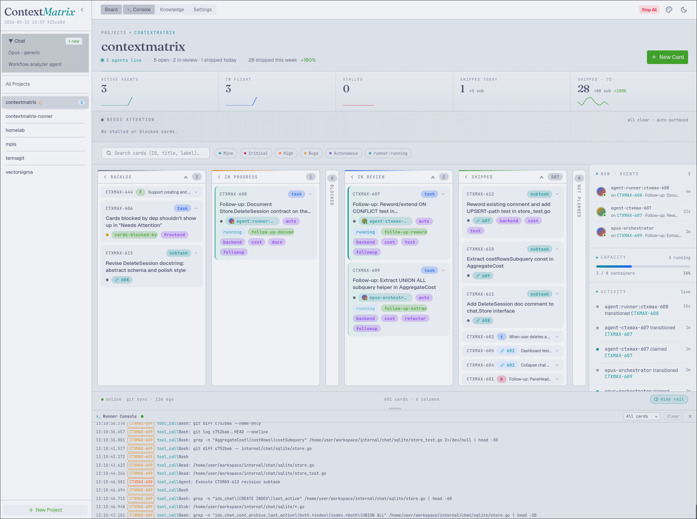
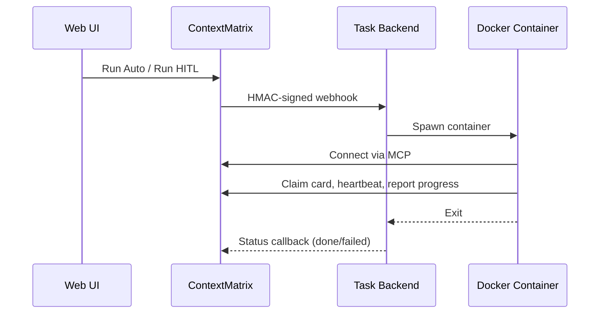

# ContextMatrix

> [!WARNING]
>
> This project is under heavy development. Breaking changes should be expected
> at the current stage.

Kanban-style task coordination for AI agents and humans. Cards are markdown
files with YAML frontmatter, stored in a git repository. Every mutation is
auto-committed, giving you a full audit trail.

ContextMatrix is a coordination layer — it tracks tasks but never touches your
project code repositories. Agents claim cards, execute them in their own repos,
and report progress back through the board. It is the hub of a small ecosystem:
ContextMatrix holds the board and dispatches work to pluggable execution
backends that do the actual coding inside sandboxed containers.



## The ContextMatrix ecosystem

ContextMatrix is the hub. It dispatches work to interchangeable backends over
HMAC-signed webhooks, and every backend reports back through the same MCP
interface. You only need this repo to get started — add a backend when you want
remote, unattended, or chat execution.

| Repository                                                                 | Role                                                                                                                                                              |
| -------------------------------------------------------------------------- | --------------------------------------------------------------------------------------------------------------------------------------------------------------------- |
| **[contextmatrix](https://github.com/mhersson/contextmatrix)** (this repo) | Coordination server, web UI, REST API, and MCP hub. Tracks tasks; never touches your code repos.                                                                  |
| **[contextmatrix-runner](https://github.com/mhersson/contextmatrix-runner)** | Default all-in-one backend. Runs cards by spawning disposable Docker containers running **Claude Code** headless, and serves the global chat surface.            |
| **[contextmatrix-agent](https://github.com/mhersson/contextmatrix-agent)**   | Alternative task backend — a custom Go harness on **OpenRouter** with per-role model selection, at v1 parity with the runner. Executes cards only.               |
| **[contextmatrix-chat](https://github.com/mhersson/contextmatrix-chat)**     | Chat backend for the global `/chat` surface — long-lived, board-aware interactive sessions. Pairs with the agent. _Unreleased; under heavy development._         |

Pick one of two backend topologies: the **runner alone** (handles tasks *and*
chat), or the **agent + chat** pair (agent runs cards, chat serves chat). The
runner is mutually exclusive with the agent and chat backends.

Three shared Go modules underpin the services:
**[contextmatrix-protocol](https://github.com/mhersson/contextmatrix-protocol)**
(the webhook protocol),
**[contextmatrix-githubauth](https://github.com/mhersson/contextmatrix-githubauth)**
(GitHub App/PAT authentication), and
**[contextmatrix-harness](https://github.com/mhersson/contextmatrix-harness)**
(the interactive agent loop shared by the agent and chat backends).

## Features

- **Kanban web UI** — drag-and-drop columns, real-time SSE updates, collapsible
  columns and cards, a filter bar, and light/dark theming with selectable color
  palettes.
- **Markdown-native cards** — plain files with YAML frontmatter, human-readable
  and diffable. No database required.
- **Git audit trail** — every card mutation is auto-committed. Optional deferred
  batching groups an agent's entire work session into a single commit.
- **MCP-first agent interface** — 28 MCP tools and 3 slash commands give agents
  structured access to the board. Agents work through MCP, never the REST API.
- **Pluggable execution backends** — trigger work from the UI and a backend runs
  it in a sandboxed Docker container: the **runner** (Claude Code headless) or
  the **agent** (a Go harness on OpenRouter). Swap them with one config change.
- **Autonomous & HITL execution** — `autonomous: true` cards run the full
  plan → execute → document → review lifecycle with no gates; Human-in-the-Loop
  mode opens a per-card chat pane to approve or redirect the agent, with
  one-click promotion to autonomous. The `simple` label triggers a fast path
  that skips planning and review.
- **Global chat surface** — a `/chat` route hosts long-lived, board-aware chat
  sessions independent of any card. Up to 4 are tiled in a resizable layout,
  persisted across reloads.
- **Image attachments** — paste from the clipboard or drag-and-drop screenshots
  into a card description. Uploads are resized server-side, content-hashed for
  deduplication, and surfaced to agents as base64 via MCP (`get_card`,
  `get_task_context`).
- **AI agent coordination** — exclusive card claims, heartbeat monitoring,
  automatic stall detection, and `depends_on` enforcement keep parallel agents
  from stepping on each other.
- **GitHub issue import** — periodically imports open issues as cards,
  de-duplicated by external ID, with a GitHub badge and a toast in the UI.
- **Cost tracking** — per-model token usage with USD estimates, broken down by
  agent and card on the dashboard.
- **Customizable workflow** — define your own types, priorities, and transition
  rules per project via `.board.yaml`. Add extra states beyond the built-in six.
- **Single binary** — the React frontend is embedded via Go's `embed.FS`. Build
  once, deploy anywhere.

## Quick Start

```bash
# Build (requires Go 1.26+ and Node.js 20+)
make install-frontend
make build

# Install config and skills into ~/.config/contextmatrix/
make install-config

# Initialize a boards repo (a separate git repo for task data)
mkdir -p ~/boards/contextmatrix
cd ~/boards/contextmatrix && git init

# Edit boards.dir in ~/.config/contextmatrix/config.yaml, then run
./contextmatrix
```

Open `http://localhost:8080` for the web UI.

## Web UI

- **Board view** — drag-and-drop kanban columns per project, with a card detail
  panel. Columns collapse to a narrow vertical strip; individual cards collapse
  to a single header row. Both collapsed sets are persisted per-project in
  `localStorage`.
- **Dashboard** — per-project or all-state counts, active agents, and token cost
  breakdown.
- **Chat** — global multi-pane chat surface (`/chat`). Up to 4 simultaneous chat
  sessions in a resizable tile layout, persisted across reloads. The 5th open
  triggers LRU eviction with an Undo toast.
- **Execution console** — when a task backend is enabled, a toggleable console
  (`>_` button in the header, keyboard `c`) streams live container logs below
  the board with a resizable divider.
- **Theme toggle** — sun/moon icon toggles dark/light, persisted in
  `localStorage`, defaulting to your system `prefers-color-scheme`.
- **Palette selector** — a dropdown picks between **Everforest** (default),
  **Radix**, and **Catppuccin**. The server default is set via the `theme`
  config key; each browser's choice is stored under the `palette` key and
  overrides it on subsequent loads.

## Creating a Board

Each project lives in a subdirectory of the boards repo with a `.board.yaml`.
The easiest way to create one is the **New Project** button in the web UI
sidebar, which opens a guided wizard. You can also use the
`/contextmatrix:init-project` slash command in Claude Code, the API
(`POST /api/projects`), or create the files manually:

```bash
mkdir -p ~/boards/contextmatrix/my-project/tasks
mkdir -p ~/boards/contextmatrix/my-project/templates
```

```yaml
# ~/boards/contextmatrix/my-project/.board.yaml
name: my-project
prefix: MYPROJ
next_id: 1
repo: git@github.com:org/my-project.git
states: [todo, in_progress, blocked, review, done, stalled, not_planned]
types: [task, bug, feature]
priorities: [low, medium, high, critical]
transitions:
  todo: [in_progress, not_planned]
  in_progress: [blocked, review, todo]
  blocked: [in_progress, todo]
  review: [done, in_progress]
  done: [todo]
  stalled: [todo, in_progress]
  not_planned: [todo]
```

Optionally add templates in `templates/task.md`, `templates/bug.md`, etc.
Templates are plain markdown (no YAML frontmatter). The filename (without `.md`)
must match the card type exactly. Each template is scoped to its type:

- When creating a card, the body editor is pre-filled with the template for the
  selected type (if one exists).
- Changing the type in the "Create Card" form loads the new type's template
  automatically, as long as the user has not yet edited the body.
- If the new type has no template and the body is unedited, the editor clears.
- If the user has already typed in the body, changing types never overwrites
  their content. Switching to a type that has a template prompts for
  confirmation before replacing the body.
- Templates are returned to agents via `get_task_context`.

```markdown
<!-- templates/task.md -->

## Objective

<!-- What this task should accomplish -->

## Acceptance Criteria

- [ ] ...

## Notes

<!-- Implementation hints, links, constraints -->
```

## Installation

The install script copies the configuration template and agent skill files into
your user config directory.

```bash
# Fresh install: create config dir, copy config.yaml from template, copy
# workflow skills into <config-dir>/workflow-skills/.
make install-config
# or equivalently:
scripts/install.sh

# Only update the workflow-skills/ directory — config.yaml is not touched
scripts/install.sh --update-workflow-skills

# Add-only refresh of task-skills/ — never overwrites user edits
scripts/install.sh --update-task-skills

# Overwrite config.yaml even if it already exists (re-install)
scripts/install.sh --force
```

**Config directory** is resolved via the XDG Base Directory spec:
`$XDG_CONFIG_HOME/contextmatrix` if set, otherwise `~/.config/contextmatrix`.

**What gets installed:**

- `config.yaml` — copied from `config.yaml.example` (skipped if it already
  exists, unless `--force`).
- `workflow-skills/` — the lifecycle workflow skill files (create-plan,
  execute-task, review-task, etc.). Always refreshed.
- `task-skills/` — curated specialist task skills (Go, TypeScript/React, etc.)
  seeded on fresh install. Never overwritten afterwards (only
  `--update-task-skills` adds missing entries).

After a fresh install, edit `boards.dir` in
`~/.config/contextmatrix/config.yaml` before starting the server.

## MCP Integration

ContextMatrix exposes an MCP server on `POST /mcp` (Streamable HTTP transport).
Connect Claude Code by adding this to your MCP config (`~/claude.json` or
project `.claude/claude.json`):

```json
{
  "mcpServers": {
    "contextmatrix": {
      "type": "http",
      "url": "http://localhost:8080/mcp",
      "headers": { "Authorization": "Bearer your-mcp-api-key" }
    }
  }
}
```

The `Authorization` header is required when `mcp_api_key` is set in
`config.yaml` (recommended for any non-localhost deployment). Omit the `headers`
block if `mcp_api_key` is empty.

### MCP Tools

| Tool                        | Description                                                             |
| --------------------------- | ----------------------------------------------------------------------- |
| `add_log`                   | Append an activity log entry                                            |
| `chat_rehydration_complete` | Signal that a resumed chat session has finished rehydrating             |
| `check_agent_health`        | Check health of subtask agents for a parent card                        |
| `claim_card`                | Claim exclusive ownership of a card                                     |
| `complete_task`             | Atomically log + transition to done + release                           |
| `create_card`               | Create a card (returns generated ID)                                    |
| `create_project`            | Create a new project board                                              |
| `delete_project`            | Delete a project (must have zero cards)                                 |
| `get_card`                  | Get a single card                                                       |
| `get_ready_tasks`           | Get unclaimed todo cards with all dependencies met                      |
| `get_skill`                 | Get a skill prompt with injected card/project context                   |
| `get_subtask_summary`       | Get subtask counts by state for a parent card                           |
| `get_task_context`          | Get card + parent + siblings + project config in one call               |
| `heartbeat`                 | Update heartbeat timestamp (prevents stalling)                          |
| `increment_review_attempts` | Increment the review attempt counter on a card                          |
| `list_cards`                | List cards with filters (state, type, label, agent, parent)             |
| `list_projects`             | List all projects with configs                                          |
| `promote_to_autonomous`     | Promote a card to autonomous mode (human-only)                          |
| `recalculate_costs`         | Recalculate token costs for cards with missing cost data                |
| `release_card`              | Release a claim                                                         |
| `report_incapable_model`    | Record that a model could not drive the tool loop so it is never auto-selected again |
| `report_push`               | Report a git push for a card                                            |
| `report_usage`              | Report token usage and estimated cost                                   |
| `start_review`              | Atomically transition a card to review and return the review-task skill |
| `start_workflow`            | Return the workflow skill for a card (routes by autonomous flag)        |
| `transition_card`           | Change card state (validated against state machine)                     |
| `update_card`               | Update card fields                                                      |
| `update_project`            | Update project configuration                                            |

### Slash Commands

Skill files in `workflow-skills/` are served as MCP prompts, available as Claude
Code slash commands:

| Command                         | Argument      | Description                                                                                  |
| ------------------------------- | ------------- | ------------------------------------------------------------------------------------------- |
| `/contextmatrix:create-task`    | `description` | Guided task creation with human interview                                                    |
| `/contextmatrix:init-project`   | `name`        | Initialize a new project board                                                               |
| `/contextmatrix:start-workflow` | `card_id`     | Drive a card through its full lifecycle (HITL or autonomous, routed by the autonomous flag) |

Phase-specific skills (`create-plan`, `execute-task`, `review-task`,
`document-task`, `run-autonomous`, `brainstorming`, `systematic-debugging`) are
loaded internally by the orchestrator via `get_skill` (or, for the review-entry
transition, via `start_review`). Invoke `start-workflow` and the orchestrator
drives the phases.

## Agent Workflow

Claude Code acts as the main orchestrator, spawning sub-agents via the `Agent`
tool. The typical workflow:

1. **Create** — `/contextmatrix:create-task` interviews the human and creates a
   card.
2. **Start** — `/contextmatrix:start-workflow <card_id>` (or the `start_workflow`
   MCP tool) drives the card through its full lifecycle. The orchestrator
   inspects the card's `autonomous` flag and routes to either the HITL flow
   (`create-plan`, with human approval gates) or the autonomous flow
   (`run-autonomous`, no gates).

Internally the orchestrator chains:

- **Plan** — break the card into subtasks with dependencies (`create-plan`).
- **Execute** — spawn parallel sub-agents (`execute-task`); each calls
  `claim_card`, works the task with periodic `heartbeat`s, then `complete_task`.
- **Document** — write external docs (`document-task`); parent stays
  `in_progress`.
- **Review** — `start_review` atomically transitions the parent to `review` and
  loads the `review-task` skill in one call. A review sub-agent writes findings;
  for HITL the user approves or rejects.

Cards with `depends_on` relationships are enforced — a card cannot transition to
`in_progress` until all its dependencies are `done`. The `get_ready_tasks` tool
returns only cards eligible for execution.

## States, Transitions, and Skills

ContextMatrix ships with **six built-in states**. Their names are part of the
contract — the server, MCP tools, and built-in workflow skills branch on these
exact strings, so they cannot be renamed or removed. You can add extra states
and control which transitions are allowed between any of them via `.board.yaml`.

| Built-in state | Role                                                                            |
| -------------- | ------------------------------------------------------------------------------- |
| `todo`         | Ready to be claimed. `claim_card` auto-transitions `todo → in_progress`.        |
| `in_progress`  | Actively being worked. Parent auto-moves to `in_progress` when a child does.    |
| `blocked`      | Waiting on an external dependency. (Required only by the `execute-task` skill.) |
| `review`       | Work complete, awaiting review. `complete_task` moves parent cards here.        |
| `done`         | Accepted and finished. `complete_task` moves subtasks here.                     |
| `stalled`      | Heartbeat timed out; system-managed. Server auto-injects transitions into it.   |
| `not_planned`  | Deprioritized; clears agent claim and flushes deferred commits on entry.        |

`stalled` and `not_planned` are enforced by the config validator — projects that
omit them are rejected at load time. The other four (`todo`, `in_progress`,
`review`, `done`) are hardcoded across claim/complete, parent/child
orchestration, dashboard metrics, and every built-in skill; renaming them
silently breaks those paths.

**You can:** add new states alongside the built-in six (e.g. a `qa` step),
restrict transitions (e.g. forbid `done → todo`), and define types and
priorities freely per project. **You cannot:** rename the six built-in state
names or change their semantics without forking — there is no alias layer.

If your workflow adds states the skills should drive into, copy `workflow-skills/`
to a custom location, edit the relevant skills, and point `workflow_skills_dir`
in `config.yaml` at your copy. The default skills are refreshed from the repo by
`scripts/install.sh`; your custom directory is never touched.

## Autonomous Mode

Cards with `autonomous: true` run through the full lifecycle without human
approval gates. `/contextmatrix:start-workflow` (or the `start_workflow` MCP
tool) routes them to the `run-autonomous` skill automatically:

```
plan → subtask creation → execute (parallel) → document → review → done
```

The orchestrator handles each phase in sequence, spawning sub-agents via the
`Agent` tool for execution, documentation, and review.

### Fast Path (`simple` label)

Cards with the label `simple` — and no existing subtasks — skip planning,
subtask creation, review, and documentation. The agent claims the card, executes
the work directly, runs tests, and transitions straight to `done`. The fast path
still enforces card claims, heartbeats, tests, branch protection, and release.
See [`docs/data-model.md`](docs/data-model.md) § Reserved labels.

### Guardrails

- **Branch protection** — autonomous agents must never push to `main` or
  `master`. The `report_push` MCP tool returns a hard error if the branch is
  `main` or `master`.
- **Maximum review cycles** — the `run-autonomous` skill halts after 3 review
  cycles and asks a human to intervene. The server caps the `review_attempts`
  counter at 5 as defense-in-depth, so even a misbehaving orchestrator cannot
  loop indefinitely.
- **Heartbeat-based stall detection** — if a sub-agent's heartbeat times out,
  the service layer marks the card `stalled` and releases the claim. The
  orchestrator uses `check_agent_health` to detect and respawn stalled
  sub-agents.

## Remote Execution & Backends

ContextMatrix dispatches work to a **task backend** that runs it in a sandboxed
Docker container. Cards in `todo` show a run button in the UI — **"Run Auto"**
when the **Autonomous mode** checkbox is checked, or **"Run HITL"** when
unchecked. ContextMatrix sends an HMAC-signed webhook to the backend, which
spawns a disposable container that connects back via MCP to claim the card,
heartbeat, and report progress. Each container is sandboxed from the host — no
access to your filesystem or other processes — and destroyed when the task
finishes or fails, so remote execution is safe to run unattended.

Two task backends exist, at v1 parity, selected globally in `config.yaml`:

- **[contextmatrix-runner](https://github.com/mhersson/contextmatrix-runner)**
  (default) — spawns containers running **Claude Code** headless, with a
  Sonnet/Opus orchestrator. It also serves the global chat surface, so the
  runner alone covers both tasks and chat.
- **[contextmatrix-agent](https://github.com/mhersson/contextmatrix-agent)** — a
  custom Go harness backed by **OpenRouter** with per-role model selection.
  Executes cards only; pair it with
  **[contextmatrix-chat](https://github.com/mhersson/contextmatrix-chat)** to
  serve the chat surface.

The runner is mutually exclusive with the agent and chat backends. Pick one
topology — **runner alone** (tasks + chat) or **agent + chat** — and restart to
apply. See
[`docs/agent-backend-parity.md`](docs/agent-backend-parity.md) for the parity
audit and the enable recipe.

**HITL mode:** uncheck **Autonomous mode** and click **"Run HITL"**. The agent
begins planning immediately — a priming message tells it to start the
`create-plan` workflow without waiting. A per-card chat pane appears while the
container runs, letting you approve or redirect the agent at each gate (plan
approval, subtask execution, review). A **Switch to Autonomous** button promotes
the session so the agent skips remaining gates and finishes without further
input.



### Setup

```yaml
# config.yaml
backends:
  runner: # or `agent:` with url / api_key / enabled / default_model
    url: "http://localhost:9090" # backend base URL
    api_key: "your-secret-key-min-32ch" # shared HMAC secret (min 32 chars)
    enabled: true
mcp_api_key: "your-mcp-bearer-token" # MCP auth for container connections
```

Per-project, override the enabled flag and set a custom worker image in
`.board.yaml`:

```yaml
remote_execution:
  enabled: true
  runner_image: "ghcr.io/org/custom-runner:latest"
```

Triggering a run automatically enables `feature_branch` and `create_pr` on the
card (both autonomous and HITL), so the container always works on a dedicated
branch and opens a pull request. Cards track execution state via `runner_status`:
`queued` → `running` → `completed`/`failed`/`killed`, surfaced as status badges
in the UI. See [`docs/remote-execution.md`](docs/remote-execution.md) for the
full architecture, webhook protocol, and security model.

## GitHub Issue Import

When GitHub authentication is configured and a project has
`github.import_issues` enabled in its `.board.yaml`, ContextMatrix periodically
fetches open issues and creates cards in the project's `todo` column. Duplicate
issues are detected by external ID and never imported twice. Imported cards show
a GitHub icon next to the type badge and trigger an info toast.

```yaml
# config.yaml (global)
github:
  auth_mode: "app" # "app" (recommended) or "pat"
  app:
    app_id: 12345
    installation_id: 67890
    private_key_path: "/path/to/private-key.pem"
  issue_importing:
    enabled: true
    sync_interval: "5m" # minimum 5m
```

```yaml
# .board.yaml (per-project)
github:
  import_issues: true
  card_type: task # optional, default: task
  default_priority: medium # optional, default: medium
  labels: [] # optional, only import issues with these GitHub labels
```

Owner and repo are resolved automatically from the project's `repo` field (SSH
and HTTPS GitHub URLs are supported); override them with explicit `owner` /
`repo` keys if needed. For GitHub Enterprise (GHEC-DR / GHES), set `github.host`
(and optionally `github.api_base_url`) in `config.yaml`. See
[docs/github-auth-setup.md](docs/github-auth-setup.md) for end-to-end setup.

## API

All endpoints live under `/api`. The REST API powers the web UI and is handy for
human verification during development — **agents always use MCP, never curl.**

Identity is sent via the `X-Agent-ID` header; claimed cards can only be mutated
by the owning agent. Non-safe methods (`POST`, `PUT`, `PATCH`, `DELETE`) require
an `X-Requested-With: contextmatrix` CSRF header, which the web UI sets
automatically. Exempt paths: `/healthz`, `/readyz`, `/mcp`, and `/api/runner/*`,
`/api/agent/*`, `/api/chat/*` (HMAC-signed instead).

A few representative calls:

```bash
# List projects
curl http://localhost:8080/api/projects

# Create a card
curl -X POST http://localhost:8080/api/projects/my-project/cards \
  -H "Content-Type: application/json" -H "X-Requested-With: contextmatrix" \
  -d '{"title": "Implement auth", "type": "task", "priority": "high"}'

# Project dashboard (state counts, active agents, costs)
curl http://localhost:8080/api/projects/my-project/dashboard

# Stream server-sent events (optionally ?project=my-project)
curl -N http://localhost:8080/api/events

# Liveness / readiness probes (for Kubernetes)
curl http://localhost:8080/healthz
curl http://localhost:8080/readyz
```

SSE event types include `card.created`, `card.updated`, `card.state_changed`,
`card.claimed`, `card.released`, `card.stalled`, `card.log_added`,
`card.usage_reported`, the `project.*` and `sync.*` families, and `runner.*`
lifecycle events. See [`docs/api-reference.md`](docs/api-reference.md) for the
complete endpoint reference, request/response shapes, and error format.

## Configuration

ContextMatrix reads `config.yaml` from the working directory or the XDG config
directory. [`config.yaml.example`](config.yaml.example) is the fully-commented
canonical reference — it documents every field, its default, and the matching
`CONTEXTMATRIX_*` environment-variable override. A minimal config:

```yaml
port: 8080
mcp_api_key: "" # Bearer token for the MCP endpoint (set for non-localhost)

boards:
  dir: ~/contextmatrix-boards # path to the boards git repo (required)

# Optional: enable a remote-execution backend (see "Remote Execution & Backends")
backends:
  runner:
    url: "http://localhost:9090"
    api_key: "your-shared-secret-min-32-chars"
    enabled: true
```

Every field has a `CONTEXTMATRIX_*` environment override (e.g.
`CONTEXTMATRIX_PORT`, `CONTEXTMATRIX_BOARDS_DIR`,
`CONTEXTMATRIX_BACKEND_RUNNER_URL`). Token cost rates (`token_costs`), GitHub
auth, chat limits, image storage, and the operational store (`op_store.db_path`,
which holds chat transcripts and the model blacklist) are all documented in
`config.yaml.example`.

## GitHub Authentication

ContextMatrix authenticates to GitHub via a single identity used for both git
operations (boards repo, task-skills repo) and REST API calls (issue import,
branch listing). Two methods are supported: GitHub App (recommended) or
fine-grained PAT. SSH deploy keys are not supported. See
[docs/github-auth-setup.md](docs/github-auth-setup.md) for end-to-end setup.

## Security

ContextMatrix is designed for **self-hosted deployment on a trusted network**
(LAN, VPN, or behind an authenticating reverse proxy). There is no per-user
access control — anyone who can reach the API can access all projects and start
autonomous runs if enabled.

```
Internet → [Reverse Proxy + TLS] → [ContextMatrix] → [Boards Git Repo]
```

ContextMatrix does not include built-in TLS, authentication, or rate limiting;
these are the responsibility of your reverse proxy (Nginx, Caddy, Cloudflare
Tunnel, etc.).

- **REST API** — unauthenticated by default. Do not expose directly to the
  internet without an authenticating proxy in front.
- **MCP endpoint** (`/mcp`) — optional Bearer token authentication via
  `mcp_api_key`. Strongly recommended for any non-localhost deployment.
- **Backend webhooks** — HMAC-SHA256 signed in both directions (ContextMatrix ↔
  backend). The shared secret is never transmitted — only signatures are sent on
  the wire.
- **Agent identity** (`X-Agent-ID` header) — a coordination mechanism, not
  cryptographic authentication. Agents are trusted participants.

For production deployment with Docker, Kubernetes, and external access, see
[`docs/deployment-example.md`](docs/deployment-example.md).

## Development

```bash
# Prerequisites: Go 1.26+, Node.js 20+, npm, golangci-lint

make test                 # run Go tests
make lint                 # run the linter
make build                # build binary with embedded frontend
cd web && npm install && npm run dev   # frontend dev server (proxies API to :8080)
```

GitHub Actions workflows live in `.github/workflows/`: `build.yaml` runs
`go vet` / `go test` / `go test -race -short` / `golangci-lint` plus the
frontend checks on every PR, and builds + pushes Docker images on push to
`main`; `nightly.yaml` runs the full race suite on a daily cron. Both run on the
self-hosted runner and read the Go toolchain version from `go.mod`.

## Troubleshooting

- **Config file not found** — ContextMatrix looks for `config.yaml` in the
  current directory, then in `~/.config/contextmatrix/config.yaml`. Run
  `make install-config` to create the default config.
- **Boards directory errors** — `boards.dir` must point to an initialized git
  repository (`mkdir -p ~/boards/contextmatrix && cd ~/boards/contextmatrix &&
  git init`).
- **MCP connection refused** — verify the server is running and the URL/port in
  your MCP config match. If `mcp_api_key` is set, add the matching
  `Authorization: Bearer …` header to your MCP config.

## Acknowledgments

- `workflow-skills/brainstorming.md` and
  `workflow-skills/systematic-debugging.md` are adopted from the
  [superpowers](https://github.com/obra/superpowers) plugin for Claude Code by
  Jesse Vincent, adapted to run inline inside the create-plan orchestrator and
  to use ContextMatrix MCP tools for card updates.

## License

MIT
