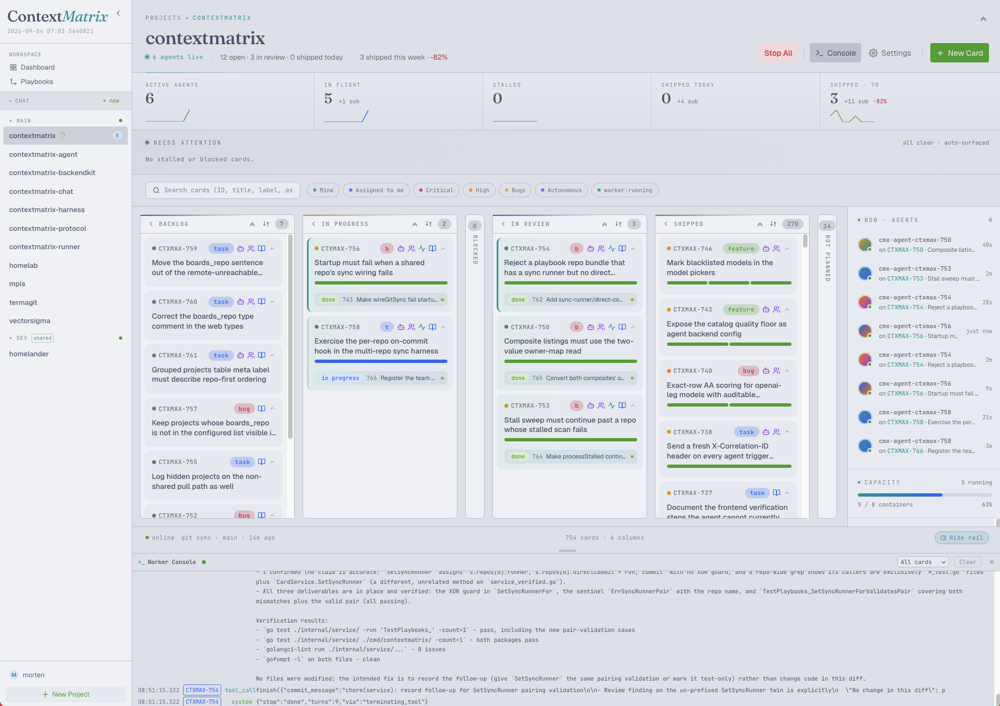
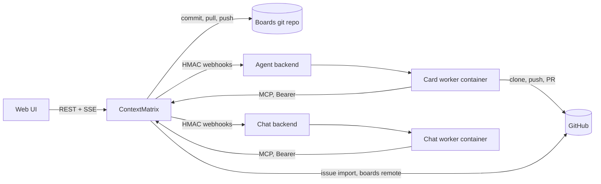

# ContextMatrix

> [!WARNING]
>
> This project is under heavy development. Breaking changes should be expected
> at the current stage.

Kanban-style task coordination for AI agents and humans. Cards are markdown
files with YAML frontmatter in a git repository; every mutation is
auto-committed, so the board is its own audit trail.

ContextMatrix is a coordination layer only. It holds the board, exposes it over
a REST API, an MCP server, and a web UI, and dispatches cards to pluggable
execution backends that do the coding inside disposable containers. It never
clones, builds, or touches your project code.



## The ecosystem


```mermaid
flowchart LR
  UI[Web UI] -->|REST + SSE| CM[ContextMatrix]
  CM -->|commit, pull, push| Boards[(Boards git repo)]
  CM -->|HMAC webhooks| Agent[Agent backend]
  CM -->|HMAC webhooks| Chat[Chat backend]
  Agent --> Worker[Card worker container]
  Chat --> ChatWorker[Chat worker container]
  Worker -->|MCP, Bearer| CM
  ChatWorker -->|MCP, Bearer| CM
  Worker -->|clone, push, PR| GitHub[(GitHub)]
  CM -->|issue import, boards remote| GitHub
```

You only need this repo to get started. Add a backend when you want unattended
or chat execution.

| Repository                                                                 | Role                                                                                                                                 |
| -------------------------------------------------------------------------- | ------------------------------------------------------------------------------------------------------------------------------------ |
| **[contextmatrix](https://github.com/mhersson/contextmatrix)** (this repo) | Coordination server: board, web UI, REST API, MCP hub.                                                                               |
| **[contextmatrix-agent](https://github.com/mhersson/contextmatrix-agent)** | Task backend. A Go harness with per-role model selection over **OpenRouter** or any OpenAI-compatible gateway. Executes cards only. |
| **[contextmatrix-chat](https://github.com/mhersson/contextmatrix-chat)**   | Chat backend for the global `/chat` surface: long-lived, board-aware sessions on the same LLM endpoint.                              |

Four shared Go modules underpin them:
[contextmatrix-protocol](https://github.com/mhersson/contextmatrix-protocol)
(webhook wire types),
[contextmatrix-githubauth](https://github.com/mhersson/contextmatrix-githubauth)
(GitHub App and PAT auth),
[contextmatrix-harness](https://github.com/mhersson/contextmatrix-harness)
(the agentic tool-use loop), and
[contextmatrix-backendkit](https://github.com/mhersson/contextmatrix-backendkit)
(serve plumbing: webhook auth, worker lifecycle, metrics, log streaming).

## Features

Each bullet links to the document that covers it in full.

**Board and cards**

- **Kanban web UI** - drag-and-drop board per project with live SSE updates,
  per-column sort modes and manual ordering, collapsible columns and cards, a
  filter bar, and a metrics ribbon with the active agents.
  [Web UI](docs/web-ui.md)
- **Markdown-native cards** - one file per card, YAML frontmatter plus a
  markdown body, diffable, no database required.
  [Card file format](docs/data-model.md#card-file-format)
- **Git audit trail** - every mutation commits with an attributed message;
  deferred batching folds an agent's whole session into one commit.
  [Async-commit consistency](docs/architecture.md#async-commit-consistency)
- **Customizable workflow** - one `.board.yaml` per project defines states,
  types, priorities, and transitions. Six state names are the contract; add
  states freely, never rename those. [Boards](docs/boards.md)
- **Image attachments** - paste or drop screenshots into a card; uploads are
  resized, content-hashed, and handed to agents inline over MCP.
  [Image attachments](docs/web-ui.md#image-attachments)
- **Playbooks** - cross-project runbooks that mix live card references with
  manual gate steps, stored as YAML in the boards repo.
  [Playbooks](docs/playbooks.md)
- **GitHub issue import** - open issues become unvetted cards, deduplicated by
  external id, one-way. [GitHub issue import](docs/github-issue-import.md)

**Agents and execution**

- **MCP-first agent interface** - 39 MCP tools and 3 slash commands give
  agents structured access to the board. Agents work through MCP, never the
  REST API. [MCP integration](docs/mcp.md)
- **Agent coordination** - exclusive claims, heartbeats, automatic stall
  detection, and `depends_on` enforcement keep parallel agents apart.
  [Key domain rules](docs/data-model.md#key-domain-rules)
- **Pluggable execution backends** - one click runs a card in a sandboxed
  container on the agent backend, driven over HMAC-signed webhooks; the
  worker reports back over MCP.
  [Running cards](docs/running-cards.md),
  [Remote execution](docs/remote-execution.md)
- **Autonomous and HITL runs** - Run Auto drives plan, execute, document,
  review, done with no gates; Run HITL opens a per-card chat with approval
  gates and a one-click switch to autonomous. Every run streams its transcript
  into the card's Chat tab. The `simple` label takes a fast path that skips
  planning and review. [Running cards](docs/running-cards.md#starting-a-run)
- **Guardrails** - pushes to `main` or `master` are refused, review cycles are
  capped, heartbeat timeouts stall the card, and a run that needs a human
  parks the card instead of failing.
  [Guardrails](docs/running-cards.md#guardrails),
  [Parked cards](docs/running-cards.md#parked-cards)
- **Best-of-N** - `best_of_n` races N coder models in parallel worktrees; a
  judge picks the one branch that is pushed.
  [Best-of-N](docs/running-cards.md#best-of-n)
- **Mob sessions (A2A)** - `mob_participants` turns chosen phases into
  moderated multi-model discussions over the A2A protocol, with optional
  registered guest agents. [Mob sessions](docs/running-cards.md#mob-sessions)
- **Model selection** - ContextMatrix rates served models with Artificial
  Analysis and ships candidates, favorites, and the blacklist in every
  trigger; the agent picks per complexity tier. Pin per card, favor per tier,
  delist from the admin page. [Model selection](docs/model-selection.md)
- **Task skills** - point the agent at your own repo of `SKILL.md` files and
  select them per card or per project.
  [Task skills](docs/agent-workflow.md#task-skills)
- **Cost tracking** - workers report measured token usage per card; the board
  prices it and breaks it down by model and agent.
  [Cost tracking](docs/running-cards.md#cost-tracking)
- **Global chat** - `/chat` tiles up to four long-lived, board-aware sessions
  backed by the chat backend. [Global chat](docs/web-ui.md#global-chat)

**Teams and operations**

- **Multi-user login** - invite-only accounts, one flat team plus an admin
  flag, private chats, and an encrypted GitHub credential pool bound per
  project. `auth.mode: none` restores zero-login single-user operation.
  [Authentication](docs/authentication.md)
- **Shared boards** - several instances work one boards repo through its
  remote: merge-only sync, card-aware conflict rules, per-instance claims with
  leases, images stored in the repo. [Shared boards](docs/shared-boards.md)
- **Several boards repositories** - a shared team repo next to a private one
  on the same instance.
  [Several boards repositories](docs/shared-boards.md#several-boards-repositories)
- **Observability** - Prometheus metrics and pprof on a loopback-only admin
  listener; liveness and readiness probes.
  [Admin listener](docs/deployment-example.md#admin-listener-prometheus--pprof)
- **Single binary** - the React frontend is embedded with `embed.FS`. Build
  once, deploy anywhere.

## Quick start

Requires Go 1.26 and Node.js 26 (the versions CI and the Docker image build
with).

```bash
make install-frontend
make build
make install-config   # config.yaml + workflow skills into ~/.config/contextmatrix/
```

Edit `~/.config/contextmatrix/config.yaml`. The boards directory is created
and git-initialised on first start; a GitHub auth mode is required even if you
never import issues:

```yaml
port: 8080
mcp_api_key: "" # Bearer token for /mcp; set it for anything beyond localhost

boards:
  dir: ~/contextmatrix-boards

github:
  auth_mode: pat # or "app"; see docs/github-auth-setup.md
  pat:
    token: github_pat_...

# auth:
#   mode: none # zero-login single-user mode
```

```bash
./contextmatrix
```

Open `http://localhost:8080`. Login is required by default: the log prints a
one-time bootstrap link (`/auth/token/<token>`, valid 48 hours) that creates
the admin account. Create a project with the **New Project** button in the
sidebar.

To let Claude Code work the board, add the MCP server to `~/.claude.json` or a
project `.mcp.json` (drop `headers` while `mcp_api_key` is empty):

```json
{
  "mcpServers": {
    "contextmatrix": {
      "type": "http",
      "url": "http://localhost:8080/mcp",
      "headers": { "Authorization": "Bearer your-mcp-api-key" }
    }
  }
}
```

Then `/contextmatrix:create-task` creates a card and
`/contextmatrix:start-workflow <card_id>` drives it through its lifecycle. To
run cards unattended in containers, add an agent backend; see
[Running cards](docs/running-cards.md) and
[Remote execution](docs/remote-execution.md).

## Documentation

| Document                                                                   | Covers                                                                                 |
| -------------------------------------------------------------------------- | -------------------------------------------------------------------------------------- |
| [Configuration](docs/configuration.md)                                     | Config discovery, env overrides, CLI, data directories, troubleshooting                |
| [Authentication](docs/authentication.md)                                   | Auth modes, bootstrap, invites, roles, credential pool, security posture               |
| [Boards](docs/boards.md)                                                   | Creating a project, `.board.yaml`, templates, built-in states, custom skills           |
| [Web UI](docs/web-ui.md)                                                   | Routes, board view, sorting, dashboard, console, chat, images, appearance              |
| [Playbooks](docs/playbooks.md)                                             | Cross-project runbooks: entries, detail view, storage, API and MCP                     |
| [MCP integration](docs/mcp.md)                                             | Connecting a client, every MCP tool, slash commands, payload rules                     |
| [Running cards](docs/running-cards.md)                                     | Run Auto / Run HITL, fast path, guardrails, Best-of-N, mob, PR gates, parking, cost    |
| [Agent workflow](docs/agent-workflow.md)                                   | Orchestration model, workflow and task skills, phases, heartbeat, model allocation     |
| [Remote execution](docs/remote-execution.md)                               | Backend webhook protocol, worker lifecycle, log streaming, kill switch                 |
| [Model selection](docs/model-selection.md)                                 | Candidate catalog, tiers, pins, favorites, blacklist, outcome ledger                   |
| [Shared boards](docs/shared-boards.md)                                     | Multi-instance sync, merge rules, per-instance claims, several boards repos            |
| [GitHub issue import](docs/github-issue-import.md)                         | Importer config, owner/repo resolution, vetting, Enterprise hosts                      |
| [GitHub auth setup](docs/github-auth-setup.md)                             | GitHub App vs PAT, permissions, Enterprise, common mistakes                            |
| [GitHub auth topologies](docs/github-auth-recommended-topologies.md)       | Where credentials live for single-host, worker-VM, and Kubernetes layouts             |
| [Deployment](docs/deployment-example.md)                                   | Docker image, Kubernetes manifests, reverse proxy and TLS, worker VM, secrets          |
| [Architecture](docs/architecture.md)                                       | Trust model, data flow, commit consistency, components, git repository scope           |
| [Data model](docs/data-model.md)                                           | Card format, domain rules, Go types, validation limits, `.board.yaml` fields           |
| [API reference](docs/api-reference.md)                                     | Every REST endpoint, request and response shapes, SSE events, error format             |
| [Integration tests](docs/integration-tests.md)                             | The real-binary harness: scenarios, prerequisites, runlogs                             |
| [Gotchas](docs/gotchas.md)                                                 | YAML, go-git, SSE, MCP, Vite, and stdlib quirks for contributors                       |

## Security

ContextMatrix is built for self-hosted deployment on a trusted network (LAN,
VPN, or behind an authenticating reverse proxy). It terminates no TLS: put
Nginx, Caddy, or a Cloudflare Tunnel in front, and never expose an
`auth.mode: none` instance to the internet. MCP uses a Bearer token, backend
webhooks are HMAC-SHA256 signed in both directions, unsafe REST methods need
the `X-Requested-With: contextmatrix` header, and the admin listener binds to
loopback. Details:
[Security posture](docs/authentication.md#security-posture) and the
[trust model](docs/architecture.md#trust-model).

## Development

```bash
make test               # Go tests (stubs web/dist for the embed; run first in a fresh clone)
make lint               # golangci-lint, read-only
make build              # binary with embedded frontend (make install-frontend first)
make test-frontend      # vitest
make lint-frontend      # eslint
make test-race          # race detector on the concurrency-heavy packages
make test-integration   # real-binary harness with a stub LLM; needs Docker
cd web && npm run dev   # frontend hot reload, proxies /api to :8080
```

CI lives in `.github/workflows/`: `build.yaml` runs vet, tests, the race
suite, golangci-lint, the frontend checks, govulncheck, hadolint, shellcheck,
and a Trivy image scan on every pull request, and builds and pushes the Docker
image on push to `main`; `nightly.yaml` runs the full race suite daily.

## Acknowledgments

`workflow-skills/brainstorming.md` and `workflow-skills/systematic-debugging.md`
are adopted from the [superpowers](https://github.com/obra/superpowers) plugin
for Claude Code by Jesse Vincent, adapted to run inline inside the create-plan
orchestrator and to use ContextMatrix MCP tools for card updates.

## License

MIT
