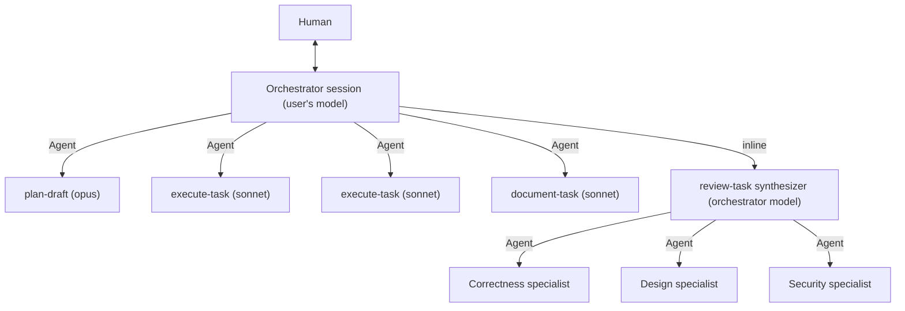

# Agent Orchestration Architecture

How AI agents coordinate work through ContextMatrix: the orchestration model,
the workflow skills served over MCP, task skills, the card lifecycle the
skills drive, and how liveness and cost are reported. For connecting a client
see [MCP](mcp.md); for run modes, guardrails and PR gates as an operator sees
them see [running cards](running-cards.md).

## Orchestration model

An orchestrator drives each card and delegates bounded work to sub-agents
with fresh contexts. Two orchestrators exist:

| Orchestrator                          | Where it runs                                                 | What drives it                                                                                                                                                                          |
| ------------------------------------- | ------------------------------------------------------------- | --------------------------------------------------------------------------------------------------------------------------------------------------------------------------------------- |
| Local session (Claude Code)           | The user's machine                                            | Workflow skills served as MCP prompts; the user starts a card with `/contextmatrix:start-workflow` or the `start_workflow` tool                                                         |
| Agent backend (`contextmatrix-agent`) | Disposable worker container started by an HMAC-signed webhook | The harness's own code-driven phases (plan, execute, document, review, integrate, pr_gates). It never loads a workflow skill; HITL runs pause at built-in gates fed by the chat console |

Both talk to the board only through MCP tools over HTTP (`POST /mcp`). The
backend's classifier and planner prompts mirror the `create-plan` rules, but
its phase boundaries live in code. See [remote execution](remote-execution.md)
for the protocol and [model selection](model-selection.md) for its picks.

Local orchestration:



The review skill runs inline because only the top-level session has the
`Agent` tool needed to spawn the three specialists. Specialists run on the
review skill's size-based pick (`sonnet`, or `opus` above 600 changed lines
or 10 changed files) regardless of the orchestrator's model.

**Sessions are split.** Board survey (`list_cards`, `get_ready_tasks`) and
card execution are separate sessions: everything a session reads becomes
context re-billed on every later model call, so survey output must not ride
into a run. Start execution in a fresh session seeded with the card ID;
`start_workflow` re-fetches everything the run needs.

**Agents use MCP tools only.** `claim_card`, `heartbeat`, `update_card`,
`complete_task` and the rest - never `curl`, `wget` or direct REST calls. The
workflow preamble prepended to every skill prompt enforces this, and each
skill's Rules section restates it. Direct HTTP is for humans verifying API
handlers.

## Workflow Skill files

Skill files are markdown documents in `workflow-skills/`, read from disk by
the MCP server and served as named prompts - one source for human readers
and agents.

| File                      | Surface                           | Notes                                      |
| ------------------------- | --------------------------------- | ------------------------------------------ |
| `create-task.md`          | `/contextmatrix:create-task`      | Interview, runs inline in the main session |
| `init-project.md`         | `/contextmatrix:init-project`     | Interview, runs inline                     |
| `create-plan.md`          | `start_workflow`, `get_skill`     | HITL orchestrator; inline                  |
| `plan-draft.md`           | `get_skill`                       | Sub-agent spawned by create-plan Phase 1   |
| `execute-task.md`         | `get_skill`                       | One sub-agent per subtask                  |
| `review-task.md`          | `start_review` (also `get_skill`) | Always inline                              |
| `document-task.md`        | `get_skill`                       | Sub-agent                                  |
| `run-autonomous.md`       | `start_workflow`                  | Autonomous orchestrator; inline            |
| `brainstorming.md`        | `get_skill`                       | Inline in create-plan Phase 0 (HITL only)  |
| `systematic-debugging.md` | `get_skill`                       | Sub-agent spawned by create-plan Phase 0   |

`start-workflow` has no skill file. It exists as a prompt (slash command) and
a tool (`start_workflow`); both fetch the card, read its `autonomous` flag
and return `run-autonomous` or `create-plan`, or an error when the card is
not found. The tool lets a plain "start workflow for ALPHA-001" reach the
same path. `skillBuilders` in `internal/mcp/prompts.go` is the registry of
names `get_skill` accepts.

**Model metadata.** Each skill file carries an `## Agent Configuration`
section naming its model (`sonnet` or `opus`; `run-autonomous` names none).
The section is stripped from every delivery and `get_skill` returns the
model as a separate `model` field.

**Delivery rules.**

- The three slash commands return the raw skill content, configuration
  section stripped, and the invoking session runs it inline. `create-task`
  and `init-project` are interviews: a sub-agent has no channel back to the
  user.
- `get_skill` returns `{skill_name, model, content, inline}`. `inline` is
  `true` only when the caller's `caller_model` family matches the skill's
  model and the skill is on the inline-eligible list
  (`inlineEligibleSkills`: `review-task`, `create-plan`, `brainstorming`).
  When `inline` is false the caller must spawn a sub-agent via the `Agent`
  tool with the returned model.
- `start_workflow` and `start_review` always return `inline: true`.
- Inline content is wrapped in a lifecycle-enforcing envelope: claim before
  work, mutations refresh the heartbeat during, `release_card` or
  `complete_task` plus `report_usage` after, `get_card` to verify at the end.

Skill content that reaches an orchestrator without lifecycle framing lets it
solve the task while leaving orphaned cards. Sub-agents get the framing from
the preamble; inline runs get it from the envelope.

**`review-task` is always inline.** It spawns three specialists in parallel
and only the top-level session has the `Agent` tool; as a spawned sub-agent
it would degrade silently to a single-perspective walkthrough. Do not
reintroduce a model-match gate on `start_review`. `get_skill('review-task')`
keeps the model-match logic for out-of-band callers; the workflow always goes
through `start_review`.

## Task skills

Workflow skills tell an agent what to do; task skills tell it how to do the
work well. Task skills are operator-provided Claude Code skills (`SKILL.md`
files) mounted read-only at `~/.claude/skills/` in the worker container and
engaged by the model through its native Skill tool when their descriptions
match the work. CM ships none: point `task_skills.dir` at your own repo.

### Two-channel design

| Channel         | Transport                                        | Role                     |
| --------------- | ------------------------------------------------ | ------------------------ |
| Workflow skills | MCP prompts injected into the first message      | Lifecycle: what to do    |
| Task skills     | Filesystem at `~/.claude/skills/<name>/SKILL.md` | Craft: how to do it well |

The channels never overlap.

### Selection

A card's `skills` field constrains what is mounted; the three-state semantics
are in the [data model](data-model.md#skills-optional-string). Resolution at
trigger time:

1. `card.skills` if set, including an explicit empty list;
2. else `project.default_skills` if set;
3. else the full set under `task_skills.dir`.

### Engagement scoping

Workflow skills scope engagement to the phases that do implementation work:

| Skill                                                   | Engagement                                                                                                                                                 |
| ------------------------------------------------------- | ---------------------------------------------------------------------------------------------------------------------------------------------------------- |
| `run-autonomous`                                        | `## Specialist skills` section forbids the orchestrator from engaging; sub-agents engage during their work                                                 |
| `execute-task`, `document-task`, `systematic-debugging` | `## Specialist skills` section permits engagement on description match, requires `add_log(action="skill_engaged")` on first engagement, workflow rules win |
| `review-task`                                           | No section; each specialist prompt carries the same engage-and-log instruction                                                                             |
| `create-plan`, `plan-draft`, `brainstorming`            | No section; orchestration and drafting only. `plan-draft` and `brainstorming` log their own `skill_engaged` entry                                          |
| `create-task`, `init-project`                           | No section; interviews                                                                                                                                     |

Engagement lands on the card as an activity-log entry with action
`skill_engaged`.

### Backends

The agent and chat backends receive the resolved per-card subset in the
trigger and fetch a `{git_remote_url, ref}` pointer from CM -
`GET /api/agent/task-skills-source` and `GET /api/chat/task-skills-source` -
together with an instance-scoped clone token. Each clones the repo itself
and mounts the subset read-only at `~/.claude/skills/`. See
[remote execution](remote-execution.md#task-skills).

### Authoring convention

Point `task_skills.dir` (optionally git-backed via
`task_skills.git_remote_url`) at a repo with one directory per skill at the
root, no nesting. The directory name is the skill name used in `card.skills`
and `project.default_skills`:

```
go-development/SKILL.md
typescript-react/SKILL.md
```

Anchor each `description` in observable activities and file types, not
subject areas: "Use when implementing or modifying Go source files" engages
on real work, "Go programming guidance" engages too eagerly.

```markdown
---
name: <skill-name-matching-dir-name>
description: Use when <observable activity>...
---

You are a <role>.

## When working on <activity>:

- Concrete pattern 1
- Concrete pattern 2
```

Optional frontmatter `allowed-tools: [Read, Write]` narrows the active tool
set while the skill is engaged; it never broadens it. Push changes to the
remote: backends re-clone from the pointer on each run.

## Playbooks

Playbooks are cross-project ordered lists of cards and manual gate steps,
managed through eight ungated MCP tools: `list_playbooks`, `get_playbook`,
`create_playbook`, `update_playbook`, `delete_playbook`,
`add_playbook_entry`, `update_playbook_entry`, `remove_playbook_entry`.
`create_playbook` accepts `boards_repo` to pick the boards repository when
several are configured. They serve planning sessions and the web UI, not
card-working agents: no workflow skill directs an agent at a playbook, and a
card-execution session has no reason to call these tools. An entry's `note`
is a human-only channel, excluded from any agent-facing context. See
[playbooks](playbooks.md) and the [data model](data-model.md#playbooks).

## Verification

Work is verified before it can pass review. The verify command resolves in
this order:

1. **Declared** - the card's `verify` merged field by field over the
   project's. CM injects the resolved command into skill prompts and the
   trigger payload; `timeout_seconds` bounds the run and `env` names the
   variables passed through.
2. **Detected** - with nothing declared, the agent backend detects the
   project's own command from the repo; the review skill runs the project's
   own test or verify command and lint.
3. **Proposed** - the agent backend's verify-command proposer seat proposes
   one when detection finds nothing.

Operators set the project's command in Project Settings (Verify) so later
runs start at step 1. Backend details: [remote execution](remote-execution.md).

## Card self-containment

Cards may execute in a worker container holding only a fresh clone of the
project repository; nothing from the author's environment travels with it.
The MCP server states the contract in its `initialize` instructions and in
the `create_card` and `update_card` tool descriptions, so any MCP client
learns it. `create-task.md` restates it for every new card and
`plan-draft.md` applies it to split cards.

A self-contained card:

- inlines any context the executor needs; never references files on the
  author's machine or in another checkout;
- references only paths inside the project repository;
- states acceptance criteria verifiable from inside that repository;
- covers exactly one deliverable a single agent workflow can complete.

### Self-containment warnings

`create_card` and `update_card` lint the mutated title and body for five
signals: absolute Unix paths (`/home/...`, `/Users/...`), home-relative paths
(`~/...`), Windows drive paths, `file://` URLs, and references to another
project's repo (full URL or its `owner/name` tail). Only signals the previous
text did not already carry are reported, so a rewrite does not re-warn. A hit
never blocks: the response gains a `warnings` field and a
`self_containment_warning` activity entry records the count. The log write is
best-effort - on a card claimed by another agent it is dropped while the
mutation and the `warnings` field stand. The creating agent fixes the text
with a follow-up `update_card`.

### Deliverable split

One card = one deliverable. When decomposition reveals independent
deliverables (not slices of one), only the first is planned. Each extra
becomes a new top-level card that inherits the original's `autonomous` flag
and links back with `depends_on` where ordering is real; the original narrows
to the first deliverable and an `add_log` entry records the split. Both
orchestrators implement it:

| Step                  | Local (workflow skills)                                      | Agent backend                                           |
| --------------------- | ------------------------------------------------------------ | ------------------------------------------------------- |
| Proposal              | `plan-draft` lists extras under a `## Split` heading         | Planner emits `followup_cards`                          |
| Execution             | `create-plan` Phase 3 creates the cards before subtasks      | `createFollowups`, resume-safe via a `## Split` section |
| More than 4 new cards | `plan-draft` stops and presents the decomposition to a human | The run parks with `SplitOverflowError`                 |

### Unreachable acceptance criteria

The agent backend's planner flags acceptance criteria that cannot be met from
inside the clone: reading an input that does not exist in the repo, or
writing outside it. An artifact that does not exist yet but is created by the
work is not unreachable. Flagged criteria are written to a
`## Unreachable Criteria` section on the card and logged one per line
(capped at 10 lines):

```
UNREACHABLE-AC: "<criterion>" - <reason>
```

Each review specialist verifies every claim against the repo and reports it
VERIFIED or REFUTED. Synthesis excludes VERIFIED entries from the verdict
(they stay visible to the human) and treats a REFUTED entry as an ordinary
unmet criterion. The HITL plan-approval gate shows unreachable criteria
before the human approves.

## Slash command interface

| Command                         | Argument                 | Description                                                |
| ------------------------------- | ------------------------ | ---------------------------------------------------------- |
| `/contextmatrix:create-task`    | `description` (optional) | Task creation interview                                    |
| `/contextmatrix:init-project`   | `name` (optional)        | Initialize a project board                                 |
| `/contextmatrix:start-workflow` | `card_id` (required)     | Drive a card through its lifecycle, routed by `autonomous` |

```
/contextmatrix:create-task there is a bug in the login form validation
/contextmatrix:start-workflow ALPHA-001
/contextmatrix:init-project my-new-project
```

Phase skills (`create-plan`, `plan-draft`, `execute-task`, `review-task`,
`document-task`, `run-autonomous`, `brainstorming`, `systematic-debugging`)
are internal orchestration steps loaded via `get_skill` or `start_review`,
not user entry points. See [MCP](mcp.md) for connecting a client.

## Workflow

The HITL lifecycle as `create-plan.md` drives it. Autonomous cards run the
same phases without the gates (next section).

**1. Task creation** - `/contextmatrix:create-task` runs the interview in the
main session, creates the card and offers next steps.

**2. Planning** (`create-plan` Phases 0-4)

| Phase   | What happens                                                                                                                                                                                                              |
| ------- | ------------------------------------------------------------------------------------------------------------------------------------------------------------------------------------------------------------------------- |
| Step 0  | `claim_card` before any exploration; the card moves to `in_progress` and stays claimed through Phase 5                                                                                                                    |
| Phase 0 | Branch on card shape: A skips (maintenance label plus mechanical title); B spawns `systematic-debugging` for bug-like cards, writing `## Diagnosis`; C runs `brainstorming` inline (HITL only), writing `## Design`       |
| Phase 1 | Spawn `plan-draft` with a Board-write identity block carrying the orchestrator's `agent_id`; it writes `## Plan` and `## Decisions` and prints `PLAN_DRAFTED` or `PLAN_BLOCKED`; the orchestrator confirms via `get_card` |
| Phase 2 | HITL presents `## Plan` and loops on feedback by respawning `plan-draft`; autonomous skips                                                                                                                                |
| Phase 3 | Execute any `## Split`, re-read `## Plan` via `get_card`, dedupe against existing non-terminal subtasks by title, `create_card` each subtask inline                                                                       |
| Phase 4 | HITL asks whether to start execution; autonomous skips                                                                                                                                                                    |

**3. Execution** (Phase 5) - the orchestrator checks out `branch_name`,
claims the parent, calls `get_ready_tasks` and spawns one `execute-task`
sub-agent per ready subtask via `Agent`, in parallel, sharing the working
tree; never inline and never in a worktree. Each sub-agent:

1. reads the injected context (`get_task_context` only to re-verify);
2. `claim_card`;
3. writes `## Plan` via `update_card`;
4. works, keeping `## Progress` current and calling `report_usage` after
   each unit of work;
5. self-reviews and leaves changes uncommitted on the feature branch;
6. `complete_task`, then prints `TASK_COMPLETE` or `TASK_BLOCKED`.

The service layer moves the parent `todo → in_progress` when the first
subtask goes `in_progress`. When every subtask is `done` the parent stays
`in_progress`: the orchestrator runs documentation and then enters review
itself. Sub-agents ignore the `next_step` field `complete_task` returns.

The monitoring loop is
`await_subtasks(parent_id, agent_id, timeout_seconds=480)`; passing the
orchestrator's own `agent_id` keeps its parent claim fresh. Every return is
followed by `report_usage` for the orchestrator's own tokens (`model` read
from its system context, never hardcoded). `completed` exits the loop;
`stalled` triggers the respawn rules (`check_agent_health` for detail, at
most two respawns per card); `timed_out` sweeps `get_ready_tasks` for newly
unblocked subtasks and waits again. Phase 5 ends with `release_card`.

**4. Documentation** (Phase 6) - always a sub-agent, for context isolation.
It claims the parent (continuing without the claim on 409), reads parent and
subtasks, decides whether external docs are needed at all, writes them to
disk, commits only those files on the feature branch (never pushes or opens a
PR), calls `report_usage` and `release_card`, and returns `DOCS_WRITTEN` with
the files written. The orchestrator then reclaims the parent.

**5. Review** (Phase 7) - `start_review(card_id, agent_id, caller_model)`
atomically transitions the parent to `review` and returns `review-task` with
`inline: true`; there is no path to the review skill without committing the
transition. The orchestrator runs it in its own session and keeps the claim.

- **Pass 1 - spec compliance and test gate.** Completeness, scope, and the
  project's own test or verify command and lint. A failure skips Pass 2 and
  recommends `revise` with the failing output.
- **Pass 2 - three parallel specialists.** One `Agent` message spawns
  Correctness, Design & Maintainability, and Security & Performance
  (`subagent_type: general-purpose`, model per the size pick). Each prompt
  carries the synthesizer's `agent_id`, because the server enforces
  `agent_id == AssignedAgent` on `report_usage` and `add_log`, plus its own
  `on_behalf_of` label (`specialist-correctness`, `specialist-design`,
  `specialist-security`) so its usage lands in its own bucket. Specialists
  never claim, transition or write the card; they return a Markdown report
  with Critical, Important, Minor and Nit findings.
- **Synthesis.** Merge and dedupe, keep the strictest defensible severity,
  hunt cross-cutting gaps. Any Critical or Important → `revise`. Only Minors
  → fix them inline when every fix is concrete, bounded and uncoupled and
  the tests pass, else `revise`. Only Nits or nothing → `approve`. A missing
  or malformed specialist report forces `revise`. Findings are written with
  `update_card(upsert_section_heading='Review Findings (Round <N>)')`,
  `report_usage` covers synthesis only, `REVIEW_FINDINGS` is printed, and
  `add_log(action="review_completed", message="head=<snapshot SHA> ...")`
  records the diff base for the next round.

**6. Decision** (Phase 8) - HITL presents `## Review Findings` and asks;
autonomous branches on `recommendation`. The rejection loop moves the parent
back to `in_progress` with `transition_card`, leaves `done` subtasks
untouched, respawns `plan-draft` with the findings as revision feedback so
`## Plan` holds only fix subtasks, and resumes from Phase 2.

**7. Commit, push, PR** (Phase 9) - the mode is the `autonomous` flag plus
the environment (`CM_CARD_ID` set means a worker container). Autonomous and
remote HITL auto-commit, push, open the PR when `create_pr` is set (against
`base_branch` when set) and call `report_push`; local HITL asks before
committing and before pushing. PR gates run after `report_push` when
`await_ci` or `await_copilot_review` is set and can park the card in
`review`.

**8. Finalization** (Phase 10) - reclaim, final `report_usage`,
`transition_card` to `done`, `release_card` (mandatory).

Parent lifecycle with rejections:
`todo → in_progress → (docs) → review → (rejected) in_progress → (docs) → review → … → (approved) done`

## Autonomous mode

Cards with `autonomous: true` skip the human gates. `start_workflow` routes
them to `run-autonomous.md`, which claims the card, creates or checks out
`branch_name`, and resumes at the phase the card state implies:

| Card state                                 | Starts at                                                             |
| ------------------------------------------ | --------------------------------------------------------------------- |
| `todo` or `in_progress`, no `## Plan`      | Phase 1 plan drafting: `create-plan` Phase 1 inline, drafting spawned |
| Has `## Plan`, no subtasks                 | Phase 2 subtask creation (inline)                                     |
| Has subtasks, not all done                 | Phase 3 execution                                                     |
| All subtasks done, no `## Review Findings` | Phase 4 documentation                                                 |
| `review` with a `## PR Gates` section      | PR gates, then finalization                                           |
| `review`                                   | Phase 5 review (`start_review`, inline)                               |
| `done`                                     | Nothing                                                               |

Phase 6 finalization commits, pushes, opens the PR, runs the PR gates, then
transitions to `done`, releases, and prints `AUTONOMOUS_COMPLETE`.

**Fast path.** The server injects `Complexity: simple` when the card carries
the `simple` label and has no subtasks (`classifyComplexity` in
`internal/mcp/prompts.go`). The skill then claims, works directly, runs the
project's tests, commits, pushes, opens the PR, runs the gates, reports usage
and transitions to `done` with no planning, review or documentation. See
[reserved labels](data-model.md#reserved-labels).

**Guardrails**

- **Branch protection** - `report_push` returns a hard error for `main` or
  `master`; the skills never push there.
- **Review cycle budget** - three reviews: initial plus two revisions. On
  `revise` with `review_attempts` below 3 the orchestrator increments the
  counter, creates a fix subtask per Critical or Important finding and runs
  execution, documentation and review again, never fixing inline. At 3 it
  creates a `Follow-up:` card per open finding, logs `review_exhausted`,
  transitions the card to `stalled`, reports usage and prints
  `AUTONOMOUS_HALTED`. `create-plan`'s autonomous branch uses
  `increment_review_attempts` and halts when the returned count reaches 3.
  The server caps the counter at 7 (`maxReviewAttempts`) so a manual override
  can pass the skill's gate without running away.
- **Stall recovery** - `await_subtasks` returns early with the stalled IDs;
  the orchestrator resets the card (`stalled → todo → in_progress`), respawns
  with the previous body prepended, and logs `respawned`. Two respawns per
  card; a third stall halts with `AUTONOMOUS_HALTED`.
- **Human vetting gate** - cards imported from external sources need a human
  to enable "Content vetted" in the card panel before an agent can claim
  them: `get_ready_tasks` filters unvetted external cards and `claim_card`
  fails with 403 `CARD_NOT_VETTED`. Non-human readers see an unvetted body
  only as a placeholder. See [GitHub issue import](github-issue-import.md).

The orchestrator halts only on an exhausted review budget, a third stall, or
a sub-agent reporting `needs_human: true`. Best-of-N, mob sessions and the
operator view of PR gates are in [running cards](running-cards.md).

## HITL chat surface

Two typed message channels reach a live worker session:

- **Per-card worker messages** -
  `POST /api/projects/{project}/cards/{id}/message` forwards human-typed
  content (8 KB max) to a running worker (`worker_status == "running"`,
  otherwise 409). Human-only: a non-human `X-Agent-ID` is rejected. The
  backend writes it to the worker's stdin as a stream-json user frame and
  echoes it through the worker-log stream so the console shows it inline.
- **Global chat panel** - `/api/chats/*` drives `internal/chat.Manager`: a
  SQLite-backed session and transcript store, an idle-TTL reaper, an SSE hub
  for browser fan-out (`GET /api/chats/{id}/stream`) and a worker-log bridge
  mapping each log entry to a transcript row. Cold sessions rehydrate from
  the persisted transcript via `transcript.Build` before the container
  starts; the rehydration phase ends on the first user message or an
  explicit `chat_rehydration_complete` call. Orientation is the chat
  backend's concern: the worker opens every epoch with its own embedded
  primer, and CM ships no orientation text and no `chat-mode` skill. See
  [web UI](web-ui.md).

**Promote to autonomous.** `POST /api/projects/{project}/cards/{id}/promote`
(web UI) or the `promote_to_autonomous` MCP tool flips a running HITL card
mid-flight. Both call `service.PromoteToAutonomous`: human `agent_id` only,
rejects terminal cards, idempotent, appends a `promoted` activity entry and
fires an SSE event. Only then does the API endpoint send the backend's
`/promote` webhook, and CM reverts the flag if that webhook fails. The
backend verifies the flag out-of-band via
`GET /api/v1/cards/{project}/{id}/autonomous` (HMAC-signed) before writing
its stdin message. Agents cannot self-promote.

## Board update ownership

- **Sub-agents** own their subtask: claim → write body throughout →
  complete. They never transition the parent.
- **Orchestrator** owns parent transitions, user interaction, and the
  approve or reject decision.
- **Review (inline)** evaluates the work, writes
  `## Review Findings (Round N)` via `update_card`, prints `REVIEW_FINDINGS`
  and keeps the claim. It never asks the user; the orchestrator does.
- **Documentation agent** writes and commits documentation files only. It
  claims and releases the parent but never changes its state or body.

## Sub-agent structured output

Sub-agents end with a structured block the orchestrator parses.

Success:

```
TASK_COMPLETE
card_id: ALPHA-003
status: done
summary: Implemented JWT middleware, added tests, all passing
blockers: none
needs_human: false
```

Blocked:

```
TASK_BLOCKED
card_id: ALPHA-003
status: blocked
reason: depends_on ALPHA-002 not yet done
blocker_cards: [ALPHA-002]
needs_human: false
```

```
TASK_BLOCKED
card_id: ALPHA-003
status: blocked
reason: Missing API credentials in config - cannot proceed
blocker_cards: []
needs_human: true
```

`needs_human: false` only when every card in `blocker_cards` is in
`in_progress`, `review` or `done`, meaning another agent in the same batch is
working it. Otherwise `needs_human: true`. A partial result is
`TASK_COMPLETE` with `summary: Partial: ...` and `needs_human: true`.
`TASK_COMPLETE` is printed only after `complete_task` succeeded.

On a shared board (`boards.shared: true`) `claim_card`, `create_card`,
`create_project`, `update_project`, `delete_project` and `create_playbook`
may fail with an error starting with `remote unreachable:`: the server could
not verify the write against the remote and nothing changed. The skills wait
10 seconds and retry, at most 3 times, before reporting blocked. `create_card`
retries are safe because the server deduplicates an identically titled
non-terminal subtask. `create_project` and `create_playbook` accept
`boards_repo` (a name from the boards config, shown by `list_projects`); an
unknown name is an ordinary error. See [shared boards](shared-boards.md).

## Blocker recovery

```
if needs_human == false:
  verify all blocker_cards are in {in_progress, review, done}
  if yes → wait for siblings to complete, then re-spawn execute-task
  if no  → escalate to human (dep exists but nobody is working it)

if needs_human == true:
  pause all related tasks, surface to human, await instruction
```

`await_subtasks(parent_id)` blocks until siblings finish;
`get_subtask_summary(parent_id)` is the point-in-time check.

## Card body structure

Subtasks maintain this structure throughout execution:

```markdown
## Plan

Decided approach and rationale.

## Progress

- [x] Step 1: done, rationale
- [x] Step 2: done
- [ ] Step 3: in progress

## Notes

Gotchas, decisions made, alternatives rejected.
```

Parent cards accumulate sections per phase:

```markdown
## Design                     <- brainstorming (HITL creative branch)
## Diagnosis                  <- systematic-debugging sub-agent
## Plan                       <- plan-draft sub-agent
## Decisions                  <- plan-draft sub-agent
## Review Findings (Round N)  <- one numbered heading per review round
## Copilot Review (Round N)   <- PR gates
## PR Gates                   <- PR gates, when parked
## Split                      <- agent backend deliverable split
## Unreachable Criteria       <- agent backend planner
```

`## Decisions` holds `### Approach`, `### Rejected alternatives` and
`### Assumptions`; empty subsections are omitted. Sections are written with
`update_card`'s `upsert_section_heading` and `upsert_section_content`, so
other sections, including human-authored text, stay untouched. The card body
is the durable audit trail; structured stdout is ephemeral.

## Heartbeat discipline

Any owner-attributed mutation - `update_card`, `add_log`, `transition_card`,
`report_usage`, `start_review`, `complete_task` - refreshes `last_heartbeat`
in the same write. An agent making steady progress never calls `heartbeat`.
The timeout checker (`heartbeat_timeout`, default 30m) marks a card `stalled`
only when neither a mutation nor an explicit heartbeat landed in the window.

**Idle waits are the main cause of stalls**: a wait produces no mutation.
The rules, enforced by the workflow preamble and restated in each skill:

- Waits on sub-agents go through `await_subtasks`, which refreshes the
  caller's claim on the parent. Any other polling loop calls `report_usage`
  or another mutation at least every 10 minutes.
- Explicit `heartbeat` is for waits with no board calls at all.
- User-facing waits are edge-triggered: call `heartbeat` immediately before
  prompting, because the orchestrator gets no turns while blocked, and again
  on resume. A wait longer than the timeout still flips the card to
  `stalled`, expected for a local session parked at a gate. The resume path
  recovers with `transition_card` to `in_progress` and `claim_card`, or via
  `todo` when the board's `transitions` forbid `stalled → in_progress`.
- Worker containers never hit this: the agent backend heartbeats from a
  background goroutine for the whole run, including human waits.

No sub-agent idles for user input. `plan-draft`, `review-task` and
`document-task` write their output to the card and return immediately;
revision feedback arrives via a fresh respawn.

## Waiting for subtasks

`await_subtasks(project, parent_id, agent_id?, timeout_seconds?)` blocks
server-side until every subtask of `parent_id` is terminal (`done` or
`not_planned`), any subtask goes `stalled`, or the window expires. It returns
`{parent_id, completed, timed_out, counts, stalled, waited_seconds}`; a
timeout is a checkpoint, so on `timed_out: true` call it again. One call
replaces a sleep-and-check loop whose real cost is the orchestrator context
re-read on every wake.

| Behaviour          | Detail                                                                                                                                                                                  |
| ------------------ | --------------------------------------------------------------------------------------------------------------------------------------------------------------------------------------- |
| Early stall return | One `stalled` subtask ends the wait with `completed: false` and the IDs in `stalled`; `stalled` is not terminal                                                                         |
| Claim refresh      | With your own `agent_id` the wait refreshes that agent's claim on the parent every 4 minutes. An unclaimed parent or another agent's claim is accepted silently: not a permission check |
| Bounded window     | `await_max` (default 8m) caps a single call; a larger `timeout_seconds` is clamped                                                                                                      |
| Event-driven       | Subscribes to the board event bus before its first check; a 30s re-list backs up dropped events                                                                                         |
| Vacuous return     | A parent with no subtasks returns `completed: true` immediately                                                                                                                         |
| Unknown parent     | Error, so a typo cannot read as "all done"                                                                                                                                              |

`get_subtask_summary` is the one-shot count without the block. Anything
between a worker and CM must tolerate a response idling for `await_max`; see
[remote execution](remote-execution.md).

## Tool response shapes

Mutation and list tools return **card summaries**: every scalar and bounded
field, never `body`, `activity_log` or `usage_breakdown`. `heartbeat` returns
a minimal `{card_id, state, last_heartbeat}` ack. Only `get_card` and
`get_task_context` return full cards; within `get_task_context` the primary
card and parent are full while siblings are summaries. Tool results are
re-read on every later model call and bodies grow during a run, so echoing a
body from a heartbeat multiplies cost for no information. Table:
[card payload shapes](api-reference.md#card-payload-shapes-full-vs-summary).

`get_card` opt-ins: `include_activity_log: false` drops the log, often the
larger half of a long-lived card, and `sections: ["Plan", ...]` returns only
the named H2 sections (`"intro"` for the pre-heading text). A `sections`
request matching nothing returns an empty body; the caller asked for less.
Image attachment scans the filtered body. Detail:
[get_card payload opt-ins](api-reference.md#get_card-payload-opt-ins).

Skill delivery follows the same economics. `get_skill`, `start_review` and
`start_workflow` inject card context; on late-run surfaces the body is
filtered to the sections the skill consumes:

| Surface                                               | Sections kept (plus the intro)                               |
| ----------------------------------------------------- | ------------------------------------------------------------ |
| `review-task`                                         | `## Plan`, `## Review Findings` (all rounds), `## Decisions` |
| `document-task`                                       | `## Plan`, `## Decisions`                                    |
| `execute-task` parent card                            | `## Plan`                                                    |
| Early-run skills, the execute-task subtask's own card | Full body                                                    |

A bracketed note names omitted sections and points at `get_card`; when none
of the kept sections exist the full body passes through. Detail:
[skill-injection body filtering](api-reference.md#skill-injection-body-filtering).

A caller that already holds the body passes `include_card: false` to
`get_skill`, `start_workflow` or `start_review`: the `### Body` block (and
execute-task's parent body) becomes a pointer note while metadata and sibling
briefs are unchanged. Leave it unset unless certain; `run-autonomous`'s fast
path reads the injected body directly.

## Token cost configuration

Every skill step and the orchestrator call `report_usage` with the model that
served them, so cost accumulates on the parent card. Rates live in
`config.yaml` under `token_costs` as USD per token. Models served through an
`openai`-type `llm_endpoint` are priced from the endpoint catalog and listed
entries act as overrides; see [configuration](configuration.md).

```yaml
token_costs:
  claude-haiku-4-5:  { prompt: 0.000001, completion: 0.000005 } # $1 / $5 MTok
  claude-sonnet-4-6: { prompt: 0.000003, completion: 0.000015 } # $3 / $15 MTok
  claude-opus-4-6:   { prompt: 0.000005, completion: 0.000025 } # $5 / $25 MTok
```

Rules for `report_usage`:

- `model` is the model that actually served the calls, read from system
  context or usage frames, never derived from an agent's name: an agent
  named `claude-opus-5-orchestrator` is no proof its calls ran on
  `claude-opus-5`, and a wrong name prices the tokens against the wrong row.
- `prompt_tokens`, `completion_tokens`, `cache_read_tokens` and
  `cache_creation_tokens` are deltas since the last report; negative values
  are rejected. `actual_cost_usd` records provider-reported cost.
- `source` (`"self"` default, `"collector"`) is stored as the bucket's sticky
  `counts_source`; `cost_source` marks cost that came from the provider
  rather than the rate table.
- `on_behalf_of` keys the bucket while `agent_id` still satisfies the claim
  check. Any step reporting under another identity's `agent_id`
  (`plan-draft`, `debug-investigator`, the review specialists) passes its own
  label so its usage is not merged into the claim holder's bucket. The card
  panel groups the breakdown by these identities and labels each bucket
  measured (collector-reported) or agent-reported.
- While the card is claimed `agent_id` must match the holder; after release
  any `agent_id` is accepted, the post-release final-report path.

`recalculate_costs` reprices from the current rate table: cards with a usage
breakdown get every estimated bucket re-priced while provider-reported costs
are untouched; cards without a breakdown gain a cost only where tokens are
non-zero and the stored cost is zero.

### Reporting measured usage (collector protocol)

An agent asked to report its own token counts is guessing, and the guess
undercounts badly. The real numbers exist only in the harness's transcripts
and usage frames; the server never sees a raw API response and cannot
correct a report. A harness-side collector reading those frames is the only
correct source. ContextMatrix ships no collector: a Claude Code `Stop` or
`SubagentStop` hook that reads the session transcript and calls
`report_usage` is the natural shape.

- Call `report_usage` with `source: "collector"`, the four token counts for
  the interval since the last report, `actual_cost_usd` when the gateway
  prices calls, and `on_behalf_of: "collector:<session-id>"`.
- Report deltas: keep the last cumulative counts client-side and subtract;
  clamp a negative delta (a transcript that shrank or reset) to zero.
- Claude Code transcripts write one record per content block and every
  record in a turn carries the same cumulative `usage`; deduplicate by
  `message.id` before summing or the total roughly doubles.
- A card's headline `token_usage` sums every report regardless of bucket. A
  collector running alongside the agent's own self-reporting counts that
  traffic twice; suppress one or accept the inflation.
- The bearer key is the authentication; `source: "collector"` is a label,
  not a privilege. Once a bucket has a collector report its `counts_source`
  stays `"collector"` even if later reports omit `source`.

The agent backend's own contract (disjoint cache buckets, vendor-prefixed
slugs) is in [remote execution](remote-execution.md#usage-reporting).

## Model Allocation

### Local orchestration (Claude Code)

The orchestrator is whatever model the user's session runs; skill files
declare the model for spawned sub-agents. Haiku is not used.

| Phase            | Model                                                                        | Method                                                   | Why                                                                                             |
| ---------------- | ---------------------------------------------------------------------------- | -------------------------------------------------------- | ----------------------------------------------------------------------------------------------- |
| Orchestrator     | User's session model                                                         | Inline (`create-plan` or `run-autonomous`)               | Coordination stays in the session that holds the claim and the chat channel                     |
| Pre-planning     | `sonnet`                                                                     | `systematic-debugging` sub-agent; `brainstorming` inline | Dialogue needs the user channel; investigation needs isolation                                  |
| Planning         | `opus`                                                                       | `plan-draft` sub-agent                                   | Decomposition is decision work; isolation pays the drafting tokens once                         |
| Subtask creation | Orchestrator                                                                 | Inline `create_card` calls                               | Trivial work; a sub-agent costs more than it saves                                              |
| Execution        | `sonnet`                                                                     | Sub-agent per subtask                                    | Fresh context per task and parallel execution                                                   |
| Review           | Orchestrator synthesizes; specialists `sonnet`, `opus` for large change sets | Inline via `start_review`; three `Agent` specialists     | Only the top-level session can spawn the specialists; findings stay in context for the decision |
| Documentation    | `sonnet`                                                                     | Sub-agent                                                | Context isolation late in the run                                                               |

`create-plan` declares `sonnet`, so `get_skill` returns `inline: true` for a
Sonnet caller; any session runs it inline through `start_workflow`, which
always sets `inline: true`.

### Agent backend (worker container)

The agent backend runs no workflow skill and has no fixed model split. CM
sets the orchestrator model per trigger (`backends.agent.default_model`,
overridden by the card's `model_orchestrator` pin); the harness's selector
picks the other seats per tier from the candidates in the trigger. Cards can
also pin `model_coder` and `model_reviewer`.

| Seat                                                                  | Role     | Tier or source                     |
| --------------------------------------------------------------------- | -------- | ---------------------------------- |
| Orchestrator phases (planning, review synthesis, docs)                | -        | `default_model` or card pin        |
| Subtask coder                                                         | coder    | Subtask tier                       |
| Review panel                                                          | reviewer | Card tier                          |
| Review-fix coder                                                      | coder    | Verdict `fix_tier`, else card tier |
| Decision phases (plan decomposition, review synthesis, mob moderator) | reviewer | `complex` floor                    |
| Best-of-N judge, mob seats, authoritative review pass                 | reviewer | Forced `complex`                   |
| Verify-command proposer                                               | reviewer | `simple`                           |

The algorithm, tier bars, favorites and pins are in
[model selection](model-selection.md).

### Inline/sub-agent decision model

`inline` from `get_skill` is true only on an exact model-family match for an
inline-eligible skill (`review-task`, `create-plan`, `brainstorming`). The
orchestrator applies it per phase:

- **Planning** - always a sub-agent; the card body is the handoff.
- **Subtask creation** - always inline.
- **Execution, documentation** - always sub-agents; `inline` is ignored.
- **Brainstorming** - always inline; it needs the user channel.
- **Review** - always inline; `start_review` returns `inline: true` for every
  caller and has already moved the card to `review`, so state and action are
  tied.

### Why `run-autonomous.md` has no model

The orchestrator model is an operational concern: local autonomous runs use
the user's session model and the agent backend never loads the skill. The
skill file therefore declares none.

## Required permissions for target projects

Worker-container tool policy belongs to the agent backend, not the project;
see [remote execution](remote-execution.md) and the agent repository. Local
sessions use their own Claude Code permissions
(`.claude/settings.local.json`): an execution agent needs at least `Edit` and
`Write`, and reports `TASK_BLOCKED` with an actionable reason when either is
denied so the operator can update the permissions and retry.
