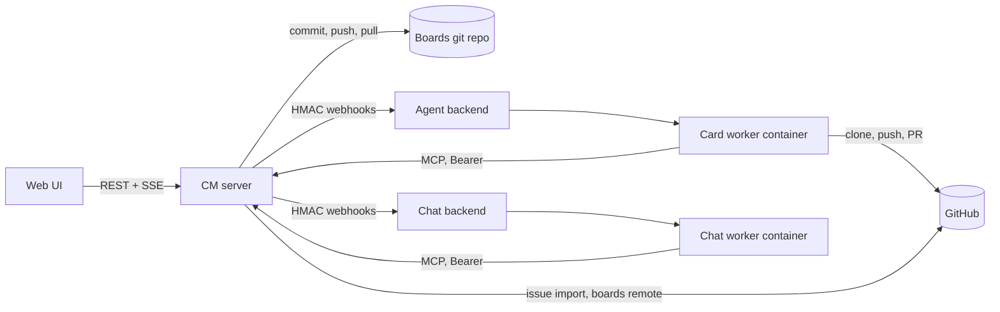
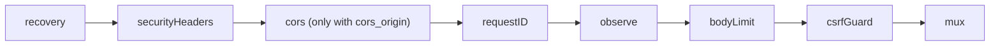
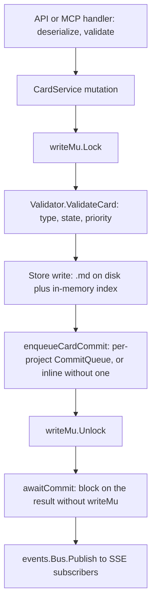

# Architecture

ContextMatrix (CM) is a coordination layer: one Go binary serving a REST API,
an MCP server and an embedded web UI over a boards git repository of markdown
cards. It never clones or builds project code. The agent and chat backends do
that in worker containers and report back over MCP and HMAC-signed webhooks.



Related docs: [data model](data-model.md),
[remote execution](remote-execution.md),
[authentication](authentication.md), [shared boards](shared-boards.md),
[configuration](configuration.md), [API reference](api-reference.md).

## Trust model

Two postures, chosen by `auth.mode` (`AuthConfig` in
`internal/config/config.go`; env `CONTEXTMATRIX_AUTH_MODE`). **`multi` is the
default** when unset (`applyAuthDefaults`); `none` is single-tenant,
zero-login CM. The router switch is a nil vs non-nil `*auth.Service`:
`RouterConfig.AuthService == nil` skips every auth route, the session guard
and the admin routes, leaving the router identical to single-user CM
(`internal/api/router.go` calls this "the auth.mode 'none' guarantee").

### `auth.mode: none`

Single-tenant and unauthenticated by design: no accounts, logins, sessions or
per-user permissions. Deployment assumes loopback or a trusted-network ACL
(firewall, NetworkPolicy, mesh rule), the same posture as the admin listener.

- **Identity is not authentication.** `X-Agent-ID` tags writes for audit:
  boards commit author, activity-log entries, `assigned_agent`. Treat it like
  `git config user.name` on a personal machine: useful for blame, trivial to
  spoof, and fine because there is no permission gradient to escalate into.
- **Per-browser identity.** `web/src/hooks/useAgentId.ts` mints
  `human:web-<8 hex>` on first visit, keeps it in localStorage and sends it
  on every request. `useIdentity` uses this hook only in none mode. There is
  no username prompt: nothing exists to authenticate against. Per-browser
  uniqueness exists only so two tabs cannot release each other's claims.
- **Marker fallbacks.** The human-only backend-control handlers
  (`internal/api/backend_control.go`) fall back to `human:api`;
  `agentIDForChat` (`internal/api/chats.go`) and the playbook handlers fall
  back to `human:web` when no `X-Agent-ID` arrives. In multi mode these are
  unreachable: the session guard rejects sessionless requests first.
- **Identity gates are workflow contracts, not access control:**
  - Claim, heartbeat and release require `X-Agent-ID` to match
    `assigned_agent`. This stops accidental clobbering, not a caller who
    sends the matching value.
  - Human-only MCP tools (`promote_to_autonomous`) require `agent_id` to
    start with `human:`. `human:anything` passes; the gate says "this is part
    of the human workflow". True in multi mode too: MCP has no session
    concept.
  - `PromoteToAutonomous` and its REST handler use the same prefix check; the
    `human:api` fallback keeps direct API calls working in none mode.
  - The `autonomous` flag is the narrower exception: MCP `update_card` lets
    any agent set or clear it, while REST keeps it human-only. Writing it
    never triggers or converts a running worker.

### `auth.mode: multi`

Adds login, sessions and an admin role. Users, sessions, one-time tokens and
the GitHub credential pool live in `auth.db` (`internal/authstore`). On first
start with zero users `main.go` issues a bootstrap token and logs its
redemption path; opening it creates the first admin.

**Session guard.** `sessionGuard` (`internal/api/auth.go`) runs on every
request and rejects any without a valid session unless `sessionExempt`:
`/healthz`, `/readyz`, `/mcp`, `/api/auth/*`, `/api/app/config` (slim payload
pre-login), the HMAC-signed callback prefixes `/api/agent/*`, `/api/chat/*`,
`/api/v1/*`, and the Bearer-authed `/api/worker/*` prefix, with
`/api/worker/logs` and `/api/backend/health` carved back out because they are
browser-facing. Reads need a session exactly like writes.

**Sessions.** Passwords are argon2id hashes with parameters embedded in the
PHC string (`internal/auth/password.go`). A session token is random; only its
SHA-256 is stored (`internal/auth/token.go`), so a stolen `auth.db` yields no
session. The `cm_session` cookie is `HttpOnly` + `SameSite=Lax`, and `Secure`
when the request arrived over TLS directly or via `X-Forwarded-Proto: https`
(`requestIsTLS`). A session idle past 5 minutes gets a sliding renewal to
`now + session_idle_ttl` (default `720h`). Cookies and bootstrap, invite and
reset links are bearer secrets, so multi mode expects TLS termination in
front; CM does not enforce it.

**Identity is session-derived and authoritative.** `withSessionIdentity`
stamps `human:<username>` into the context; `extractAgentID`
(`internal/api/agents.go`) reads it first and falls back to the header only
without a session. This upgrades the claim-ownership check from a courtesy
into real enforcement.

**Admin role.** `requireAdmin` (`internal/api/admin.go`) returns 403
`FORBIDDEN` for a non-admin and gates: user management
(`/api/admin/users*`, invite regeneration), the credential pool
(`/api/admin/credentials*`), admin chat management (`/api/admin/chats*`),
the model-outcomes and model-blacklist admin endpoints, and project
management (`POST`/`PUT`/`DELETE /api/projects*`,
`POST /api/projects/{project}/recalculate-costs`; see `authEnabled` in
`internal/api/projects.go`). Card work needs only a session. The store
refuses to demote or disable the last active admin (`ErrLastAdmin`) as a
guarded atomic update, not a check-then-write.

**Chats are per-user.** Each session carries `created_by`. `GET /api/chats`
lists only the caller's sessions; every per-ID endpoint returns the same 404
`CHAT_NOT_FOUND` for foreign and nonexistent IDs. Admins manage chats via
`/api/admin/chats*` (list, force-end, delete; no transcript routes). None mode
keeps chats unscoped.

**Credential pool.** Admins register named GitHub App or PAT credentials;
each secret is AES-256-GCM encrypted (`internal/auth/crypto.go`) under a key
HKDF-derived from the master key (`internal/auth/masterkey.go`;
`master_key_file` is auto-generated 0600 with a log warning to move it into
secret management). `.board.yaml` `github_credential` binds a project to one
entry; `TokenProviderFor` (`internal/auth/credentials.go`) resolves it into a
cached `githubauth.TokenGenerator` scoping that project's GitHub operations:
issue import (`cmd/contextmatrix/main.go`), branch listing
(`internal/api/branches.go`) and the git token minted for a run's worker
(`internal/api/backend_run.go`). Boards-repo git always uses the instance
provider (`cmd/contextmatrix/wire_repos.go`). `newProviderForProject`
(`cmd/contextmatrix/provider.go`) fails closed on a broken binding and never
substitutes the instance credential. Unbound projects use the instance-wide
`githubauth` provider, as in none mode.

**Operator CLI** (`cmd/contextmatrix/authcli.go`, multi mode only). Host
access to run the binary against the server's config is root trust. Both
commands load config like the server (`--config`, else XDG discovery) and open
`auth.db` directly:

- `contextmatrix auth reset-admin <username>` prints a one-time 48-hour
  password-reset link for an existing, enabled admin.
- `contextmatrix auth rotate-master-key` re-encrypts the whole pool under a
  fresh key inside one transaction: the new key is staged at `<path>.new`,
  installed over `<path>` after commit, and the old key is kept at
  `<path>.bak` for reference only (restoring it does not roll back). Restart
  the server afterward. `SetCredentialKey` wires the key once at startup, so
  a live server keeps encrypting under the old key, and `CreateCredential` /
  `RotateCredentialSecret` only ever encrypt, so a pool write between the
  rotation and the restart succeeds now and fails to decrypt later. Safest
  is to stop the server first.

### Constant across both modes

| Channel                                  | Auth                                                                                                                                                                                                                                                                                                  |
| ---------------------------------------- | ----------------------------------------------------------------------------------------------------------------------------------------------------------------------------------------------------------------------------------------------------------------------------------------------------- |
| `/mcp`                                   | Bearer `mcp_api_key`. Optional on loopback; set it whenever `/mcp` is reachable over a network.                                                                                                                                                                                                       |
| Backend webhooks                         | Per-backend HMAC secret; the backends run on other hosts.                                                                                                                                                                                                                                             |
| Mob guest endpoints (`mob.guests`)       | Config-file-only registry, operator-trusted like `llm_endpoint`; no UI or API management. Tokens ship to the agent backend inside the trigger payload, staged into the per-run secrets file and redacted from logs. The moderator dials out; nothing listens inbound. `GET /api/app/config` exposes names only. |
| `/healthz`, `/readyz`                    | Open.                                                                                                                                                                                                                                                                                                 |
| Admin listener (`admin_port`)            | pprof + `/metrics`, bound to `admin_bind_addr` (default loopback).                                                                                                                                                                                                                                    |
| CSRF gate (`csrfGuard`)                  | Unconditional: state-changing requests need `X-Requested-With: contextmatrix`.                                                                                                                                                                                                                        |
| GitHub auth (`contextmatrix-githubauth`) | Real auth against an external system in every mode; never weaken.                                                                                                                                                                                                                                     |

**MCP project tools are not admin-gated in either mode, by design.**
`create_project`, `update_project` and `delete_project`
(`internal/mcp/tools_projects.go`) call `CardService` directly. MCP has no
role concept; the Bearer key is its only gate, uniform across every tool. This
is safe because `updateProjectToolInput` has no `github_credential` field, so
MCP cannot touch credential bindings. REST `PUT /api/projects/{project}` does
accept it and is admin-gated in multi mode.

"UI = human" holds in both modes: a convention behind the CSRF gate in none
mode, a proof in multi mode.

### Reviewing auth code

- **none mode:** "missing `X-Agent-ID`" or "`human:web` is spoofable"
  findings are out of scope. A publicly exposed CM without a network gate is
  an ops concern, not a code fix.
- **multi mode:** a handler reached without a session is a `sessionGuard`
  bug. A new user, credential or project route without `requireAdmin` is a
  finding; `requireAdmin` on a card-scoped route is over-gating.
- Do not propose admin-gating the MCP project tools or backing the `human:`
  gates with sessions without changing the trust model first.
- Do not propose username prompts, OAuth or permissions for none mode; that
  is what multi mode is for.
- `assignee` is informational, never a permission boundary: it gates nothing,
  MCP cannot write it, and its REST `HUMAN_ONLY_FIELD` gate forks like every
  other identity check.
- Review `githubauth` token handling strictly.

## Data flow

Every request walks the middleware chain in `internal/api/router.go`:



| Middleware        | Role                                                                                                                                         |
| ----------------- | -------------------------------------------------------------------------------------------------------------------------------------------- |
| `recovery`        | Catches panics, returns 500.                                                                                                                 |
| `securityHeaders` | Static security headers and CSP.                                                                                                             |
| `cors`            | CORS preamble; registered only when `cors_origin` is set.                                                                                    |
| `requestID`       | Mints or accepts `X-Request-ID`; stores a request-scoped `*slog.Logger` via `ctxlog.WithRequestID`.                                          |
| `observe`         | RED metrics plus the per-request log line.                                                                                                   |
| `bodyLimit`       | 5 MB cap; `bodyLimitOverrides` raises `POST /api/images` to 11 MB (10 MiB image plus multipart headroom).                                    |
| `csrfGuard`       | Rejects state-changing requests without `X-Requested-With: contextmatrix`. Exempt: GET/HEAD/OPTIONS, `/healthz`, `/readyz`, `/api/agent/*`, `/api/chat/*`, `/mcp`. |

Card mutations follow one pipeline through the service layer:



The MCP server calls `CardService` methods, never the store or git layer. The
`/mcp` handler sits on the same inner `http.ServeMux` as the REST API, so it
shares every middleware above plus an inner stack: `mcpAuthMiddleware` ->
`clearWriteDeadlineForStreaming` -> `chatSessionHeaderMiddleware` ->
`mcpRequestInfoMiddleware` -> SDK handler.

## Async-commit consistency

Mutations are eager-write, async-commit:

1. `store.Update*` writes cache and disk under `writeMu`.
2. The commit is enqueued on `gitops.CommitQueue` (or run inline without a
   queue) and awaited after `writeMu` is released, so slow go-git work never
   blocks other writers.

`CommitQueue` runs one worker goroutine per project: same-project commits
run in enqueue order, different projects commit in parallel. Workers spawn
lazily and, with `WithIdleTimeout`, tear down after an idle window
(`wire_repos.go` uses 30 minutes). `Pause` / `Resume` / `AwaitIdle` let the
syncer drain in-flight commits before a shell rebase or push;
`CardService.LockWrites` calls them in sequence.

Cache and disk can therefore run ahead of git until the commit lands. On
failure the service layer closes the gap:

- **Commit success:** cache, disk and git converge.
- **Commit failure:** every card mutation (`applyCardMutation`,
  `TransitionTo`, `DeleteCard`, `AddLogEntry`, claim, release, force-release,
  stall, worker status, push, parked, review attempts, promote, usage and
  cost recalculation) snapshots the pre-mutation card via `store.GetCard`
  (a deep copy) and reapplies it after a failed commit. The caller gets
  `git commit: <err>`.
- **Rollback failure (rare):** cache and disk diverge. A `slog.Error` with
  `committed=false`, `rollback_failed=true`, the card ID and both errors is
  emitted; the returned error joins the commit error (wrapped "rollback
  failed, state inconsistent") with the rollback error;
  `contextmatrix_rollback_failures_total` increments. Page on any non-zero
  rate: reconcile by hand from the log line or the git HEAD copy.
- **Heartbeats never roll back.** A failed heartbeat commit is self-healing:
  the next heartbeat commits again.
- **Parent auto-transitions never roll back.** They are fire-and-forget from
  the child write path (`maybeTransitionParent` ->
  `transitionParentDirect`); a failed commit increments
  `contextmatrix_parent_autotransition_errors_total` and logs a Warn, and the
  next parent mutation re-commits.

## Component responsibilities

| Package             | Main types                                           | Role                                                                                                                                                                   |
| ------------------- | ---------------------------------------------------- | ---------------------------------------------------------------------------------------------------------------------------------------------------------------------- |
| `board`             | `Card`, `ProjectConfig`, `Playbook`, `Validator`     | Domain types, pure validation, transition rules, self-containment lint, body sections.                                                                                 |
| `storage`           | `Store`, `FilesystemStore`, `Composite`              | Reads and writes `.md` files and `.board.yaml`; in-memory index; `Composite` routes by project across boards repos. No git, events or locking.                          |
| `gitops`            | `Manager`, `CommitQueue`                             | Stage, commit, push, pull via go-git (shell for merges); per-project commit workers. No knowledge of cards.                                                              |
| `gitsync`           | `Syncer`, `Group`                                    | Background pull and push per boards repo; shared-repo merge cycles; `Group` fronts all syncers for `/api/sync`.                                                          |
| `boardmerge`        | `Resolve`, rule constants                            | Pure three-way merge rules for shared boards repos.                                                                                                                    |
| `lock`              | `Manager`                                            | Claim, release, heartbeat and stall enumeration; shared-board leases and fences. Reads cards, returns modified data, never writes.                                        |
| `service`           | `CardService`, `PlaybookService`                     | The only orchestrators: validate -> store write -> commit -> event. Runs the stall checker, deferred-commit flushes, usage pricing, dashboards.                          |
| `api`               | handlers, middleware                                 | Thin HTTP layer: deserialize -> `CardService` -> serialize. SSE endpoints, CSRF gate, session guard, admin gate.                                                          |
| `mcp`               | `NewServer`, tools, prompts                          | MCP over Streamable HTTP on `/mcp` (`POST`, `GET`, `DELETE`); tools call `CardService`; prompts serve `workflow-skills/`.                                                |
| `backend`           | client, reconcile, `sessionlog.Manager`              | Task-backend webhook client, reconcile sweep, end-session subscriber, HMAC signature cache, per-card session-log buffer and fan-out hub.                                 |
| `chat`              | `Manager`, `Store`, `SSEHub`, `IdleReaper`, `transcript` | Global chat sessions: lifecycle, transcript persistence, per-session SSE, cost accumulation, cold-reopen resume payloads.                                            |
| `opstore`           | `sqlite.Store`                                       | `ops.db`: chat sessions and messages, cost archive, model blacklist, Best-of-N outcomes. Schema is `CREATE TABLE IF NOT EXISTS` with no migration ledger.               |
| `images`            | `Store`, `Layered`, `RepoIndex`, `Process`           | Content-hashed image store: `images.db` plus `<project>/images/` files in shared repos.                                                                                 |
| `modelcatalog`      | `Builder`                                            | Fetches and rates model candidates (Artificial Analysis joined with OpenRouter or an OpenAI-compatible endpoint); 6h TTL, last-good fallback. See [model selection](model-selection.md). |
| `auth`, `authstore` | `Service`, `Store`                                   | Multi-mode auth: argon2id, sessions, one-time tokens (48h TTL), credential-pool crypto, master key; `auth.db` tables `users`, `sessions`, `one_time_tokens`, `credentials`. |
| `github`            | `client.go`, `parse.go`, `syncer.go`                 | GitHub REST client for issue import and branch listing, issue-to-card mapping, per-project import loop driven by `github.import_issues`. Auth via `githubauth`; never reads tokens itself. |
| `events`            | `Bus`                                                | In-process pub/sub. A slow subscriber drops events instead of blocking the publisher; drops count in `contextmatrix_eventbus_dropped_total`.                              |
| `clock`             | `Clock`                                              | Injectable time. `lock.Manager`, `CardService` and `chat.Manager` share one clock so a single fake drives every time-sensitive path; the service adopts the lock manager's clock. |
| `config`            | typed loader                                         | YAML config with `CONTEXTMATRIX_*` env overrides; `config.yaml.example` is the reference. See [configuration](configuration.md).                                          |
| `ctxlog`            | `WithRequestID`, `Logger`, `WithMCPCall`             | Request-scoped logger carrying `request_id`; `mcpRequestInfoMiddleware` adds `mcp_method` / `mcp_tool` for `/mcp` requests. Background goroutines fall back to `slog.Default()`. |
| `metrics`           | metric vars, `Register`                              | All Prometheus metrics, registered once in `main.go`, served on the admin listener only.                                                                                 |

### CardService

Every mutation follows validate -> store write -> commit -> event publish. The
heartbeat timeout checker lives here rather than in `lock` because it
coordinates store, git and events; it also reaps abandoned parents (see
[data model](data-model.md)). `CardService` satisfies `chat.Pricer`
(`PriceTokens`), so chat cost frames use the same cache-tier formula as
card-scoped `report_usage`, and holds a `chatCostSummarizer`
(`SetChatCostSummarizer`) that `GetDashboard` calls to append server-wide
chat-cost aggregates.

### PlaybookService

Mirrors `CardService` (store, git, events, clock) but is scoped to the global
`playbooks` partition of each repo. A service-level write mutex serializes
mutations (the store's `RWMutex` protects the index, not a read-modify-write
cycle). Commits ride the same `CommitQueue` under the reserved partition key
`playbooks`, so they get their own serialized worker, and the `onCommit`
callback pushes them like card commits. `LockWrites` / `UnlockWrites` let the
syncer quiesce playbook writes during a pull.

### chat.Manager

Orchestrates project-agnostic chat sessions that share the worker image with
card runs but use long-lived containers. Owns the lifecycle (`cold` ->
`active` -> `warm-idle` -> `ending`), persists transcripts through
`chat.Store`, and delegates containers to `chat.Backend` (HMAC-signed
`/chat/start` and `/chat/end`; the sole implementation is `NewBackendClient`).
The backend's `/logs?session_id=` SSE feed is bridged into the transcript via
`AppendMessage`, which holds `m.mu` across seq assignment and insert so disk
order matches seq order.

- **Rehydration.** On cold reopen `chat/transcript.Build` produces the resume
  payload: it drops `rehydration_phase` rows and non-conversation roles, pins
  the first user turn and the last 20 turns, and truncates the middle to
  `chat.resume_budget_tokens` (default 40000). While `RehydrationActive` is
  set, incoming entries are stamped `rehydration_phase=TRUE`; the
  `chat_rehydration_complete` MCP tool clears the flag and persists the
  agent's summary as the first visible message. That tool is gated by the
  caller's `CM_CHAT_SESSION` (forwarded as `X-CM-Chat-Session`), so a
  container can only flip its own session.
- **Cost accumulation.** Each `usage` frame carries per-turn token counts
  (one `message.usage` block per assistant turn, not cumulative totals).
  `handleUsageEntry` prices them through `chat.Pricer` and persists via
  `Store.IncrementSessionCost`, a single atomic `UPDATE ... RETURNING`. On
  success a `session_updated` event carries the running totals
  (`prompt_tokens`, `completion_tokens`, `cache_read_tokens`,
  `cache_creation_tokens`, `estimated_cost_usd`); on persist error nothing is
  published. `GetChatCostSummary` aggregates a 30-day UTC window and caches
  it for 30 seconds (`chatCostCacheTTL`) so the All Projects view's
  per-project dashboard fan-out does not amplify SQL.
- **SSEHub.** One `sessionHub` per session with a 128-event ring buffer,
  replayed on `Subscribe(sinceSeq)` so reconnects inside the window are
  gapless; `DeleteSession` drops the hub. Two event kinds: `message` (a
  transcript row) and `session_updated` (metadata: `context_tokens`,
  `rehydration_active`, model, `status` as a pointer so `omitempty` separates
  "no change" from a transition, and the five cost fields).
  `publishSessionUpdate` fans out in a goroutine so lock holders cannot
  deadlock. `status` is emitted by `OpenSession` (cold or warm-idle ->
  active), the `OnSubscribe` callback (warm-idle -> active), `MarkWarmIdle`
  and `EndSession` (any -> cold).
- **Store.** `opstore/sqlite.Store` in WAL mode with `MaxOpenConns=5`, so
  readers bypass the single-writer gate that `chat.Manager.mu` enforces above
  the pool. The unique index on `(session_id, seq)` backs the in-memory seq
  cache. `DeleteSession` archives cost columns to `chat_cost_archive` before
  the hard delete, and `AggregateCost` unions both tables.
- **IdleReaper.** Periodically ends `warm-idle` sessions older than the idle
  TTL and sweeps sessions stuck in rehydration past the rehydration timeout.

### Session log manager

`backend/sessionlog.Manager` keeps one authenticated upstream connection to
the backend per active card, tees events into a bounded ring buffer, and
replays the snapshot to each new subscriber before tailing live events.
Started by `CardService.UpdateWorkerStatus` on `running`, stopped on terminal
statuses. `GET /api/worker/logs` has a card-scoped mode and a project-scoped
mode that fans out every card's events. See
[remote execution](remote-execution.md#log-streaming-architecture).

### images

IDs are `sha256(processed bytes)[:16]`, so identical uploads dedupe and URLs
are stable. `Process` caps input at 10 MiB, accepts PNG, JPEG, single-frame
GIF and WebP, resizes to fit 1024x768 (CatmullRom), re-encodes as PNG or JPEG
(GIF and WebP become PNG, EXIF is dropped), and rejects animated GIFs and
other MIME types. `Layered` reads from every shared repo's `RepoIndex` first
(`<project>/images/<id>.png|.jpg`, MIME from the extension, bytes verified
against the id on every read) and from `images.db` second. An upload naming a
project in a shared repo is written into that repo through
`CardService.WriteRepoImages` (under the service write lock, one commit per
upload on the repo's queue, pushed by the next sync); every other upload goes
to `images.db`. `Syncer.SetImages` rebuilds a repo's index after every pull.
Wired into `POST /api/images`, `GET /api/images/{id}` and the inline image
attachments on the `get_card` / `get_task_context` MCP tools.

### gitsync Syncer

One syncer per boards repo with a remote; `gitsync.Group` fronts them for
`/api/sync`. It pulls when `git_auto_pull` is on and pushes after each
successful commit when `git_auto_push` is on, coordinating with the service
through `LockWrites` / `UnlockWrites` and with the commit queue through
`Pause` / `Resume` / `AwaitIdle` so a rebase never races an in-flight commit.
A cycle takes the global playbook lock, then the service write mutex, then
drains only its own repo's queue; another repo's commits never wait. Lock
order is load-bearing: a playbook mutation holds its mutex while awaiting a
queued commit, and `CardService.LockWrites` pauses that queue, so taking the
card lock first would deadlock. Playbook mutations never take the card mutex,
so the reverse order is safe.

With `boards.shared: true` the syncer never rebases. Each cycle (`Synced`)
aborts any merge an earlier cycle left behind, commits dirty files as
`external edit`, fetches, fast-forwards or merges, hands unmerged paths to
`boardmerge`, commits, reloads the index, and pushes when ahead, retrying up
to 5 attempts on a non-fast-forward rejection with backoff and 25% jitter. A
failure after a merge started aborts it, so every cycle ends on a clean
tree. The periodic tick is jittered by 25% and also pushes, so an unpushed
commit never waits for the next local write. Push-verified mutations (card
create, claim, force-release, project create, update and delete, playbook
create, foreign stall) run as a cycle body through `SyncedMutation`: applied
once after the merge under both locks, pushed with the cycle, and undone
under the same locks if the push never lands. After a successful cycle
`SyncSucceeded` confirms the leases this instance holds; after every reload
`ObserveLeases` records other instances' leases, both keyed by repo name.
Claims a pull took away are published as `claim.lost`.

### Metrics

All metrics are declared in `internal/metrics/metrics.go` and served at
`GET /metrics` on the admin listener only. `observe` records per-route RED
metrics; unmatched routes collapse to `path="unmatched"`, and SSE endpoints
are excluded from the latency histogram. Alert-worthy counters:
`contextmatrix_rollback_failures_total`,
`contextmatrix_parent_autotransition_errors_total`,
`contextmatrix_report_usage_unknown_model_total` (labeled by model; a
`report_usage` for a model absent from the rate table),
`contextmatrix_chat_usage_unknown_model_total`, and
`contextmatrix_chat_cost_summary_errors_total`.

## Git repository scope

The boards directory is a git repository separate from the source tree.
`gitops.Manager` operates on each configured `dir`; paths passed to
`CommitFile` / `CommitFiles` are relative to it (for example
`project-alpha/tasks/ALPHA-001.md`). A missing or non-git boards directory
is created and initialised on startup.

`boards` in `config.yaml` is a mapping (one repo, named `boards`) or a list
of named entries, each with its own `dir`, remote, sync flags and `shared`
setting. Every `dir` must be outside the source tree and outside every other
boards dir; equal dirs refuse startup. `storage.Composite` presents every
repo as one `storage.Store` and routes by project name: names are unique
across repos, the earliest configured repo holding a name owns it, a
duplicate at startup is fatal, and a duplicate arriving through a pull is
hidden (on disk, syncing, not served) and reported in that repo's sync
status. Each repo has its own `gitops.Manager`, commit queue, `lock.Manager`
(private repos carry an empty instance ID, so they keep agent-ID ownership
next to a shared repo), playbook store and syncer. `boards_repo` on project
and playbook creation picks the repo, defaulting to the first entry.

**Shared repos.** Several instances may share one boards repo through its
remote (`boards.shared: true`). Each instance commits as
`ContextMatrix <contextmatrix@<instance.id>>`. Conflicts are resolved by
`internal/boardmerge` with card-aware three-way rules: terminal state
absorbs, later `updated` breaks scalar ties, usage is additive, lists are set
unions, activity logs union, delete wins, and on an add/add the remote keeps
the ID and the local card is re-minted. Field, state, body, re-mint and
invariant overrides write a `merge` activity entry on the surviving card;
every resolution appears under `resolutions` in `GET /api/sync`. Claims on a
shared board are owned by `(assigned_agent, claimed_via)` plus a
`claim_epoch` fence, with leases and fencing described in the
[data model](data-model.md) and [shared boards](shared-boards.md).

**Images in shared repos** are files at `<project>/images/<id>.png|.jpg`
(`boardmerge` takes theirs on an add/add, which is identical bytes by
construction). On every start, after the startup pull, each shared repo
receives every image its card bodies reference that this instance still holds
only in `images.db`, one commit per project. An image pasted into a private
card and copied by hand into a shared card is a dead link on other instances
until the holding instance restarts. Deleting a project removes its directory
and the images in it; nothing else collects orphans.

Every instance on a shared repo must run a version with shared-board support:
an older version drops the ownership fields whenever it rewrites a card,
handing the claim back to the agent ID alone and losing the epoch a merge
decides by.

## File layout

Source packages are listed in the component table above; `web/` is the React
frontend embedded via `web/embed.go`, and `workflow-skills/` holds the skill
markdown served as MCP prompts.

Boards repo:

```text
project-alpha/
  .board.yaml
  templates/
    task.md
    bug.md
    feature.md
  tasks/
    ALPHA-001.md
    ALPHA-002.md
  images/                       # shared repos only: <id>.png / <id>.jpg
    aabbccddeeff0011.png
project-beta/
  .board.yaml
  templates/
  tasks/
playbooks/
  alpha-rollout.yaml
  beta-launch.yaml
```

`playbooks/` is a reserved top-level directory, not a project:
`board.DiscoverProjects` skips any directory without a `.board.yaml`, and
`CreateProject` rejects the name `playbooks` (case-insensitive). If a repo
contains `playbooks/.board.yaml` (a project literally named `playbooks`), the
playbook subsystem is disabled for the whole server with a logged error
naming the repo and the rename migration, and everything else starts
normally.
