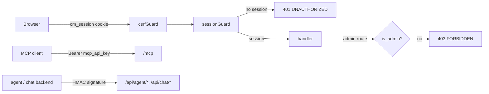

# Authentication

ContextMatrix has two authentication postures selected by `auth.mode`:
`multi` (the default) requires a login for the whole API and adds an admin
flag, invite links, and a GitHub credential pool; `none` runs single-tenant
with no accounts at all. This page covers what each mode does on the wire and
how to operate it. The security reasoning behind the split lives in
[Trust model](architecture.md#trust-model) and is not repeated here.

## Modes

| `auth.mode`       | Who can call the API                  | Identity on writes                                                     | Stores                                 |
| ----------------- | ------------------------------------- | ---------------------------------------------------------------------- | -------------------------------------- |
| `multi` (default) | Logged-in users, reads and writes     | `human:<username>` from the session; `X-Agent-ID` ignored when a session exists | `auth.db`: users, sessions, one-time tokens, credential pool |
| `none`            | Anyone who can reach the port         | `X-Agent-ID` header, an audit tag rather than a credential            | `auth.db` not opened                   |

Env: `CONTEXTMATRIX_AUTH_MODE`. In `none` mode the `/api/auth/*` and
`/api/admin/*` routes are not registered (404, not 401) and the web UI mints
a per-browser `human:web-<8 hex>` identity instead of asking for a name.



## First start: bootstrap link

On every start with zero users the server logs a one-time link:

```
auth: no users exist yet - create the first admin account by opening:
auth: bootstrap link path=/auth/token/<token>
auth: (prefix with this server's URL; the link is valid for 48h)
```

Open `<server-url>/auth/token/<token>` in a browser. The page asks for a
username, display name and password, creates the account as admin, and logs
it in. Rules:

- Valid 48 hours, single use. A restart with zero users mints another link;
  every unexpired link works until the first account exists, because
  redemption re-checks that no users exist.
- Usernames are lowercased and trimmed: 1-32 chars of `a-z 0-9 . _ -`,
  starting and ending alphanumeric.
- Passwords are at least 10 characters. The form is validated before the
  token is consumed, so a rejected form does not burn the link.

## Invites and password resets

Accounts are invite-only. No admin ever sets or sees another user's password.

- **Create** - the user chip menu in the sidebar, ADMIN, Users. Creating an
  account (username, display name, admin flag) returns a one-time invite link
  `/auth/token/<token>` in a copy dialog. The user opens it, sets a password,
  and is logged in.
- **Regenerate link** - on a user row. Issues an invite when the user has
  never set a password, otherwise a password reset. Earlier unused links of
  the same purpose are invalidated. Redeeming a reset kills every existing
  session for that account.
- **Disable** - kills the user's sessions and blocks login and link
  redemption. The last active admin cannot be disabled or demoted.
- **Self-service** - a logged-in user changes their password with the
  current one; their other sessions are terminated.

Links expire after 48 hours and can be used once. An unknown token answers
404, a spent or expired one 410.

Sessions: cookie `cm_session` (`HttpOnly`, `SameSite=Lax`, `Secure` over TLS
or `X-Forwarded-Proto: https`), sliding lifetime `auth.session_idle_ttl`
(default 720h), only the SHA-256 hash stored server-side. Failed logins are
rate-limited per account and IP: three free failures, then a block that
doubles from one second up to five minutes. Wire details in
[API reference](api-reference.md#authentication-multi-mode).

## Roles

One flat team plus an `is_admin` flag. Every logged-in user gets the full
board: all projects, cards, claims, chat, and run triggers. The admin flag
gates only:

| Surface              | Routes                                                                                   |
| -------------------- | ---------------------------------------------------------------------------------------- |
| User management      | `GET`/`POST /api/admin/users`, `PATCH /api/admin/users/{username}`, invite regeneration  |
| Credential pool      | `GET`/`POST /api/admin/credentials`, `PUT`/`DELETE /api/admin/credentials/{name}`        |
| Project management   | `POST`/`PUT`/`DELETE /api/projects*`, `POST /api/projects/{project}/recalculate-costs`   |
| Chat administration  | `GET /api/admin/chats`, `POST /api/admin/chats/{id}/end`, `DELETE /api/admin/chats/{id}` |
| Model selection admin | `/api/admin/model-outcomes`, `/api/admin/model-blacklist`, `GET /api/backends/{backend}/images` |

The UI mirrors this: the ADMIN section of the user menu (Users, Credentials,
Chats, Model selection) and the project settings form appear for admins only.

## Private chats

Chat sessions belong to their creator. `GET /api/chats` lists only the
caller's sessions, and every per-id chat endpoint answers 404 for a foreign
id. Admins get a metadata-only view (ADMIN, Chats) that lists every session
and can end or delete one; there is no transcript access. In `none` mode
chats are unscoped.

## GitHub credential pool and per-project binding

Admins register named GitHub credentials under ADMIN, Credentials:

| Field                        | Meaning                                                              |
| ---------------------------- | -------------------------------------------------------------------- |
| `name`                       | 1-64 chars `a-z 0-9 . _ -`; referenced by projects                   |
| `kind`                       | `pat` or `app`                                                       |
| `secret`                     | The PAT, or the App's PEM private key                                |
| `app_id`, `installation_id`  | `app` only                                                           |
| `host`, `api_base_url`       | GitHub Enterprise; empty means github.com                            |

Every save is validated live: an App mints an installation token, a PAT
probes `/rate_limit`. A credential that fails is not stored. Secrets are
encrypted with AES-256-GCM under a key derived from `auth.master_key_file`
and never returned by the API. A PUT rotates the secret, edits metadata, or
toggles `disabled`.

Binding: the project settings form (admins) writes `github_credential:
<name>` into the project's `.board.yaml`. Issue import, branch listing, and
the git token minted for a worker run then use that entry. A binding that
does not resolve fails closed: the run is rejected and the sync cycle skips
the project, never falling back to the instance credential. Unbound projects
use the instance-wide `github.*` credential, exactly as in `none` mode, where
`github_credential` is rejected.

## Operator escape hatches

Both run on the host against the same config file the server uses (`--config
PATH`, else XDG discovery) and require `auth.mode: multi`.

| Command                                                      | Effect                                                                                     |
| ------------------------------------------------------------ | ------------------------------------------------------------------------------------------ |
| `contextmatrix auth reset-admin [--config PATH] <username>`  | Prints a 48-hour one-time reset link for an existing, enabled admin. Refuses non-admins and disabled users |
| `contextmatrix auth rotate-master-key [--config PATH]`       | Generates a new key, re-encrypts every pool entry in one transaction, installs it at `master_key_file`, keeps the old key at `<path>.bak` |

Flags go before the username. After a rotation restart the server: the
running process keeps the old key in memory, so do not create or rotate pool
credentials through the live server in between. `<path>.bak` is reference
only and does not roll the rotation back. If the command reports a leftover
`<path>.new`, move it into place as instructed before retrying.

## What machines use in each mode

| Channel                                                        | `multi`                              | `none`                               |
| -------------------------------------------------------------- | ------------------------------------ | ------------------------------------ |
| MCP `/mcp`                                                     | `Authorization: Bearer <mcp_api_key>` | same                                 |
| Backend callbacks `/api/agent/*`, `/api/chat/*`, `/api/v1/*`   | HMAC-SHA256 with the backend `api_key` | same                                 |
| Worker `GET /api/worker/git-credentials`                       | Per-session bearer token             | same                                 |
| `/healthz`, `/readyz`                                          | Open                                 | Open                                 |
| Admin listener (`admin_port`: pprof, `/metrics`)               | No auth, loopback bind               | same                                 |
| Card claim, heartbeat, release ownership                       | Session identity, enforced           | Header identity, a courtesy check    |

Agents never log in and MCP has no role concept: the bearer key is the only
gate on every tool, including project management. See
[MCP](mcp.md) and [Remote execution](remote-execution.md).

## Security posture

- Deploy on a trusted network (LAN, VPN, or behind an authenticating proxy).
  Built-in login is defence in depth, not the perimeter.
- ContextMatrix terminates no TLS. Put a reverse proxy in front in every
  deployment; session cookies and one-time links are bearer secrets. Forward
  `X-Forwarded-Proto` so cookies get the `Secure` flag.
- Every `POST`/`PUT`/`PATCH`/`DELETE` needs `X-Requested-With: contextmatrix`
  or is rejected with 403 before authentication runs, in both modes. Exempt:
  `/mcp`, `/api/agent/*`, `/api/chat/*`, `/healthz`, `/readyz`. The proxy
  must preserve the header.
- Set `mcp_api_key` whenever `/mcp` is reachable off-host, and block `/mcp`
  at the ingress when agents sit inside the network.
- Backend `api_key` values are at least 32 characters and never travel on
  the wire; only HMAC signatures do.
- Keep `admin_bind_addr` on loopback; a non-loopback bind logs a warning and
  exposes heap dumps.
- Never expose a `none` instance to the internet without an authenticating
  proxy: whoever reaches the port owns the board.
- Mount a real secret at `auth.master_key_file` in production; the
  auto-generated file logs a warning on creation.

## See also

- [Trust model](architecture.md#trust-model) - what the two modes guarantee
  and what not to flag in review
- [API reference](api-reference.md#authentication-multi-mode) - auth and
  admin endpoints, 401/403 contract
- [Configuration](configuration.md) - the `auth` block, `auth.db`, master key
- [GitHub auth setup](github-auth-setup.md) - the instance-wide `github.*`
  credential
- [Deployment example](deployment-example.md) - ingress, TLS, path blocking
