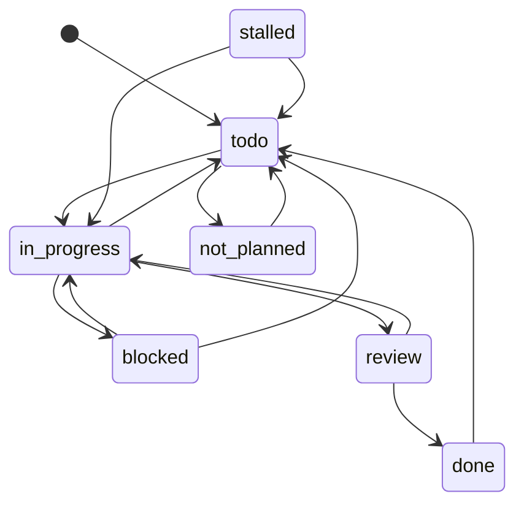

# Boards

A board is one project directory in the boards repository, described by its
`.board.yaml`. This page covers where boards live, the four ways to create one,
every field the config accepts, body templates and the state contract the
server enforces. Validation limits and Go types are in the
[data model](data-model.md#project-board-config-format).

## The boards repository

The boards directory is a git repository of its own, separate from this source
tree and from every code repository it points at. `config.yaml` names it under
`boards` (one repository, or a list of named repositories; see
[configuration](configuration.md)). Every mutation is committed there.

```
<boards repo>/
  my-project/
    .board.yaml        project config
    tasks/             one markdown file per card
    templates/         optional <type>.md body templates
    images/            shared repositories only: pasted images
  playbooks/           reserved top level, see playbooks.md
```

The server discovers every subdirectory holding a `.board.yaml` at startup and
after a sync. A directory whose config fails validation is skipped with a
warning. The name `playbooks` is reserved and refused at creation.

## Creating a project

| Method                        | Notes                                                          |
| ----------------------------- | -------------------------------------------------------------- |
| New Project in the web UI     | Wizard: boards repo, display name, name, prefix, code repo URL |
| `/contextmatrix:init-project` | Claude Code slash command backed by the `init-project` prompt  |
| `POST /api/projects`          | JSON; admin-only in `multi` mode                               |
| By hand                       | `mkdir -p my-project/tasks`, write `.board.yaml`, restart or sync |

The slash command detects the repo URL from `git remote`, shows the defaults
for confirmation and calls the `create_project` MCP tool. The REST body takes
`name` or `display_name`, `prefix` and optionally `repo`, `boards_repo`,
`states`, `types`, `priorities` and `transitions`.

All four produce the same layout. Project names must match
`^[a-zA-Z0-9][a-zA-Z0-9_-]*$`; a display name is slugified into one when no
name is given. With several boards repositories, `boards_repo` chooses one and
the first configured repository is the default.

## `.board.yaml` reference

Every top-level field the server reads. Unknown fields are ignored.

```yaml
name: my-project                   # required; directory name; immutable
display_name: My Project           # optional label shown in the UI
prefix: MYPROJ                     # required; card ids are MYPROJ-001, ...
next_id: 1                         # required, >= 1; the server increments it
repo: https://github.com/org/my-project.git   # single code repo
repos:                             # or several; https only, at most one primary
  - name: api
    url: https://github.com/org/my-project.git
    primary: true
  - url: https://github.com/org/my-project-web.git   # name derived from URL
states: [todo, in_progress, blocked, review, done, stalled, not_planned]
types: [task, bug, feature]        # subtask is built in; do not list it
priorities: [low, medium, high, critical]   # least to most urgent
transitions:                       # allowed moves; a state with no entry is terminal
  todo: [in_progress, not_planned]
  in_progress: [blocked, review, todo]
  blocked: [in_progress, todo]
  review: [done, in_progress]
  done: [todo]
  stalled: [todo, in_progress]
  not_planned: [todo]
default_skills: [go-development]   # task skills every card inherits
github_credential: team-bot        # multi mode only; credential-pool entry name
github:                            # issue import, see github-issue-import.md
  import_issues: true
  owner: org
  repo: my-project
  card_type: bug
  default_priority: medium
  labels: [bug]
remote_execution:                  # per-project worker image overrides
  worker_image: ghcr.io/org/worker:go1.26
  chat_worker_image: ghcr.io/org/chat-worker:go1.26
verify:                            # verify gate every card inherits
  command: make test
  timeout_seconds: 900
  env: [GOFLAGS]
favorites:                         # per-tier model preferences, merged with config.yaml
  complex: [anthropic/claude-opus-4.8]
  critical:
    reviewer: [openai/gpt-5.5]
```

Rules the validator applies on load and on every save:

- `name`, `prefix` and `next_id >= 1` are required.
- `stalled` and `not_planned` must appear in `states` and have a `transitions`
  entry. Every transition target must be a listed state.
- `repos` entries need an `https://` URL, unique names and at most one
  `primary`; the first entry becomes primary when none is marked. A `repo`
  string is shorthand for one primary entry.
- The file is capped at 1 MiB.

Two fields appear in API responses only and are never written to the file:
`boards_repo` (which repository holds the project) and `templates` (loaded
from the `templates/` directory).

## Body templates

`templates/<type>.md` pre-fills the body of a new card of that type. Files are
plain markdown without frontmatter; the filename must equal the type. The
server loads them at startup and on reload, and agents receive them inside the
project config returned by `get_task_context`.

The Create Card form switches templates with the type:

| Body edited? | New type has a template     | New type has none  |
| ------------ | --------------------------- | ------------------ |
| No           | Loaded automatically        | Body cleared       |
| Yes          | Confirm before replacing    | Body left as is    |

## Built-in states

Six state names are part of the contract: the service layer, the MCP tools and
the shipped workflow skills branch on these exact strings.

| State         | Role                                                                     |
| ------------- | ------------------------------------------------------------------------ |
| `todo`        | Claimable. `claim_card` moves the card to `in_progress`                  |
| `in_progress` | Being worked. A parent enters it when its first subtask is claimed       |
| `review`      | Work done, awaiting review. `complete_task` moves parents here           |
| `done`        | Accepted; terminal. `complete_task` moves subtasks here                  |
| `stalled`     | Heartbeat timed out; system-managed. Reachable from every state          |
| `not_planned` | Cancelled; terminal. Clears the claim and flushes deferred commits       |

`stalled` and `not_planned` are validator-enforced. The other four are not
checked but are hardcoded across claim and complete, parent orchestration,
dashboard metrics and every skill, so renaming them silently breaks the
lifecycle. `blocked` is not one of the six: the server attaches no meaning to
it. It is an ordinary configured state that the `execute-task` skill moves a
card into when a dependency, missing information or an external blocker stops
the work, and the default board ships it.

Default board transitions; the server also injects `any state -> stalled`:



## What you can customize

- Add states next to the built-in six (a `qa` step, for example) and route
  them through `transitions`. Project Settings edits the same matrix.
- Restrict transitions: drop `done: [todo]` to make `done` final.
- Define `types` and `priorities` freely. Priority order is least to most
  urgent; the board sorts on it.
- You cannot rename the six built-in states, change their semantics, or add
  `subtask` to `types` (it is assigned automatically when `parent` is set).

## Custom workflow skills

Workflow skills are the lifecycle prompts the MCP server hands to agents. If a
custom state should be driven by them, copy `workflow-skills/` somewhere of
your own, edit the relevant skills and point `workflow_skills_dir` in
`config.yaml` (env `CONTEXTMATRIX_WORKFLOW_SKILLS_DIR`) at the copy.
contextmatrix-setup refreshes the default copy in the config directory when
the upstream skills change. Task skills are a different system; see
[agent workflow](agent-workflow.md).

## See also

- [Data model](data-model.md) - card format, limits, Go types
- [Web UI](web-ui.md) - the New Project wizard and Project Settings
- [Playbooks](playbooks.md) - the reserved `playbooks/` directory
- [Shared boards](shared-boards.md) - several instances on one repository
- [GitHub issue import](github-issue-import.md) - the `github` block
- [Remote execution](remote-execution.md) - `remote_execution` and `verify`
- [Model selection](model-selection.md) - `favorites`
