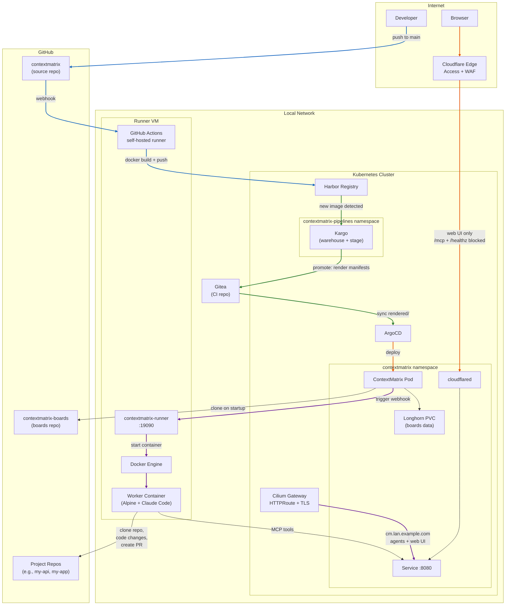

# Deployment Example: ContextMatrix on Kubernetes with Remote Runner

This document describes one way to deploy ContextMatrix — on a home lab
Kubernetes cluster with a remote runner for autonomous agent tasks. It's a
showcase of what a full-featured deployment *could* look like, not a
requirement. ContextMatrix runs just as well as a single binary on your laptop
with `./contextmatrix` and no containers, orchestration, or cloud services
involved.

If you just want to get started, see the Quick Start section in the README.
Everything below is for when you want a persistent, multi-machine setup.

## Architecture Overview



## Components

| Component                | Role                                                                                                                                                                          |
| ------------------------ | ----------------------------------------------------------------------------------------------------------------------------------------------------------------------------- |
| **ContextMatrix**        | Kanban server — REST API, web UI, MCP endpoint. Runs as a single-replica pod in k8s.                                                                                          |
| **contextmatrix-runner** | Webhook receiver on a LAN VM. Spawns disposable Docker containers that run Claude Code autonomously — cloning project repos, making code changes, and creating pull requests. |
| **GitHub Actions**       | CI — builds Docker image on push to main, pushes to Harbor. Uses a self-hosted runner on the LAN (Harbor is not internet-accessible).                                         |
| **Kargo**                | CD — detects new images in Harbor, renders Kustomize manifests, pushes to CI repo.                                                                                            |
| **ArgoCD**               | GitOps — syncs rendered manifests from CI repo to cluster.                                                                                                                    |
| **Cloudflare Tunnel**    | Exposes the web UI to the internet with Cloudflare Access authentication. MCP and health endpoints are blocked at the edge.                                                   |
| **Cilium Gateway**       | LAN ingress with TLS (cert-manager wildcard cert). Agents and local browsers connect here.                                                                                    |
| **Longhorn**             | Persistent storage for the boards git repository.                                                                                                                             |
| **Harbor**               | Private container registry on the LAN.                                                                                                                                        |
| **Gitea**                | LAN git server hosting the CI/CD manifests repo.                                                                                                                              |

## Prerequisites (for this example)

This particular setup uses:

- Kubernetes cluster with ArgoCD, Kargo, cert-manager, Longhorn, and a Gateway
  API implementation (e.g., Cilium)
- Private container registry (e.g., Harbor) accessible from the LAN
- Local git server (e.g., Gitea) for the CI repo
- Cloudflare account with a domain and Zero Trust Access
- A LAN machine (VM or bare metal) with Docker for the runner
- GitHub account (source code + boards repo)
- GitHub App for runner git operations (clone, push, PRs)

None of these are required to use ContextMatrix itself — they're specific to
this deployment pattern.

## How This Example Is Set Up

### 1. Container Image

The repo includes a multi-stage Dockerfile:

- **Stage 1**: Node.js — build the React frontend
- **Stage 2**: Go — build the binary with embedded frontend
- **Stage 3**: Alpine runtime with `git` and `openssh-client`

Skills are baked into the image at build time.

### 2. CI Pipeline (GitHub Actions)

A workflow triggers on push to main:

- Runs on a **self-hosted runner** on the LAN (required when the registry is
  LAN-only)
- Builds the Docker image and tags with the short commit SHA
- Pushes to the private registry

The self-hosted runner is installed on the same VM as the contextmatrix-runner.

### 3. CI/CD Repo (Gitea)

A separate repo on the local git server holds infrastructure manifests:

```
contextmatrix-ci/
├── base/runtime/       # Deployment, Service, PVC, HTTPRoute, ConfigMap
├── stages/production/  # Kustomize overlay (image tag, managed by Kargo)
├── rendered/production/# Kargo output (ArgoCD reads this)
├── kargo/              # Warehouse, Stage, Project
├── cloudflared/        # Tunnel deployment + encrypted token
├── bootstrap/argocd/   # AppProject + Application resources
└── bootstrap.sh        # One-time setup script
```

### 4. Kubernetes Manifests

**Deployment** — single replica with `Recreate` strategy (one writer to the
boards repo):

- Boards data on a Longhorn PVC
- SSH deploy key mounted for boards repo git operations
- All configuration via environment variables (no config file in the container)
- Clone-on-empty: if the PVC is fresh, CM clones the boards repo on startup
- `readOnlyRootFilesystem: true` with emptyDir mounts for `/tmp` and home

**ConfigMap** — for settings that can't be set via env vars (e.g.,
`token_costs`). Mounted at `/config/config.yaml`, passed via `--config` flag.

**PVC** — Longhorn, 1Gi, ReadWriteOnce. The boards git repo lives here.

**HTTPRoute** — routes `cm.lan.example.com` through the Cilium Gateway for LAN
access.

### 5. Kargo Pipeline

- **One warehouse** watching Harbor for new image tags and the CI repo for
  config changes
- **One stage** (`production`) with auto-promote
- Promotion steps: clone CI repo → kustomize-set-image → kustomize-build →
  commit → push → ArgoCD update

### 6. Cloudflare Tunnel

A separate cloudflared deployment in the CM namespace connects to Cloudflare's
edge.

**Security layers:**

- **Cloudflare Access** — requires authentication for all requests to the
  hostname
- **WAF rules** — block `/mcp*` and `/healthz` at the edge (these endpoints
  should only be reachable from the LAN)

The tunnel is configured in the Cloudflare dashboard (token-based). The token is
stored as a SOPS-encrypted Kubernetes secret.

### 7. TLS Certificate

This example uses cert-manager with a wildcard certificate for
`*.lan.example.com` on the gateway, covering all LAN services without
per-service certificates.

### 8. Bootstrap

A one-time bootstrap script creates:

- Namespaces (application + pipelines)
- Kargo git credentials (SSH key for CI repo)
- Harbor registry credentials (for Kargo image discovery)
- Boards repo SSH deploy key
- MCP API key (randomly generated)
- Runner API key (randomly generated)
- ArgoCD applications

### 9. Runner Setup

On the runner VM:

- Build the worker Docker image (Alpine-based with Claude Code, Go, Node.js,
  GitHub CLI)
- Configure `config.yaml` with the CM URL, shared API key, Claude auth
  directory, and GitHub App credentials
- Run as a systemd user service

The runner resolves the CM hostname on the host (where `/etc/hosts` entries
work) and injects it into container `/etc/hosts` entries so containers can reach
LAN services.

## Security Model

| Layer                   | Protection                                                                   |
| ----------------------- | ---------------------------------------------------------------------------- |
| **Internet → Web UI**   | Cloudflare Access (SSO/email auth)                                           |
| **Internet → MCP**      | Blocked at Cloudflare edge (WAF rule)                                        |
| **Internet → /healthz** | Blocked at Cloudflare edge (WAF rule)                                        |
| **LAN → MCP**           | Bearer token authentication (`mcp_api_key`)                                  |
| **CM ↔ Runner**         | HMAC-SHA256 signed webhooks (shared secret, never transmitted)               |
| **Runner containers**   | All capabilities dropped, `no-new-privileges`, memory/PID limits, disposable |
| **Git credentials**     | Short-lived GitHub App tokens (1-hour expiry), SSH deploy keys               |
| **Secrets in k8s**      | SOPS encryption (age) for cloudflared token, k8s Secrets for API keys        |
| **Container images**    | Private Harbor registry, image allowlist in runner config                    |

## Key Design Decisions

**Single stage, no progressive delivery** — ContextMatrix is tested locally
before pushing. A single auto-promoting stage keeps the pipeline simple.

**GitHub Actions with self-hosted runner** — The source code is on GitHub but
the registry is LAN-only. A self-hosted runner bridges the gap without exposing
the registry to the internet.

**CI repo on local git server** — Keeps infrastructure configuration close to
the infrastructure. ArgoCD and Kargo access it directly on the LAN with no
external dependency.

**Separate cloudflared tunnel** — Isolates CM's internet exposure from other
services. Can be torn down independently.

**Clone-on-empty** — When the PVC is fresh (first deployment or data loss), CM
automatically clones the boards repo from the configured remote URL. No manual
initialization needed.

**Alpine worker image** — Smaller and faster to pull than Ubuntu-based
alternatives. Clean user namespace with no pre-existing users at common UIDs.
