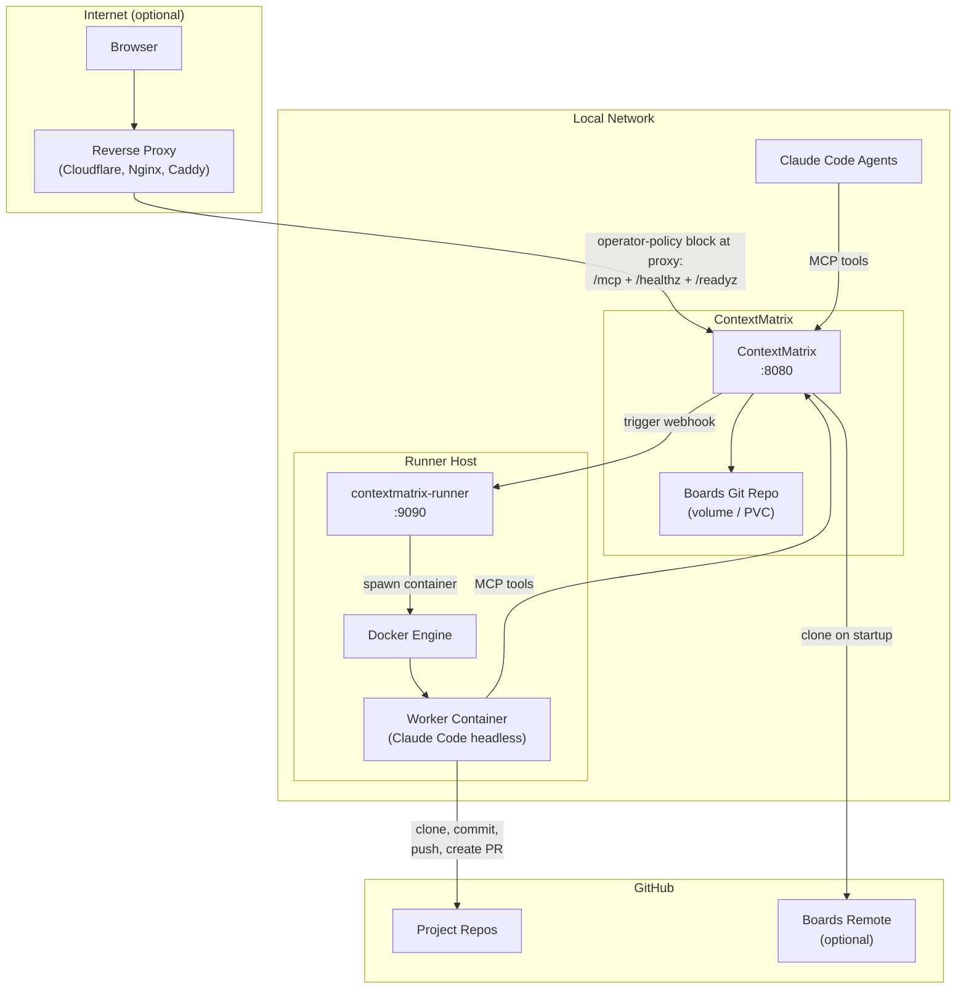

# Deploying ContextMatrix

This document covers deploying ContextMatrix as a persistent service — with a
container, persistent storage, and optionally a remote runner for autonomous
agent tasks. For local development, see the Quick Start section in the README.

ContextMatrix runs just as well as a single binary on your laptop with
`./contextmatrix` and no containers involved. Everything below is for when you
want a persistent, multi-machine setup.

## Architecture Overview



## Building the Container Image

The repo includes a multi-stage Dockerfile:

- **Stage 1**: Node.js — builds the React frontend.
- **Stage 2**: Go — compiles the binary with the frontend embedded via
  `embed.FS` (`web/embed.go`), so the final image is a single binary.
- **Stage 3**: Alpine runtime with `git`, `openssh-client`, and
  `ca-certificates`. The runtime user is `nobody` with `HOME=/home/nobody`. The
  config validator rejects any `boards.git_remote_url` or
  `task_skills.git_remote_url` that does not start with `https://`, so all
  cloning is over HTTPS; the `openssh-client` package is unused.

Workflow skills are baked into the image at `/etc/contextmatrix/skills/` (the
Dockerfile sets `CONTEXTMATRIX_WORKFLOW_SKILLS_DIR` to that path). Override
`workflow_skills_dir` or `CONTEXTMATRIX_WORKFLOW_SKILLS_DIR` if you bake them at
a different path. Task-skills are **not** baked into the image — see the
task-skills note in the Kubernetes section below.

```bash
docker build -t contextmatrix:latest .
# or, with version metadata stamped into the binary:
make docker-build
```

## Running with Docker

The simplest production deployment — a single container with a volume for boards
data.

`config.Validate()` requires the following at startup (the server refuses to
start otherwise):

- `boards.dir`
- `github.auth_mode` set to `app` or `pat`, with the matching credential block
  populated (App: `app_id` + `installation_id` + `private_key_path`; PAT:
  `pat.token`).

The other commonly-set fields (`mcp_api_key`, `backends.*`, `chat.*`) are
optional but typical for a real deployment.

```bash
# Initialize the boards repo
mkdir -p ~/boards/contextmatrix
cd ~/boards/contextmatrix && git init

# Run (PAT auth mode shown — github.auth_mode is mandatory)
docker run -d \
  --name contextmatrix \
  -p 8080:8080 \
  -v ~/boards/contextmatrix:/data/boards \
  -e CONTEXTMATRIX_BOARDS_DIR=/data/boards \
  -e CONTEXTMATRIX_MCP_API_KEY=your-mcp-key-here \
  -e CONTEXTMATRIX_GITHUB_AUTH_MODE=pat \
  -e CONTEXTMATRIX_GITHUB_PAT_TOKEN=ghp_xxx \
  contextmatrix:latest
```

For runner integration, add:

```bash
  -e CONTEXTMATRIX_BACKEND_RUNNER_ENABLED=true \
  -e CONTEXTMATRIX_BACKEND_RUNNER_URL=http://runner-host:9090 \
  -e CONTEXTMATRIX_BACKEND_RUNNER_API_KEY=your-shared-secret-must-be-at-least-32-chars-long \
```

### Operational store persistence

ContextMatrix persists chat sessions/transcripts **and** the model blacklist in a
single SQLite operational store (`ops.db`). The default path is
`$XDG_STATE_HOME/contextmatrix/ops.db`; override with
`CONTEXTMATRIX_OP_STORE_DB_PATH` (or `op_store.db_path`) and mount that directory
on a volume if you want this state to survive container restarts. Chat tunables —
`chat.idle_ttl`, `chat.max_concurrent`, `chat.default_model`,
`chat.resume_budget_tokens`, `chat.rehydration_timeout`, and the `chat.models`
allowlist — all have working defaults; see `config.yaml.example` for the full
list. Note `chat.default_model` / `chat.models` apply only when the **runner**
serves chat; when the dedicated **chat** backend (contextmatrix-chat, OpenRouter)
serves chat, the picker uses the live OpenRouter catalog and the default comes
from `backends.chat.default_model` (required when that backend is enabled).

## Running on Kubernetes

ContextMatrix writes to the boards git repo on every mutation. Use a
**single-replica** deployment with `Recreate` strategy to avoid concurrent
writers.

### Key points

- **Persistent storage** — mount a PVC at the boards directory. Any storage
  class that supports ReadWriteOnce works.
- **Clone-on-empty** — if the PVC is empty on startup, ContextMatrix
  automatically clones the boards repo from the configured remote URL. No manual
  initialization needed.
- **GitHub auth mode required** — `github.auth_mode` (or
  `CONTEXTMATRIX_GITHUB_AUTH_MODE`) must be set to either `app` or `pat`. The
  server refuses to start without it.
- **Git auth** — two modes supported; see variant below.
- **Configuration** — all settings can be set via `CONTEXTMATRIX_*` environment
  variables. See `config.yaml.example` for the full list.
- **Security context** — the image runs as `nobody`. Use
  `readOnlyRootFilesystem: true` with emptyDir mounts for `/tmp` and
  `/home/nobody`.
- **Multi-user auth** (the default) — give `auth.db` a persistent volume
  (`CONTEXTMATRIX_AUTH_DB_PATH`; it holds users, sessions, and the encrypted
  credential pool) and mount the master key as a Secret
  (`CONTEXTMATRIX_AUTH_MASTER_KEY_FILE`, see Secrets below). On first start
  the pod log prints a one-time `/auth/token/<token>` bootstrap link — open
  it to create the admin account.
- **Memory sizing** — argon2id password hashing allocates **64Mi per
  concurrent login, by design** (memory-hardness is what makes it
  brute-force-resistant). Size the container for baseline plus login
  headroom: 128Mi request / 512Mi limit works for a small team. A 128Mi
  limit OOM-kills the pod under normal operation.

> **HTTPS only.** The server rejects any `boards.git_remote_url` (and
> `task_skills.git_remote_url`) that does not start with `https://`. Use the PAT
> or GitHub App variants below.

### Health probes

The main listener serves two probe endpoints, both unauthenticated and excluded
from request logging:

| Path       | Returns                                            | Use as          |
| ---------- | -------------------------------------------------- | --------------- |
| `/healthz` | `200 {"status":"ok"}` always (no checks)           | liveness probe  |
| `/readyz`  | `200` with per-check JSON, or `503` if any degrade | readiness probe |

`/readyz` runs the registered service health checks (e.g. boards-repo write
access) with a 500ms timeout and returns the per-check results in
`{ "status": "ok"|"degraded", "checks": [...] }`. Treat any non-200 response as
not-ready.

Example pod spec snippet:

```yaml
livenessProbe:
  httpGet: { path: /healthz, port: 8080 }
  periodSeconds: 10
readinessProbe:
  httpGet: { path: /readyz, port: 8080 }
  periodSeconds: 5
```

### Admin listener (Prometheus + pprof)

`/metrics` and `/debug/pprof/*` are served by a **separate** admin listener, not
the main port. Set `admin_port` (env `CONTEXTMATRIX_ADMIN_PORT`) to a non-zero
value to enable it. The bind address defaults to `127.0.0.1`; binding to
anything else logs a loud warning because pprof can dump heap and goroutine
state. In a pod, expose it as a sidecar port and scrape via the cluster's
Prometheus operator; do not route it through the public proxy.

### Example deployment snippet — GitHub fine-grained PAT

Use this variant when the boards repo is on GitHub and you want a single
credential that covers both boards sync and GitHub issue import. The PAT is
passed via the environment — it is never embedded in the remote URL or exposed
in process argument lists.

**Required PAT permissions:**

- `boards` repo: `Contents: Read and write`
- each project repo referenced in `.board.yaml`: `Issues: Read-only`

**Note:** all remote URLs (`boards.git_remote_url` and
`task_skills.git_remote_url`) must use HTTPS — this is unconditional and applies
to both PAT and GitHub App auth modes. SSH URLs are rejected at startup.

```yaml
apiVersion: apps/v1
kind: Deployment
metadata:
  name: contextmatrix
spec:
  replicas: 1
  strategy:
    type: Recreate
  template:
    spec:
      containers:
        - name: contextmatrix
          image: contextmatrix:latest
          ports:
            - containerPort: 8080
          securityContext:
            readOnlyRootFilesystem: true
          env:
            - name: CONTEXTMATRIX_BOARDS_DIR
              value: /data/boards
            - name: CONTEXTMATRIX_BOARDS_GIT_REMOTE_URL
              value: https://github.com/org/boards.git
            - name: CONTEXTMATRIX_GITHUB_AUTH_MODE
              value: pat
            - name: CONTEXTMATRIX_GITHUB_PAT_TOKEN
              valueFrom:
                secretKeyRef:
                  name: contextmatrix-secrets
                  key: github-token
            - name: CONTEXTMATRIX_MCP_API_KEY
              valueFrom:
                secretKeyRef:
                  name: contextmatrix-secrets
                  key: mcp-api-key
            # Optional: enable task-skills (must point at a writable
            # directory if git_clone_on_empty is enabled).
            # - name: CONTEXTMATRIX_TASK_SKILLS_DIR
            #   value: /data/task-skills
            # - name: CONTEXTMATRIX_TASK_SKILLS_GIT_REMOTE_URL
            #   value: https://github.com/org/task-skills.git
            # - name: CONTEXTMATRIX_TASK_SKILLS_GIT_CLONE_ON_EMPTY
            #   value: "true"
          volumeMounts:
            - name: boards
              mountPath: /data/boards
            - name: tmp
              mountPath: /tmp
            - name: home
              mountPath: /home/nobody
            # - name: task-skills
            #   mountPath: /data/task-skills
      volumes:
        - name: boards
          persistentVolumeClaim:
            claimName: contextmatrix-boards
        - name: tmp
          emptyDir: {}
        - name: home
          emptyDir: {}
        # - name: task-skills
        #   persistentVolumeClaim:
        #     claimName: contextmatrix-task-skills
```

No SSH key volume is needed. The same `github-token` secret value is used for
both boards git operations and issue import.

**Task-skills:** the image does not bake task-skills into a fixed path. To
enable the task-skills feature, set `CONTEXTMATRIX_TASK_SKILLS_DIR` to a
writable directory and provide a volume for it. If
`CONTEXTMATRIX_TASK_SKILLS_GIT_CLONE_ON_EMPTY=true` is set, ContextMatrix will
clone the repo at startup; otherwise mount a pre-populated volume.

## Runner on a Separate Host

The [contextmatrix-runner](https://github.com/mhersson/contextmatrix-runner)
receives webhooks from ContextMatrix and spawns disposable Docker containers
that execute tasks autonomously.

### Requirements

- Docker Engine on the runner host
- Network access from runner containers back to ContextMatrix (for MCP tools)
- A worker Docker image with Claude Code, the project's language toolchain, and
  GitHub CLI

### Configuration

```yaml
# runner config.yaml
contextmatrix_url: "http://cm-host:8080"
api_key: "same-shared-secret-as-cm"

# Override when containers can't resolve the CM hostname directly
# (e.g. runner on host, CM on LAN). Defaults to contextmatrix_url.
# container_contextmatrix_url: "http://host.docker.internal:8080"
```

The runner resolves the CM hostname on the host. If CM is on a LAN hostname that
containers can't resolve, set `container_contextmatrix_url` to an address
reachable from inside Docker (e.g. `host.docker.internal` or the host's LAN IP).

## External Access (Optional)

ContextMatrix authenticates users natively in its default mode
(`auth.mode: multi`): invite-only accounts, argon2id-hashed passwords, and
session cookies. What the reverse proxy must provide is **TLS** — session
cookies and one-time links must never cross an untrusted network in the clear,
and ContextMatrix does not terminate TLS itself.

In `auth.mode: none` there are no accounts at all, so an **authenticating**
reverse proxy (SSO, basic auth, Cloudflare Access) is mandatory for any
internet exposure — the proxy is the only thing standing between the internet
and a fully trusting API.

### General pattern

```
auth.mode: multi (default)
Internet → [Reverse Proxy + TLS] → ContextMatrix :8080 (native login)

auth.mode: none
Internet → [Reverse Proxy + Auth + TLS] → ContextMatrix :8080
```

Proxy-level authentication in front of multi mode is optional
defense-in-depth — two login layers, useful when the instance should not be
discoverable at all.

**Critical:** Block these paths at the proxy — they should only be reachable
from the LAN:

- `/mcp*` — MCP endpoint (agent access)
- `/healthz` — liveness probe
- `/readyz` — readiness probe

The admin listener (when enabled) is on a separate port (`admin_port`, loopback
by default) and is never reachable through the main port, so no proxy rule is
required for it.

### Header and stream passthrough

ContextMatrix runs a CSRF guard on every state-changing request: the request
must carry `X-Requested-With: contextmatrix`. The web UI injects this header
automatically. A reverse proxy must **preserve** that header and not strip it.
Nginx, Caddy, and Cloudflare all pass it through by default; check that no
custom header policy is filtering it.

The app uses SSE for several long-lived streams (board events, runner session
logs, chat events). Configure the proxy for these:

- Disable response buffering (Nginx: `proxy_buffering off;` for the relevant
  locations; Caddy buffers very little by default).
- Use long-lived idle timeouts (≥ a few minutes — the server emits keepalive
  comments but a 60s idle timeout will still cut connections).
- No HTTP/2 stream multiplexing limits below ~32 concurrent streams per client;
  a single dashboard tab opens multiple SSE connections.

WebSockets are not used; everything streaming is SSE over plain HTTP/1.1 or
HTTP/2.

### Cloudflare Tunnel example

A Cloudflare Tunnel terminates TLS and exposes no inbound ports:

- The tunnel connects outbound from your network — no inbound firewall rules
  needed; Cloudflare provides the TLS multi mode requires
- **WAF rules** — block `/mcp*`, `/healthz`, and `/readyz` at the edge
- **Cloudflare Access** (optional in multi mode, required in none mode) — puts
  SSO/email authentication in front of ContextMatrix's own login

## Secrets to Provision

Before first deployment, generate these:

| Secret                      | Purpose                                   | Notes                                                                                                           |
| --------------------------- | ----------------------------------------- | --------------------------------------------------------------------------------------------------------------- |
| **MCP API key**             | Bearer token for MCP endpoint             | Random string, set in config                                                                                    |
| **Auth master key**         | Encrypts the credential pool (multi mode) | `openssl rand -hex 32` into a 0600 file; mount it and set `auth.master_key_file`. Auto-generated on the data volume when unset — fine for a first boot, but point it at real secret management |
| **Runner API key**          | HMAC-SHA256 webhook signing               | Shared between CM and runner, min 32 chars, never transmitted                                                   |
| **GitHub fine-grained PAT** | Boards git auth + issue import (PAT mode) | Requires `contents:write` on boards repo and `issues:read` on project repos; max 1-year expiry, rotate annually |
| **GitHub App** (runner)     | Clone repos, push branches, create PRs    | Short-lived tokens (1h expiry)                                                                                  |

## Security Model

| Layer                 | Protection                                                                   |
| --------------------- | ---------------------------------------------------------------------------- |
| **Internet → Web UI** | TLS at the proxy + native session login (`auth.mode: multi`, the default); in `none` mode, an authenticating proxy (e.g. Cloudflare Access) is mandatory |
| **Internet → MCP**    | Blocked at proxy (LAN-only)                                                  |
| **LAN → MCP**         | Bearer token (`mcp_api_key`)                                                 |
| **CM ↔ Runner**       | HMAC-SHA256 signed webhooks (shared secret, never transmitted)               |
| **Runner containers** | All capabilities dropped, `no-new-privileges`, memory/PID limits, disposable |
| **Git credentials**   | Short-lived GitHub App tokens (1h expiry) or fine-grained PAT (HTTPS only)   |
