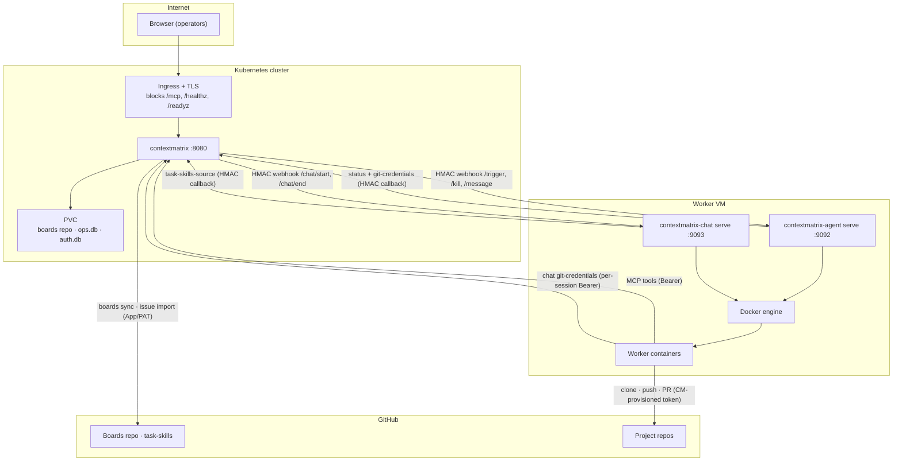

# Deploying ContextMatrix

This document is one worked example of a persistent, multi-machine deployment:
**ContextMatrix in Kubernetes** and a **worker VM** running the two execution
backends (`contextmatrix-agent serve` for card execution and
`contextmatrix-chat serve` for the chat panel) alongside Docker. It is
opinionated on purpose — a single coherent setup, not an exhaustive matrix of
every supported permutation.

ContextMatrix also runs as a single binary on your laptop with `./contextmatrix`
and no containers or backends involved. Everything below is for when you want a
persistent service with autonomous execution and chat.

## Architecture

ContextMatrix is a coordination layer: it owns the board, the git-token
authority, and the model catalog, but never clones or builds project code. The
two backends own container execution; the worker containers do the code work and
talk to CM only over MCP.



**Credential authority.** CM is the sole holder of long-lived GitHub
credentials (the App private key or a PAT). Worker containers never hold a
long-lived credential: agent workers receive a **per-run** token that CM mints
and the agent backend refreshes host-side into the container; chat workers
fetch a **per-repo** token on demand with a per-session bearer. CM also
provisions the LLM inference endpoint (base URL + key) into each trigger and
chat-start payload — the backends carry no model credentials of their own.

## Part 1 — ContextMatrix on Kubernetes

### Building the image

The repo ships a multi-stage `Dockerfile`:

- **Stage 1 (Node):** builds the React frontend.
- **Stage 2 (Go):** compiles the binary with the frontend embedded via
  `embed.FS` (`web/embed.go`) — the result is a single binary.
- **Stage 3 (Alpine):** runtime with `git` and `ca-certificates`. Runs as
  `nobody` with `HOME=/home/nobody`. All git remotes are HTTPS-only (the config
  validator rejects any non-`https://` `boards.git_remote_url` or
  `task_skills.git_remote_url`).

Workflow skills are baked into the image at `/etc/contextmatrix/skills/`
(`CONTEXTMATRIX_WORKFLOW_SKILLS_DIR`). Task-skills are **not** baked in — see the
task-skills note below.

```bash
docker build -t contextmatrix:latest .
# or, with version metadata stamped into the binary:
make docker-build
```

### Deployment, PVC, and probes

CM writes to the boards git repo on every mutation and keeps `ops.db` and
`auth.db` on local disk. Use a **single-replica** Deployment with the `Recreate`
strategy and a single ReadWriteOnce PVC that holds all three:

- **Boards repo** — if the mounted directory is empty on startup, CM clones it
  from `boards.git_remote_url` — but only when `boards.git_clone_on_empty: true`
  (`CONTEXTMATRIX_BOARDS_GIT_CLONE_ON_EMPTY`, default `false`; without it CM
  runs `git init` on the empty directory instead). No manual init needed.
- **`ops.db`** — chat sessions/transcripts, model outcomes, the self-learning
  blacklist, and the cost archive (`CONTEXTMATRIX_OP_STORE_DB_PATH`).
- **`auth.db`** — users, sessions, one-time tokens, and the encrypted instance
  credential pool (`CONTEXTMATRIX_AUTH_DB_PATH`).

The main listener serves two unauthenticated probe endpoints (both excluded from
request logging):

| Path       | Returns                                            | Use as          |
| ---------- | -------------------------------------------------- | --------------- |
| `/healthz` | `200 {"status":"ok"}` always (no checks)           | liveness probe  |
| `/readyz`  | `200`, or `503` if any registered check degrades   | readiness probe |

```yaml
apiVersion: apps/v1
kind: Deployment
metadata:
  name: contextmatrix
spec:
  replicas: 1
  strategy:
    type: Recreate
  template:
    spec:
      containers:
        - name: contextmatrix
          image: contextmatrix:latest
          ports:
            - containerPort: 8080
          securityContext:
            readOnlyRootFilesystem: true
          livenessProbe:
            httpGet: { path: /healthz, port: 8080 }
            periodSeconds: 10
          readinessProbe:
            httpGet: { path: /readyz, port: 8080 }
            periodSeconds: 5
          resources:
            requests: { memory: 128Mi }
            limits: { memory: 512Mi }
          env:
            - name: CONTEXTMATRIX_AUTH_MODE
              value: multi
            - name: CONTEXTMATRIX_BOARDS_DIR
              value: /data/boards
            - name: CONTEXTMATRIX_BOARDS_GIT_REMOTE_URL
              value: https://github.com/org/boards.git
            - name: CONTEXTMATRIX_BOARDS_GIT_CLONE_ON_EMPTY
              value: "true"
            - name: CONTEXTMATRIX_OP_STORE_DB_PATH
              value: /data/ops.db
            - name: CONTEXTMATRIX_AUTH_DB_PATH
              value: /data/auth.db
            - name: CONTEXTMATRIX_AUTH_MASTER_KEY_FILE
              value: /secrets/auth/master.key
            # GitHub App auth — CM is the only holder of this key.
            - name: CONTEXTMATRIX_GITHUB_AUTH_MODE
              value: app
            - name: CONTEXTMATRIX_GITHUB_APP_ID
              valueFrom: { secretKeyRef: { name: contextmatrix-github, key: app-id } }
            - name: CONTEXTMATRIX_GITHUB_INSTALLATION_ID
              valueFrom: { secretKeyRef: { name: contextmatrix-github, key: installation-id } }
            - name: CONTEXTMATRIX_GITHUB_PRIVATE_KEY_PATH
              value: /secrets/github/private-key.pem
            # MCP bearer handed to every worker container.
            - name: CONTEXTMATRIX_MCP_API_KEY
              valueFrom: { secretKeyRef: { name: contextmatrix-secrets, key: mcp-api-key } }
            # Inference endpoint CM reads the model catalog from and provisions
            # to the backends (openrouter | openai).
            - name: CONTEXTMATRIX_LLM_ENDPOINT_TYPE
              value: openrouter
            - name: CONTEXTMATRIX_LLM_ENDPOINT_API_KEY
              valueFrom: { secretKeyRef: { name: contextmatrix-secrets, key: llm-api-key } }
            # Agent backend (card execution) on the worker VM.
            - name: CONTEXTMATRIX_BACKEND_AGENT_URL
              value: http://worker-vm.internal:9092
            - name: CONTEXTMATRIX_BACKEND_AGENT_API_KEY
              valueFrom: { secretKeyRef: { name: contextmatrix-secrets, key: agent-hmac } }
            - name: CONTEXTMATRIX_BACKEND_AGENT_DEFAULT_MODEL
              value: deepseek/deepseek-v4-flash
            # Chat backend (global chat panel) on the same VM.
            - name: CONTEXTMATRIX_BACKEND_CHAT_URL
              value: http://worker-vm.internal:9093
            - name: CONTEXTMATRIX_BACKEND_CHAT_API_KEY
              valueFrom: { secretKeyRef: { name: contextmatrix-secrets, key: chat-hmac } }
            - name: CONTEXTMATRIX_BACKEND_CHAT_DEFAULT_MODEL
              value: anthropic/claude-sonnet-4
          volumeMounts:
            - { name: data, mountPath: /data }
            - { name: github, mountPath: /secrets/github, readOnly: true }
            - { name: master-key, mountPath: /secrets/auth, readOnly: true }
            - { name: tmp, mountPath: /tmp }
            - { name: home, mountPath: /home/nobody }
      volumes:
        - name: data
          persistentVolumeClaim: { claimName: contextmatrix-data }
        - name: github
          secret: { secretName: contextmatrix-github }
        - name: master-key
          secret: { secretName: contextmatrix-auth-master-key }
        - name: tmp
          emptyDir: {}
        - name: home
          emptyDir: {}
```

Notes:

- **`github.auth_mode` is mandatory.** `config.Validate()` refuses to start
  unless it is `app` (with `app_id` + `installation_id` + `private_key_path`) or
  `pat` (with `pat.token`). See `docs/github-auth-setup.md`.
- **Memory sizing.** argon2id password hashing allocates **64Mi per concurrent
  login by design** (memory-hardness is the point). 128Mi request / 512Mi limit
  suits a small team; a 128Mi *limit* OOM-kills the pod under normal login load.
- **Read-only root filesystem** works with `emptyDir` mounts for `/tmp` and
  `/home/nobody`; `/data` is the writable PVC and the two `/secrets/*` paths are
  read-only Secret mounts.
- **Secrets.** The `contextmatrix-github` Secret (keys `app-id`,
  `installation-id`, `private-key.pem`) is defined in
  [github-auth-recommended-topologies.md](github-auth-recommended-topologies.md)
  (Topology 3). Create the master-key Secret with a fresh key:

  ```bash
  kubectl create secret generic contextmatrix-auth-master-key \
    --from-literal=master.key="$(openssl rand -hex 32)"
  ```

  The master key encrypts the credential pool. If
  `CONTEXTMATRIX_AUTH_MASTER_KEY_FILE` is unset, CM auto-generates a key under
  `~/.local/state/contextmatrix/` — in this manifest that is the `/home/nobody`
  `emptyDir`, which a pod restart wipes, leaving the pool undecryptable. Always
  mount a real key.

On first start the pod log prints a one-time `/auth/token/<token>` bootstrap
link — open it to create the admin account.

### Task-skills

The image bakes no task-skills into a fixed path. To enable the feature, set
`CONTEXTMATRIX_TASK_SKILLS_DIR` to a writable directory (add it to the PVC) and,
if you want CM to clone the repo on an empty directory, set
`CONTEXTMATRIX_TASK_SKILLS_GIT_REMOTE_URL` +
`CONTEXTMATRIX_TASK_SKILLS_GIT_CLONE_ON_EMPTY=true`. CM derives a
`{git_remote_url, ref}` pointer from this directory; both backends clone that
pointer server-side and mount the resolved subset into worker containers.

### Ingress, TLS, and path blocking

CM authenticates users natively in the default `auth.mode: multi` (invite-only
accounts, argon2id passwords, session cookies). The Ingress must provide **TLS**
— session cookies and one-time links must never cross the network in the clear,
and CM does not terminate TLS itself.

Block these paths at the Ingress so they are reachable only inside the cluster
(and from the worker VM):

- `/mcp*` — MCP endpoint (worker + human-agent access, Bearer-authed)
- `/healthz`, `/readyz` — probes

CM runs a CSRF guard on every state-changing request: it requires
`X-Requested-With: contextmatrix` (the web UI injects it). The Ingress must
**preserve** that header.

> In `auth.mode: none` there are no accounts at all, so an **authenticating**
> proxy (SSO, Cloudflare Access, basic auth) is mandatory for any exposure — the
> proxy is the only thing standing between the internet and a fully trusting API.

### Admin listener (Prometheus + pprof)

`/metrics` and `/debug/pprof/*` are served by a **separate** admin listener, not
the main port. Enable it with a non-zero `admin_port`
(`CONTEXTMATRIX_ADMIN_PORT`); it binds `127.0.0.1` by default and there is no
auth on it. Scrape it from a Prometheus sidecar or a localhost-only path; never
route it through the Ingress. A non-loopback bind logs a loud warning because
pprof can dump heap and goroutine state.

## Part 2 — Worker VM (agent + chat backends)

One VM runs both backends and Docker. Each backend receives HMAC-signed webhooks
from CM, spawns worker containers, and streams their logs back.

### Requirements

- Docker Engine on the VM.
- Network from the VM to CM (`:8080`) for callbacks, and from CM to the VM
  (`:9092`, `:9093`) for webhooks.
- Worker container images carrying the project's language toolchain. The shipped
  defaults (`ghcr.io/mhersson/contextmatrix-agent`, `-chat`) carry Go, Node,
  Python, and Rust; other ecosystems need an image built `FROM` a published
  variant.

### Serve config

Both binaries read `~/.config/contextmatrix-{agent,chat}/serve.yaml` (XDG
default) and take `CMX_*` env overrides. Credentials are **not** configured
here — CM provisions the git token, the LLM endpoint, and the task-skills clone
token per run/session. Copy each repo's `serve.yaml.example` and set the
connectivity fields:

```yaml
# ~/.config/contextmatrix-agent/serve.yaml
contextmatrix_url: https://contextmatrix.example.com     # CM, as the VM sees it
container_contextmatrix_url: http://172.17.0.1:8080      # CM, as containers see it
api_key: "<agent-hmac — matches CONTEXTMATRIX_BACKEND_AGENT_API_KEY>"
mcp_api_key: "<mcp-api-key — matches CONTEXTMATRIX_MCP_API_KEY>"
port: 9092
base_image: ghcr.io/mhersson/contextmatrix-agent@sha256:<digest>
secrets_dir: /var/run/cm-agent/secrets
```

```yaml
# ~/.config/contextmatrix-chat/serve.yaml
contextmatrix_url: https://contextmatrix.example.com
container_contextmatrix_url: http://172.17.0.1:8080
api_key: "<chat-hmac — matches CONTEXTMATRIX_BACKEND_CHAT_API_KEY>"
port: 9093
base_image: ghcr.io/mhersson/contextmatrix-chat@sha256:<digest>
secrets_dir: /var/run/cm-chat/secrets
chat_run_dir: /var/run/cm-chat/sessions
```

`container_contextmatrix_url` is the CM address **reachable from inside a
container** (workers derive `CM_MCP_URL` from it). With Docker bridge
networking this is the bridge gateway (typically `172.17.0.1`), not CM's public
hostname — containers cannot resolve the latter.

### systemd units

Each repo ships an `svc.sh` that generates and installs a hardened
**systemd `--user`** unit (per-operator; the backend uses the operator's Docker
socket). From each checked-out, built repo:

```bash
./svc.sh install     # write the unit, daemon-reload, enable
./svc.sh start       # start it
./svc.sh status      # inspect
./svc.sh verify      # print the unit and check the hardening directives
```

The generated units run `contextmatrix-{agent,chat} serve --config <serve.yaml>`
with a baseline sandbox (`NoNewPrivileges`, `ProtectSystem=strict`,
`ProtectHome=read-only`, seccomp `@system-service`, `MemoryMax`, restart-backoff
with jitter) and `ReadWritePaths` narrowed to the secrets dir (and, for chat,
`chat_run_dir`). The default `secrets_dir` under `/var/run` is root-owned and
not auto-created for a user service — pre-create it and `chown` it to the
operator, or point `secrets_dir`/`chat_run_dir` at a path under `%h`.

Each backend also exposes an optional loopback-only admin listener
(`CMX_ADMIN_PORT`) serving Prometheus `/metrics` behind the same HMAC signed-GET
scheme as its webhooks.

## Network and endpoint reference

### Traffic matrix

| From                | To               | Path(s)                                                            | Auth                                  |
| ------------------- | ---------------- | ----------------------------------------------------------------- | ------------------------------------- |
| Browser             | CM `:8080`       | web UI, `/api/*`, `/api/worker/logs`, `/api/backend/health`       | session cookie + CSRF header          |
| Human agent (e.g. Claude Code) | CM `:8080` | `/mcp`                                                    | MCP Bearer (`mcp_api_key`)            |
| CM                  | agent backend `:9092` | `/trigger`, `/kill`, `/stop-all`, `/message`, `/promote`     | HMAC (`backends.agent.api_key`)       |
| CM                  | chat backend `:9093`  | `/chat/start`, `/chat/end`, `/message`                       | HMAC (`backends.chat.api_key`)        |
| Agent backend       | CM `:8080`       | `POST /api/agent/status`, `GET /api/agent/task-skills-source`, `GET /api/agent/git-credentials` | HMAC (`backends.agent.api_key`) |
| Chat backend        | CM `:8080`       | `GET /api/chat/task-skills-source`                                | HMAC (`backends.chat.api_key`)        |
| Either backend      | CM `:8080`       | `GET /api/v1/cards/{project}/{id}/autonomous`                     | HMAC (backend's key)                  |
| Worker container    | CM `:8080`       | `POST /mcp`                                                       | MCP Bearer (`mcp_api_key`, delivered per trigger / chat-start) |
| Chat worker         | CM `:8080`       | `GET /api/worker/git-credentials`                                 | per-session Bearer (minted at chat-start) |
| CM                  | GitHub           | boards sync, task-skills, issue import, branch list               | GitHub App / PAT                      |
| Worker container    | GitHub           | project repo clone / push / PR                                    | CM-provisioned per-run token          |

The agent backend refreshes its per-run token from
`GET /api/agent/git-credentials` and stages it into `/run/cm-secrets` inside the
container until the run is torn down; chat workers present their per-session
bearer to `GET /api/worker/git-credentials` and receive a per-repo token on
demand. Neither token is long-lived.

### SSE endpoints for the reverse proxy

CM uses Server-Sent Events for several long-lived streams. Configure the Ingress
/ reverse proxy to not buffer these and to use long idle timeouts (≥ a few
minutes — CM emits keepalive comments, but a 60s idle timeout still cuts the
connection):

- `GET /api/events` — board events
- `GET /api/worker/logs` — worker/session log stream (the card transcript and
  chat panel)
- `GET /api/chats/{id}/stream` — chat session events

A single dashboard tab opens several SSE connections; do not cap HTTP/2 streams
per client below ~32. WebSockets are not used — everything streaming is SSE over
HTTP/1.1 or HTTP/2.

## Secrets to provision

| Secret                  | Purpose                                            | Notes                                                                        |
| ----------------------- | -------------------------------------------------- | ---------------------------------------------------------------------------- |
| **MCP API key**         | Bearer for `/mcp` (workers + human agents)         | Random ≥ 32 chars; set in CM and the agent serve config (`mcp_api_key`); CM supplies it to chat workers in the chat-start payload |
| **Agent backend HMAC**  | Signs CM↔agent webhooks and callbacks              | Random ≥ 32 chars; shared between CM and the agent serve config, never sent  |
| **Chat backend HMAC**   | Signs CM↔chat webhooks and callbacks               | Random ≥ 32 chars; shared between CM and the chat serve config, never sent   |
| **Auth master key**     | Encrypts the credential pool (multi mode)          | `openssl rand -hex 32` in a 0600 file; mount and set `auth.master_key_file`  |
| **GitHub App key / PAT**| Boards sync, issue import, per-run worker tokens   | Lives on CM **only**; App tokens are short-lived (1h), PAT is HTTPS-only     |
| **LLM endpoint key**    | Model catalog + provisioned to backends            | Provider key for `llm_endpoint`; CM forwards it in trigger/chat-start payloads |

## Security model

| Layer                       | Protection                                                                                     |
| --------------------------- | ---------------------------------------------------------------------------------------------- |
| **Internet → Web UI**       | TLS at the Ingress + native session login (`auth.mode: multi`); in `none` mode, an authenticating proxy is mandatory |
| **Internet → MCP / probes** | Blocked at the Ingress (cluster/VM-only)                                                        |
| **Worker/agent → MCP**      | Bearer token (`mcp_api_key`), delivered per trigger / chat-start                                |
| **CM ↔ backends**           | Per-backend HMAC-SHA256 signed webhooks and callbacks (distinct secrets, never transmitted)    |
| **Worker containers**       | Disposable; the backend applies capability/memory/PID limits and container timeouts            |
| **Git credentials**         | CM-provisioned, short-lived, per-run (agent) or per-repo/per-session (chat); HTTPS-only         |
| **LLM credentials**         | Held by CM, provisioned into each payload; backends carry none of their own                    |
| **Admin listeners**         | Loopback-only (`admin_port` on CM, `CMX_ADMIN_PORT` on each backend); never on the main port   |
