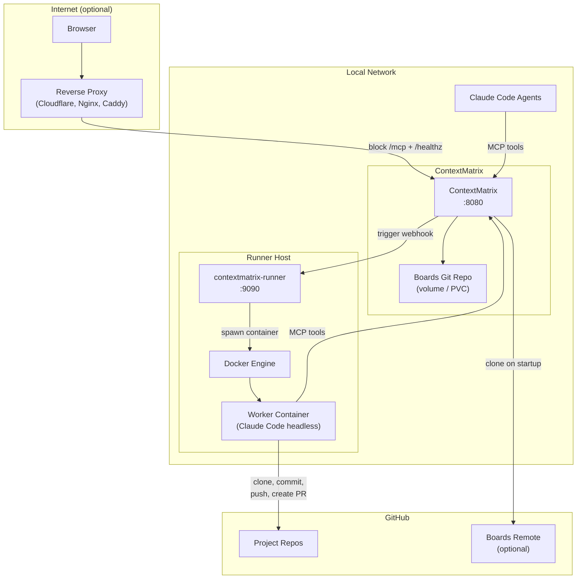

# Deploying ContextMatrix

This document covers deploying ContextMatrix as a persistent service — with a
container, persistent storage, and optionally a remote runner for autonomous
agent tasks. For local development, see the Quick Start section in the README.

ContextMatrix runs just as well as a single binary on your laptop with
`./contextmatrix` and no containers involved. Everything below is for when you
want a persistent, multi-machine setup.

## Architecture Overview



## Building the Container Image

The repo includes a multi-stage Dockerfile:

- **Stage 1**: Node.js — builds the React frontend
- **Stage 2**: Go — compiles the binary with embedded frontend
- **Stage 3**: Alpine runtime with `git` and `openssh-client`

Skills are baked into the image at `/etc/contextmatrix/skills/`.

```bash
docker build -t contextmatrix:latest .
```

## Running with Docker

The simplest production deployment — a single container with a volume for boards
data.

```bash
# Initialize the boards repo
mkdir -p ~/boards/contextmatrix
cd ~/boards/contextmatrix && git init

# Run
docker run -d \
  --name contextmatrix \
  -p 8080:8080 \
  -v ~/boards/contextmatrix:/data/boards \
  -e CONTEXTMATRIX_BOARDS_DIR=/data/boards \
  -e CONTEXTMATRIX_MCP_API_KEY=your-mcp-key-here \
  contextmatrix:latest
```

For runner integration, add:

```bash
  -e CONTEXTMATRIX_RUNNER_ENABLED=true \
  -e CONTEXTMATRIX_RUNNER_URL=http://runner-host:9090 \
  -e CONTEXTMATRIX_RUNNER_API_KEY=your-shared-secret-min-32ch \
  -e CONTEXTMATRIX_RUNNER_PUBLIC_URL=http://host-ip:8080 \
```

`CONTEXTMATRIX_RUNNER_PUBLIC_URL` must be reachable from inside runner
containers — `localhost` won't work. Use the host's LAN IP or
`host.docker.internal` on Docker Desktop.

## Running on Kubernetes

ContextMatrix writes to the boards git repo on every mutation. Use a
**single-replica** deployment with `Recreate` strategy to avoid concurrent
writers.

### Key points

- **Persistent storage** — mount a PVC at the boards directory. Any storage
  class that supports ReadWriteOnce works.
- **Clone-on-empty** — if the PVC is empty on startup, ContextMatrix
  automatically clones the boards repo from the configured remote URL. No manual
  initialization needed.
- **Git auth** — two modes supported; see variants below.
- **Configuration** — all settings can be set via `CONTEXTMATRIX_*` environment
  variables. See `config.yaml.example` for the full list.
- **Security context** — the image runs as `nobody`. Use
  `readOnlyRootFilesystem: true` with emptyDir mounts for `/tmp` and
  `/home/nobody`.

### Example deployment snippet — SSH deploy key (default)

Use this variant for any git host (GitHub, GitLab, Gitea, etc.). Mount a deploy
key with write access to the boards repo. The SSH key file must be readable by
the `nobody` user (mode `0400`).

```yaml
apiVersion: apps/v1
kind: Deployment
metadata:
  name: contextmatrix
spec:
  replicas: 1
  strategy:
    type: Recreate
  template:
    spec:
      containers:
        - name: contextmatrix
          image: contextmatrix:latest
          ports:
            - containerPort: 8080
          env:
            - name: CONTEXTMATRIX_BOARDS_DIR
              value: /data/boards
            - name: CONTEXTMATRIX_BOARDS_GIT_REMOTE_URL
              value: git@github.com:org/boards.git
            - name: CONTEXTMATRIX_MCP_API_KEY
              valueFrom:
                secretKeyRef:
                  name: contextmatrix-secrets
                  key: mcp-api-key
          volumeMounts:
            - name: boards
              mountPath: /data/boards
            - name: ssh-key
              mountPath: /etc/contextmatrix/ssh
              readOnly: true
      volumes:
        - name: boards
          persistentVolumeClaim:
            claimName: contextmatrix-boards
        - name: ssh-key
          secret:
            secretName: boards-deploy-key
            defaultMode: 0400
```

### Example deployment snippet — GitHub fine-grained PAT

Use this variant when the boards repo is on GitHub and you want a single
credential that covers both boards sync and GitHub issue import. The PAT is
passed via the environment — it is never embedded in the remote URL or exposed
in process argument lists.

**Required PAT permissions:**
- `boards` repo: `Contents: Read and write`
- each project repo referenced in `.board.yaml`: `Issues: Read-only`

**Note:** the remote URL must use HTTPS, not SSH.

```yaml
apiVersion: apps/v1
kind: Deployment
metadata:
  name: contextmatrix
spec:
  replicas: 1
  strategy:
    type: Recreate
  template:
    spec:
      containers:
        - name: contextmatrix
          image: contextmatrix:latest
          ports:
            - containerPort: 8080
          env:
            - name: CONTEXTMATRIX_BOARDS_DIR
              value: /data/boards
            - name: CONTEXTMATRIX_BOARDS_GIT_REMOTE_URL
              value: https://github.com/org/boards.git
            - name: CONTEXTMATRIX_BOARDS_GIT_AUTH_MODE
              value: pat
            - name: CONTEXTMATRIX_GITHUB_TOKEN
              valueFrom:
                secretKeyRef:
                  name: contextmatrix-secrets
                  key: github-token
            - name: CONTEXTMATRIX_MCP_API_KEY
              valueFrom:
                secretKeyRef:
                  name: contextmatrix-secrets
                  key: mcp-api-key
          volumeMounts:
            - name: boards
              mountPath: /data/boards
      volumes:
        - name: boards
          persistentVolumeClaim:
            claimName: contextmatrix-boards
```

No SSH key volume is needed. The same `github-token` secret value is used for
both boards git operations and issue import.

## Runner on a Separate Host

The [contextmatrix-runner](https://github.com/mhersson/contextmatrix-runner)
receives webhooks from ContextMatrix and spawns disposable Docker containers
that execute tasks autonomously.

### Requirements

- Docker Engine on the runner host
- Network access from runner containers back to ContextMatrix (for MCP tools)
- A worker Docker image with Claude Code, the project's language toolchain, and
  GitHub CLI

### Configuration

```yaml
# runner config.yaml
contextmatrix:
  url: "http://cm-host:8080"
  api_key: "same-shared-secret-as-cm"
  public_url: "http://cm-host:8080" # URL containers use to reach CM
```

The runner resolves the CM hostname on the host. If CM is on a LAN hostname that
containers can't resolve, inject a `/etc/hosts` entry into containers via the
runner config.

## External Access (Optional)

ContextMatrix is designed for trusted networks. To expose the web UI to the
internet, put an authenticating reverse proxy in front.

### General pattern

```
Internet → [Reverse Proxy + Auth + TLS] → ContextMatrix :8080
```

**Critical:** Block these paths at the proxy — they should only be reachable
from the LAN:

- `/mcp*` — MCP endpoint (agent access)
- `/healthz` — health check

### Cloudflare Tunnel example

A Cloudflare Tunnel with Access provides authentication without exposing any
ports:

- **Cloudflare Access** — requires SSO/email authentication for all requests
- **WAF rules** — block `/mcp*` and `/healthz` at the edge
- The tunnel connects outbound from your network — no inbound firewall rules
  needed

## Secrets to Provision

Before first deployment, generate these:

| Secret                    | Purpose                                | Notes                                                                                                   |
| ------------------------- | -------------------------------------- | ------------------------------------------------------------------------------------------------------- |
| **MCP API key**           | Bearer token for MCP endpoint          | Random string, set in config                                                                            |
| **Runner API key**        | HMAC-SHA256 webhook signing            | Shared between CM and runner, min 32 chars, never transmitted                                           |
| **Boards SSH key**        | Git push to boards remote (SSH mode)   | Deploy key with write access; not needed in PAT mode                                                    |
| **GitHub fine-grained PAT** | Boards git auth + issue import (PAT mode) | Requires `contents:write` on boards repo and `issues:read` on project repos; max 1-year expiry, rotate annually |
| **GitHub App** (runner)   | Clone repos, push branches, create PRs | Short-lived tokens (1h expiry)                                                                          |

## Security Model

| Layer                 | Protection                                                                   |
| --------------------- | ---------------------------------------------------------------------------- |
| **Internet → Web UI** | Reverse proxy with authentication (e.g., Cloudflare Access)                  |
| **Internet → MCP**    | Blocked at proxy (LAN-only)                                                  |
| **LAN → MCP**         | Bearer token (`mcp_api_key`)                                                 |
| **CM ↔ Runner**       | HMAC-SHA256 signed webhooks (shared secret, never transmitted)               |
| **Runner containers** | All capabilities dropped, `no-new-privileges`, memory/PID limits, disposable |
| **Git credentials**   | Short-lived GitHub App tokens (1h expiry), SSH deploy keys                   |
