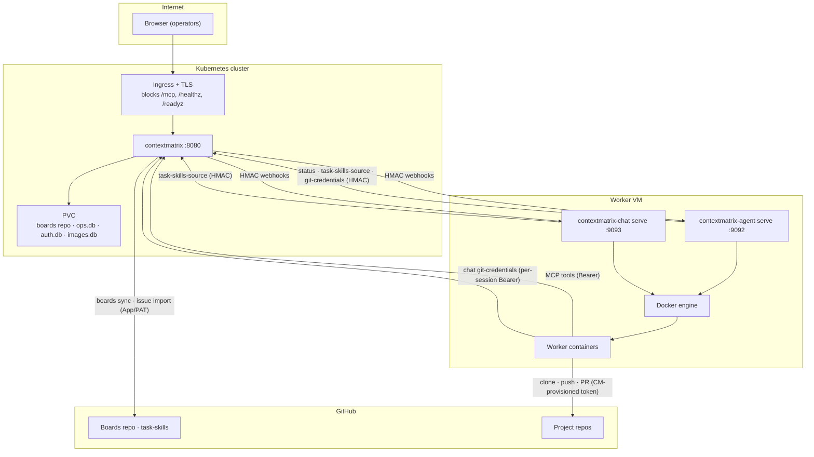

# Deploying ContextMatrix

One worked example of a persistent, multi-machine deployment: **ContextMatrix
in Kubernetes** plus a **worker VM** running the two execution backends
(`contextmatrix-agent serve` for card execution, `contextmatrix-chat serve` for
the chat panel) alongside Docker. It is one coherent setup, not a matrix of
every supported permutation. For the topology choices see
[github-auth-recommended-topologies.md](github-auth-recommended-topologies.md);
for every config key see [configuration.md](configuration.md).

ContextMatrix also runs as a single binary on a laptop with `./contextmatrix`
and no containers or backends. Everything below is for a persistent service
with autonomous execution and chat.

## Architecture

ContextMatrix (CM) is the coordination layer: it owns the boards, the GitHub
credentials, and the model catalog, and never clones or builds project code.
The backends own container execution; worker containers do the code work and
talk to CM over MCP.


```mermaid
flowchart TB
    subgraph internet["Internet"]
        browser["Browser (operators)"]
    end

    subgraph k8s["Kubernetes cluster"]
        ingress["Ingress + TLS<br/>blocks /mcp, /healthz, /readyz"]
        cm["contextmatrix :8080"]
        pvc["PVC<br/>boards repo · ops.db · auth.db · images.db"]
        cm --> pvc
        ingress --> cm
    end

    subgraph vm["Worker VM"]
        agent["contextmatrix-agent serve :9092"]
        chat["contextmatrix-chat serve :9093"]
        docker["Docker engine"]
        worker["Worker containers"]
        agent --> docker
        chat --> docker
        docker --> worker
    end

    subgraph github["GitHub"]
        boards["Boards repo · task-skills"]
        repos["Project repos"]
    end

    browser --> ingress
    cm -- "HMAC webhooks" --> agent
    cm -- "HMAC webhooks" --> chat
    agent -- "status · task-skills-source · git-credentials (HMAC)" --> cm
    chat -- "task-skills-source (HMAC)" --> cm
    worker -- "MCP tools (Bearer)" --> cm
    worker -- "chat git-credentials (per-session Bearer)" --> cm
    cm -- "boards sync · issue import (App/PAT)" --> boards
    worker -- "clone · push · PR (CM-provisioned token)" --> repos
```

**Credential authority.** CM is the sole holder of long-lived GitHub
credentials: the instance credential from `github.*` and, in multi-user mode,
the encrypted credential pool that `.board.yaml` can bind per project (see
[authentication.md](authentication.md)). Backends configure no GitHub
credential. Agent workers receive a token in the trigger payload that the agent
backend refreshes host-side into the container; chat workers fetch a per-repo
token on demand with a per-session bearer. In GitHub App mode that token is an
installation token that expires within an hour. In PAT mode it is the PAT
itself, so only App mode keeps long-lived credentials off the worker VM. CM
also provisions the LLM inference endpoint (base URL + key) into every trigger
and chat-start payload; the backends carry no model credentials of their own.

## Part 1 - ContextMatrix on Kubernetes

### Building the image

The repo ships a multi-stage `Dockerfile`:

| Stage | Base   | Does                                                                                                           |
| ----- | ------ | -------------------------------------------------------------------------------------------------------------- |
| 1     | Node   | builds the React frontend                                                                                      |
| 2     | Go     | compiles the binary with the frontend embedded (`web/embed.go`)                                                |
| 3     | Alpine | runtime with `git`, `openssh-client`, `ca-certificates`; runs as `nobody` (uid 65534) with `HOME=/home/nobody` |

Workflow skills are baked in at `/etc/contextmatrix/skills/`
(`CONTEXTMATRIX_WORKFLOW_SKILLS_DIR`). Task-skills are not baked in; see
[Task-skills](#task-skills). All git remotes are HTTPS-only: the config
validator rejects any non-`https://` `boards.git_remote_url` or
`task_skills.git_remote_url`.

```bash
docker build -t contextmatrix:latest .
# or, with version metadata stamped into the binary:
make docker-build
```

### Deployment, PVC, and probes

CM writes to the boards git repo on every mutation and keeps three SQLite
databases on local disk. Use a single-replica Deployment with the `Recreate`
strategy and one ReadWriteOnce PVC holding all of them:

| Path        | Holds                                                                                                                                  | Env override                     |
| ----------- | -------------------------------------------------------------------------------------------------------------------------------------- | -------------------------------- |
| boards repo | cards, `.board.yaml`, playbooks; cloned on an empty dir when `boards.git_clone_on_empty: true` (default `false`, otherwise `git init`) | `CONTEXTMATRIX_BOARDS_DIR`       |
| `ops.db`    | chat sessions and transcripts, model blacklist, model outcomes, chat cost archive                                                      | `CONTEXTMATRIX_OP_STORE_DB_PATH` |
| `auth.db`   | users, sessions, one-time tokens, encrypted credential pool                                                                            | `CONTEXTMATRIX_AUTH_DB_PATH`     |
| `images.db` | pasted card images (private boards repos and project-less uploads)                                                                     | `CONTEXTMATRIX_IMAGES_DB_PATH`   |

Every database defaults to `$XDG_STATE_HOME/contextmatrix/` (in the image
that is under `/home/nobody`, an `emptyDir` below), so set all four paths.

The main listener serves two unauthenticated probe endpoints, both excluded
from request logging:

| Path       | Returns                                                                             | Use as          |
| ---------- | ----------------------------------------------------------------------------------- | --------------- |
| `/healthz` | `200 {"status":"ok"}` always                                                        | liveness probe  |
| `/readyz`  | `200 {"status":"ok"}`, or `503 {"status":"degraded"}` when a registered check fails | readiness probe |

```yaml
apiVersion: apps/v1
kind: Deployment
metadata:
  name: contextmatrix
spec:
  replicas: 1
  strategy:
    type: Recreate
  template:
    spec:
      containers:
        - name: contextmatrix
          image: contextmatrix:latest
          ports:
            - containerPort: 8080
          securityContext:
            readOnlyRootFilesystem: true
          livenessProbe:
            httpGet: { path: /healthz, port: 8080 }
            periodSeconds: 10
          readinessProbe:
            httpGet: { path: /readyz, port: 8080 }
            periodSeconds: 5
          resources:
            requests: { memory: 128Mi }
            limits: { memory: 512Mi }
          env:
            - name: CONTEXTMATRIX_AUTH_MODE
              value: multi
            - name: CONTEXTMATRIX_BOARDS_DIR
              value: /data/boards
            - name: CONTEXTMATRIX_BOARDS_GIT_REMOTE_URL
              value: https://github.com/org/boards.git
            - name: CONTEXTMATRIX_BOARDS_GIT_CLONE_ON_EMPTY
              value: "true"
            - name: CONTEXTMATRIX_OP_STORE_DB_PATH
              value: /data/ops.db
            - name: CONTEXTMATRIX_AUTH_DB_PATH
              value: /data/auth.db
            - name: CONTEXTMATRIX_IMAGES_DB_PATH
              value: /data/images.db
            - name: CONTEXTMATRIX_AUTH_MASTER_KEY_FILE
              value: /secrets/auth/master.key
            # GitHub App auth - CM is the only holder of this key.
            - name: CONTEXTMATRIX_GITHUB_AUTH_MODE
              value: app
            - name: CONTEXTMATRIX_GITHUB_APP_ID
              valueFrom: { secretKeyRef: { name: contextmatrix-github, key: app-id } }
            - name: CONTEXTMATRIX_GITHUB_INSTALLATION_ID
              valueFrom: { secretKeyRef: { name: contextmatrix-github, key: installation-id } }
            - name: CONTEXTMATRIX_GITHUB_PRIVATE_KEY_PATH
              value: /secrets/github/private-key.pem
            # MCP bearer handed to every worker container.
            - name: CONTEXTMATRIX_MCP_API_KEY
              valueFrom: { secretKeyRef: { name: contextmatrix-secrets, key: mcp-api-key } }
            # Inference endpoint CM reads the model catalog from and provisions
            # to the backends (openrouter | openai).
            - name: CONTEXTMATRIX_LLM_ENDPOINT_TYPE
              value: openrouter
            - name: CONTEXTMATRIX_LLM_ENDPOINT_API_KEY
              valueFrom: { secretKeyRef: { name: contextmatrix-secrets, key: llm-api-key } }
            # Agent backend (card execution) on the worker VM.
            - name: CONTEXTMATRIX_BACKEND_AGENT_URL
              value: http://worker-vm.internal:9092
            - name: CONTEXTMATRIX_BACKEND_AGENT_API_KEY
              valueFrom: { secretKeyRef: { name: contextmatrix-secrets, key: agent-hmac } }
            - name: CONTEXTMATRIX_BACKEND_AGENT_DEFAULT_MODEL
              value: deepseek/deepseek-v4-flash
            # Chat backend (global chat panel) on the same VM.
            - name: CONTEXTMATRIX_BACKEND_CHAT_URL
              value: http://worker-vm.internal:9093
            - name: CONTEXTMATRIX_BACKEND_CHAT_API_KEY
              valueFrom: { secretKeyRef: { name: contextmatrix-secrets, key: chat-hmac } }
            - name: CONTEXTMATRIX_BACKEND_CHAT_DEFAULT_MODEL
              value: anthropic/claude-sonnet-4
          volumeMounts:
            - { name: data, mountPath: /data }
            - { name: github, mountPath: /secrets/github, readOnly: true }
            - { name: master-key, mountPath: /secrets/auth, readOnly: true }
            - { name: tmp, mountPath: /tmp }
            - { name: home, mountPath: /home/nobody }
      volumes:
        - name: data
          persistentVolumeClaim: { claimName: contextmatrix-data }
        - name: github
          secret: { secretName: contextmatrix-github }
        - name: master-key
          secret: { secretName: contextmatrix-auth-master-key }
        - name: tmp
          emptyDir: {}
        - name: home
          emptyDir: {}
```

Notes:

- **`github.auth_mode` is mandatory.** Config validation refuses to start
  unless it is `app` (with `app_id`, `installation_id`, `private_key_path`)
  or `pat` (with `pat.token`). The App PEM is read and parsed at startup, so a
  missing or unreadable key file also fails startup. See
  [github-auth-setup.md](github-auth-setup.md).
- **Memory sizing.** argon2id password hashing allocates 64 MiB per concurrent
  login by design. The login path caps concurrent derivations at four (peak
  256 MiB); a request that saturates the gate is rejected immediately with
  `503` and `Retry-After: 1` rather than queued. A 128Mi request / 512Mi limit
  suits a small team; a 128Mi limit OOM-kills the pod under normal login load.
- **Read-only root filesystem** works with `emptyDir` mounts for `/tmp` and
  `/home/nobody`; `/data` is the writable PVC and the two `/secrets/*` paths
  are read-only Secret mounts.
- **Secrets.** The `contextmatrix-github` Secret (keys `app-id`,
  `installation-id`, `private-key.pem`) is defined in
  [github-auth-recommended-topologies.md](github-auth-recommended-topologies.md)
  (Topology 3). Create the master-key Secret with a fresh key:

  ```bash
  kubectl create secret generic contextmatrix-auth-master-key \
    --from-literal=master.key="$(openssl rand -hex 32)"
  ```

  The master key encrypts the credential pool. When
  `CONTEXTMATRIX_AUTH_MASTER_KEY_FILE` is unset, CM auto-generates one under
  `$XDG_STATE_HOME/contextmatrix/` (the `/home/nobody` `emptyDir` here), which
  a pod restart wipes, leaving the pool undecryptable. Always mount a real key.
  Rotate it with `contextmatrix auth rotate-master-key`; recover a locked-out
  admin with `contextmatrix auth reset-admin <username>`.
- **Shared boards need a stable instance ID.** With `boards.shared: true`, CM
  identifies itself by `instance.id`, generated once and persisted under the
  state dir. In this manifest that dir is an `emptyDir`, so set
  `CONTEXTMATRIX_INSTANCE_ID` explicitly. See
  [shared-boards.md](shared-boards.md).

On first start with zero users the pod log prints a one-time
`/auth/token/<token>` bootstrap link; open it to create the admin account.

### Task-skills

The image bakes no task-skills. To enable the feature, set
`CONTEXTMATRIX_TASK_SKILLS_DIR` to a writable directory (add it to the PVC)
and, to have CM clone the repo into an empty directory, set
`CONTEXTMATRIX_TASK_SKILLS_GIT_REMOTE_URL` and
`CONTEXTMATRIX_TASK_SKILLS_GIT_CLONE_ON_EMPTY=true`. CM fast-forward pulls the
directory at startup and serves its contents at `GET /api/task-skills`. Each
backend fetches a `{git_remote_url, ref, token}` pointer from
`GET /api/{agent,chat}/task-skills-source` (the token is minted from the
instance credential), clones that ref server-side, and mounts the subset the
trigger names into worker containers.

### Ingress, TLS, and path blocking

CM authenticates users natively in the default `auth.mode: multi` (invite-only
accounts, argon2id passwords, session cookies). The Ingress must provide TLS:
session cookies and one-time links must never cross the network in the clear,
and CM does not terminate TLS itself.

Block these paths at the Ingress so they are reachable only inside the cluster
and from the worker VM:

- `/mcp` - MCP endpoint (worker and human-agent access, Bearer-authed)
- `/healthz`, `/readyz` - probes

CM runs a CSRF guard on every state-changing request: it requires
`X-Requested-With: contextmatrix` (the web UI injects it). The Ingress must
preserve that header.

> In `auth.mode: none` there are no accounts, and an empty `mcp_api_key`
> disables MCP authentication too. An authenticating proxy (SSO, Cloudflare
> Access, basic auth) is then mandatory for any exposure.

### Admin listener (Prometheus + pprof)

`/metrics` and `/debug/pprof/*` are served by a separate admin listener, never
the main port. Enable it with a non-zero `admin_port`
(`CONTEXTMATRIX_ADMIN_PORT`); it binds `admin_bind_addr`
(`CONTEXTMATRIX_ADMIN_BIND_ADDR`, default `127.0.0.1`) and has no
authentication. Scrape it from a sidecar or a localhost-only path and never
route it through the Ingress. A non-loopback bind logs a warning at startup
because pprof can dump heap and goroutine state.

## Part 2 - Worker VM (agent + chat backends)

One VM runs both backends and Docker. Each backend receives HMAC-signed
webhooks from CM, spawns worker containers, and streams their logs back.

### Requirements

- Docker Engine on the VM.
- Network from the VM to CM (`:8080`) for callbacks, and from CM to the VM
  (`:9092`, `:9093`) for webhooks.
- Worker container images carrying the project's language toolchain. The
  published variants of `ghcr.io/mhersson/contextmatrix-agent` and `-chat`
  cover Go, Node, Python, and Rust; other ecosystems need an image built
  `FROM` a published variant.

### Serve config

Both binaries read `~/.config/contextmatrix-{agent,chat}/serve.yaml` (XDG
default) and take `CMX_*` env overrides. Credentials are not configured here:
CM provisions the git token, the LLM endpoint, and the task-skills clone token
per run or session. Copy each repo's `serve.yaml.example` and set the
connectivity fields:

```yaml
# ~/.config/contextmatrix-agent/serve.yaml
contextmatrix_url: https://contextmatrix.example.com     # CM, as the VM sees it
container_contextmatrix_url: http://172.17.0.1:8080      # CM, as containers see it
api_key: "<agent-hmac - matches CONTEXTMATRIX_BACKEND_AGENT_API_KEY>"
mcp_api_key: "<mcp-api-key - matches CONTEXTMATRIX_MCP_API_KEY>"
port: 9092
base_image: ghcr.io/mhersson/contextmatrix-agent@sha256:<digest>
secrets_dir: /var/run/cm-agent/secrets
```

```yaml
# ~/.config/contextmatrix-chat/serve.yaml
contextmatrix_url: https://contextmatrix.example.com
container_contextmatrix_url: http://172.17.0.1:8080
api_key: "<chat-hmac - matches CONTEXTMATRIX_BACKEND_CHAT_API_KEY>"
port: 9093
base_image: ghcr.io/mhersson/contextmatrix-chat@sha256:<digest>
secrets_dir: /var/run/cm-chat/secrets
chat_run_dir: /var/run/cm-chat/sessions
```

`container_contextmatrix_url` is the CM address reachable from inside a
container (workers derive `CM_MCP_URL` from it). With Docker bridge networking
this is the bridge gateway (typically `172.17.0.1`), not CM's public hostname.
The chat backend gets its MCP key from CM in the chat-start payload, so its
serve config has no `mcp_api_key`.

### systemd units

Each repo ships an `svc.sh` that generates and installs a hardened
systemd `--user` unit (per-operator; the backend uses the operator's Docker
socket). From each checked-out, built repo:

```bash
./svc.sh install     # write the unit, daemon-reload, enable (--dry-run prints it)
./svc.sh start       # start it (also: stop, status, uninstall, print)
./svc.sh verify      # print the unit, run systemd-analyze verify, check directives
```

The generated units run `contextmatrix-{agent,chat} serve --config <serve.yaml>`
with `NoNewPrivileges`, `ProtectSystem=strict`, `ProtectHome=read-only`,
seccomp `@system-service`, `MemoryMax`, restart backoff with jitter, and
`ReadWritePaths` narrowed to the secrets dir (and, for chat, `chat_run_dir`).
The default `secrets_dir` under `/var/run` is root-owned and not auto-created
for a user service: pre-create it and `chown` it to the operator, or point
`secrets_dir` and `chat_run_dir` at a path under `%h`.

Each backend also has an optional admin listener (`CMX_ADMIN_PORT`,
`CMX_ADMIN_BIND_ADDR`, default loopback) serving Prometheus `/metrics` behind
the same HMAC signed-request scheme as its webhooks, or a static
`CMX_METRICS_TOKEN` bearer for scrapers that cannot sign.

## Network and endpoint reference

### Traffic matrix

| From             | To                    | Path(s)                                                                                                                                        | Auth                                           |
| ---------------- | --------------------- | ---------------------------------------------------------------------------------------------------------------------------------------------- | ---------------------------------------------- |
| Browser          | CM `:8080`            | web UI, `/api/*`, `/api/worker/logs`, `/api/backend/health`                                                                                    | session cookie + CSRF header                   |
| Human agent      | CM `:8080`            | `/mcp`                                                                                                                                         | MCP Bearer (`mcp_api_key`)                     |
| CM               | agent backend `:9092` | `POST /trigger`, `/kill`, `/stop-all`, `/message`, `/promote`, `/end-session`; `GET /health`, `/containers`, `/images`                         | HMAC (`backends.agent.api_key`)                |
| CM               | chat backend `:9093`  | `POST /chat/start`, `/chat/end`, `/message`; `GET /logs`                                                                                       | HMAC (`backends.chat.api_key`)                 |
| Agent backend    | CM `:8080`            | `POST /api/agent/status`, `GET /api/agent/task-skills-source`, `GET /api/agent/git-credentials`, `GET /api/v1/cards/{project}/{id}/autonomous` | HMAC (`backends.agent.api_key`)                |
| Chat backend     | CM `:8080`            | `GET /api/chat/task-skills-source`                                                                                                             | HMAC (`backends.chat.api_key`)                 |
| Worker container | CM `:8080`            | `/mcp`                                                                                                                                         | MCP Bearer, delivered per trigger / chat-start |
| Chat worker      | CM `:8080`            | `GET /api/worker/git-credentials`                                                                                                              | per-session Bearer minted at chat-start        |
| CM               | GitHub                | boards sync, task-skills pull, issue import, branch list                                                                                       | GitHub App / PAT                               |
| Worker container | GitHub                | project repo clone / push / PR                                                                                                                 | CM-provisioned token                           |

Webhooks and callbacks are signed with HMAC-SHA256 over method, path, body,
and a timestamp (`X-Signature-256`, `X-Webhook-Timestamp`); the secrets are
never transmitted. The agent backend refreshes a running card's token from
`GET /api/agent/git-credentials` (the card must be running, and a broken
per-project binding fails closed) and stages it into `/run/cm-secrets` inside
the container. Chat workers present their per-session bearer to
`GET /api/worker/git-credentials` and receive a token for the requested repo.

### SSE endpoints for the reverse proxy

CM uses Server-Sent Events for its long-lived streams. Configure the Ingress
or reverse proxy not to buffer these paths and to allow long idle times. CM
emits keepalive comments and clears its own write deadline on them, but a
proxy idle timeout shorter than the keepalive still cuts the connection:

| Path                         | Stream                                               | Keepalive |
| ---------------------------- | ---------------------------------------------------- | --------- |
| `GET /api/events`            | board events                                         | 30 s      |
| `GET /api/worker/logs`       | worker log stream (card transcript, project console) | 30 s      |
| `GET /api/chats/{id}/stream` | chat session events                                  | 15 s      |

The first two also send `X-Accel-Buffering: no`. A single dashboard tab holds
several SSE connections at once. Everything streaming is SSE; there are no
WebSockets.

## Secrets to provision

| Secret                      | Purpose                                               | Notes                                                                                                                             |
| --------------------------- | ----------------------------------------------------- | --------------------------------------------------------------------------------------------------------------------------------- |
| **MCP API key**             | Bearer for `/mcp` (workers + human agents)            | Random, 32+ chars; set in CM and the agent serve config (`mcp_api_key`); CM supplies it to chat workers in the chat-start payload |
| **Agent backend HMAC**      | Signs CM-agent webhooks and callbacks                 | Random, 32+ chars; shared between CM and the agent serve config, never sent                                                       |
| **Chat backend HMAC**       | Signs CM-chat webhooks and callbacks                  | Random, 32+ chars; shared between CM and the chat serve config, never sent                                                        |
| **Auth master key**         | Encrypts the credential pool (multi mode)             | `openssl rand -hex 32` in a 0600 file; mount and set `auth.master_key_file`                                                       |
| **GitHub App key / PAT**    | Boards sync, task-skills, issue import, worker tokens | Lives on CM only; App tokens expire within 1h, a PAT is handed to workers as-is                                                   |
| **LLM endpoint key**        | Model catalog + provisioned to backends               | `llm_endpoint.api_key`; forwarded in trigger and chat-start payloads                                                              |
| **Artificial Analysis key** | Optional; live model quality data for the catalog     | `backends.agent.aa_api_key` (`CONTEXTMATRIX_BACKEND_AGENT_AA_API_KEY`)                                                            |

## Security model

| Layer                        | Protection                                                                                                              |
| ---------------------------- | ----------------------------------------------------------------------------------------------------------------------- |
| **Internet to web UI**       | TLS at the Ingress + native session login (`auth.mode: multi`); in `none` mode an authenticating proxy is mandatory     |
| **Internet to MCP / probes** | Blocked at the Ingress (cluster and VM only)                                                                            |
| **Worker/agent to MCP**      | Bearer token (`mcp_api_key`), delivered per trigger / chat-start                                                        |
| **CM and backends**          | Per-backend HMAC-SHA256 signed webhooks and callbacks (distinct secrets, never transmitted)                             |
| **Worker containers**        | Disposable; the backend drops all capabilities, sets `no-new-privileges`, memory and PID limits, and container timeouts |
| **Git credentials**          | CM-provisioned per run (agent) or per repo and session (chat); HTTPS-only; short-lived in App mode                      |
| **LLM credentials**          | Held by CM, provisioned into each payload; backends carry none of their own                                             |
| **Admin listeners**          | Loopback by default (`admin_port` on CM, `CMX_ADMIN_PORT` on each backend); never on the main port                      |
