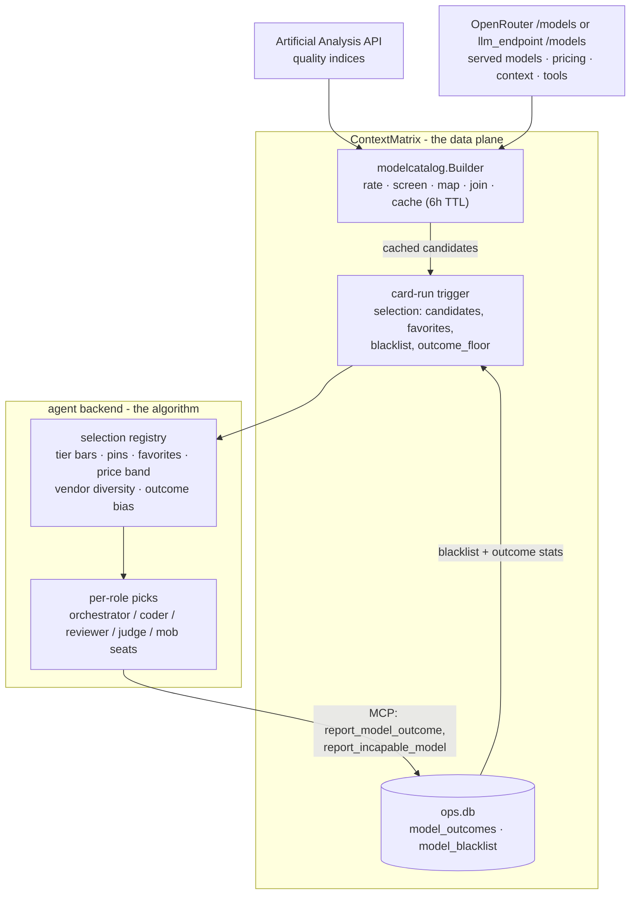

# Model Selection

This document explains how ContextMatrix decides which LLM runs each part of a
card: how the candidate catalog is built from Artificial Analysis and the
served-model list, what the trigger payload carries, how the agent backend
turns task complexity into tiers, and the exact order in which pins, favorites,
quality bars, and price decide a pick. Read it to configure selection, to
predict what it will choose, and to answer "why did it pick that model".

Two components share the work. ContextMatrix is the **data plane**: it rates
models and ships the inputs. The agent backend (the `contextmatrix-agent`
repository) is the **algorithm**: it makes every pick. Nothing in this
repository selects a model for a card run.

Chat sessions are out of scope here: a chat receives a single model choice
validated against the served catalog, never a selection payload.

## Steering the selector

The operator-facing controls, most direct first:

| I want to...                          | Knob                                        | Where                                        | Notes                                                                                          |
| ------------------------------------- | ------------------------------------------- | -------------------------------------------- | ---------------------------------------------------------------------------------------------- |
| Force a model for one card            | model pin on the card                       | card detail UI / `PATCH` card                | Honored when the slug is a candidate; then it beats everything, including the blacklist        |
| Pick the most capable model for one card's tier | card `max_capability`           | card Automation UI / `PATCH` card            | Intended: most capable in tier, ignores cost, bypasses favorites. Shipped in the payload but **not yet honored by the agent backend** |
| Prefer models for a complexity tier   | `favorites`                                 | `config.yaml` (global), `.board.yaml` (project) | Favorites skip the cost logic but must still clear the tier bar and not be blacklisted      |
| Restrict which vendors are eligible   | `backends.agent.model_allowlist`            | `config.yaml`                                | Vendor prefixes (`qwen`, `z-ai`); replaces the built-in list; inert on the `openai` leg        |
| Rate models AA does not know          | `backends.agent.model_priors`               | `config.yaml`                                | `openai` leg only; verbatim 0..1 priors                                                        |
| Widen or narrow the price band        | `selector_price_headroom`                   | agent backend `serve.yaml`                   | Default 1.5; env `CMX_SELECTOR_PRICE_HEADROOM`                                                 |
| Set the orchestrator model            | `backends.agent.default_model`              | `config.yaml`                                | Card pins override it; the selector's own empty-pool fallback is the agent's serve default     |
| Reset learned win-rates               | `DELETE /api/admin/model-outcomes`          | REST (admin)                                 | Clears outcome stats; does not touch the blacklist                                             |
| Control Best-of-N race size           | `best_of_n.*`                               | `config.yaml`                                | Caps the number of racing candidates, never the candidate list                                 |

Details for each: [The decision order](#the-decision-order),
[Configuration reference](#configuration-reference),
[Failure modes](#failure-modes).

## Who computes what



| ContextMatrix computes                                        | The agent backend computes                                  |
| ------------------------------------------------------------- | ----------------------------------------------------------- |
| Candidate list: rated, screened, priced, tool-capable models  | Card and subtask complexity tiers (planner LLM output)      |
| Normalized quality priors per role (coder, reviewer)          | The pick per role and tier: pin, favorite, bar, price band  |
| Favorites merge (global plus project)                         | Outcome-bias application to the coder prior                 |
| Blacklist and outcome stats from `ops.db`                     | Vendor diversity across multi-seat picks                    |
| The `outcome_floor` threshold                                 | In-run incapable-model recovery and re-selection            |

The agent is a pure consumer: it fetches nothing itself and holds no embedded
model knowledge. Everything it knows about models arrives in the trigger
payload. The split means the Artificial Analysis API key lives only in
ContextMatrix, and every pick is explainable from three inputs: the payload,
the agent's serve config (default model, price headroom), and the tier the
planner assigned.

## The candidate catalog (CM side)

The catalog is built by `modelcatalog.Builder`
(`internal/modelcatalog/catalog.go`) from two sources: a quality leaderboard
and the served-model list of the configured gateway.

### Data sources

**Artificial Analysis** supplies quality. The Builder fetches
`https://artificialanalysis.ai/api/v2/language/models/free` with the
`x-api-key` header (`backends.agent.aa_api_key`), paginated at roughly 200
models per page, capped at 10 pages and 60 seconds per refresh. Four fields
are consumed per model: the AA slug, the creator name, the coding index, and
the intelligence index. AA supplies no pricing. The free tier's 100
requests/day is ample: a refresh spends one request per page (the catalog is
about 3 pages), and the 6-hour cache holds normal operation to about 4
refreshes - roughly 12 requests - per day. Failed refreshes retry on a
60-second cooldown, so a broken AA response spends more.

**The served catalog** supplies availability, pricing, context windows, and
tool capability. With `llm_endpoint.type: openrouter` (the default) it comes
from `https://openrouter.ai/api/v1/models`, unauthenticated. With
`llm_endpoint.type: openai` it comes from `GET {base_url}/models` with a
Bearer token, and tool capability is read from each model's
`capabilities.features`.

### Quality priors

Each candidate carries two priors in `[0, 1]`:

- `coder_prior` = AA coding index / the highest coding index in the response
- `reviewer_prior` = AA intelligence index / the highest intelligence index

The priors are **relative to the current best model**, not absolute scores.
When a new frontier model tops the leaderboard, every other model's priors
drop on the next refresh. The 0.65 floor therefore means "within 65% of the
current best", and floor drift after leaderboard shake-ups is expected
behavior, not a bug.

### Creator screen and the allowlist

On the OpenRouter leg, only models from trusted creators become candidates.
The built-in list of vendor prefixes:

```
openai, anthropic, google, deepseek, z-ai, moonshotai, minimax, x-ai
```

`backends.agent.model_allowlist` **replaces** this list when set (it does not
extend it). Entries are OpenRouter vendor prefixes exactly as they appear in
model slugs: `qwen`, `z-ai`, `moonshotai`.

AA identifies creators by display name, which ContextMatrix slugifies into the
vendor-prefix vocabulary, with hand overrides where the two diverge
(`Alibaba` -> `qwen`, `Kimi` -> `moonshotai`, `SpaceXAI` -> `x-ai`; see
`internal/modelcatalog/mapping.go`).

**The allowlist is inert on the `openai` leg.** There, the candidate set is
governed entirely by `aa_model_map` and `model_priors`: only served slugs that
appear in one of those two maps are considered. `config.yaml.example`
documents the same caveat inline.

### The quality floor

A model is dropped when **both** priors fall below 0.65 - clearing the floor
for either role keeps it as a candidate for that role's picks. The floor is
hardcoded and not configurable.

### Slug mapping (OpenRouter leg)

AA slugs and OpenRouter slugs differ, so each surviving AA row is mapped:
prefix the creator's vendor slug and rewrite version dashes to dots
(`glm-5-2` -> `z-ai/glm-5.2`). Version-ambiguous slugs the heuristic cannot
reconstruct sit in a small override table in
`internal/modelcatalog/mapping.go`. Unmapped models are logged at debug level
and skipped.

The mapped slug is then joined against the served catalog: the model must be
served **and tool-capable** (the agent drives everything through tool calls).
The join attaches per-token prompt and completion prices and the context
window. Finally, effort variants of the same served slug collapse to the
single row with the best combined priors.

### The `openai` endpoint leg

The `openai` leg builds candidates from the **endpoint's** served list
instead:

| Aspect            | `openrouter` leg                              | `openai` leg                                                  |
| ----------------- | --------------------------------------------- | ------------------------------------------------------------- |
| Eligibility       | trusted-creator allowlist                     | membership in `aa_model_map` or `model_priors`                |
| Quality source    | AA row joined by mapped slug                  | AA stem family (`aa_model_map`) or verbatim `model_priors`    |
| Variant handling  | best combined-prior row per served slug       | independent per-axis max across the stem family               |
| Pricing / window  | OpenRouter catalog                            | endpoint catalog                                              |

`aa_model_map` maps an endpoint slug to its AA model stem; the Builder
aggregates every AA row in that stem family and takes the best coding and best
intelligence values independently (AA populates variant rows inconsistently,
so the per-axis max is deliberate). `model_priors` entries bypass the AA join
entirely - the configured 0..1 values are used verbatim. The same 0.65 floor
applies. When the endpoint serves tool-capable models that produce no
candidate (unmapped, no prior, or below the floor), the Builder logs a warning
naming the gap so a thin candidate set is never silent.

### Caching and refresh

The catalog is cached in memory for 6 hours and refreshed lazily: the first
consumer call after the TTL performs the fetch synchronously. A failed refresh
keeps serving the last good catalog and backs off for 60 seconds before the
next attempt; an AA response with zero models counts as a failure (schema
drift lands in the last-good path instead of emptying the candidate set).
There is no background refresh loop, and the TTL and cooldown are not
configurable. A restart forces a fresh fetch.

The Builder also serves three adjacent read paths from the same cache: token
pricing for cost tracking (every served model, including below-floor ones),
the model pickers in the UI, and card-pin validation. Pin validation fails
open - a catalog outage never blocks card writes.

### Builder modes

What the Builder produces depends on configuration
(`cmd/contextmatrix/main.go`):

| Condition                                                | Mode                     | Result                                                             |
| -------------------------------------------------------- | ------------------------ | ------------------------------------------------------------------ |
| agent backend configured and `aa_api_key` set            | `aa+candidates`          | full catalog: candidates, pricing, pickers, validation             |
| no AA key, `llm_endpoint.type: openai`                   | `endpoint-pricing-only`  | pricing and pickers only, no candidates                            |
| no AA key, agent or chat backend present                 | `openrouter-catalog-only`| served set and pricing only, no candidates                         |

**Without an AA key there is no `selection` block in the trigger payload at
all.** The agent then falls back to defaults for every phase - the trigger's
`default_model` for orchestrator phases, its own serve-config default for
selector picks - and no card pin is honored (a pin resolves against the
candidate catalog, which is empty). Auto-selection requires the key.

## What the trigger carries

`runCard` (`internal/api/backend_run.go`) assembles a
`protocol.SelectionContext` into every card-run trigger whenever the catalog
is configured (see [Builder modes](#builder-modes)):

| Field           | Content                                                                                  |
| --------------- | ---------------------------------------------------------------------------------------- |
| `candidates`    | the cached catalog, cloned per trigger                                                   |
| `favorites`     | operator tier preferences, global merged with project                                    |
| `blacklist`     | slugs the self-learning loop has marked incapable (from `ops.db`)                        |
| `outcome_floor` | minimum per-model sample count before win-rates bias selection (`best_of_n.outcome_floor`) |

Each `CandidateModel` carries:

| Field                                             | Content                                                        |
| ------------------------------------------------- | -------------------------------------------------------------- |
| `slug`                                            | the served model identifier the agent passes to the gateway    |
| `prompt_price_per_tok`, `completion_price_per_tok`| USD per token, from the served catalog                         |
| `context_window`                                  | tokens                                                         |
| `coder_prior`, `reviewer_prior`                   | normalized quality, `[0, 1]`                                   |
| `creator`                                         | vendor prefix, drives the agent's vendor-diversity preference  |
| `outcomes`                                        | `{samples, wins, expected_wins}` when the model has recorded outcome history (Best-of-N or solo) |

Assembly rules:

- **Favorites merge**: a project's `.board.yaml` `favorites` entry for a tier
  replaces the global `backends.agent.favorites` entry for that tier
  wholesale - the merge is per tier, not per role.
- **Blacklist and outcome reads are best-effort**: a failed `ops.db` read logs
  a warning and the trigger proceeds without that input rather than blocking
  the run.
- **`best_of_n` clamps the race size, never the candidate list**: the payload
  always carries the full candidate set; the card's `best_of_n` value is
  clamped to `best_of_n.max_candidates` at trigger time.
- **Mob execute wins over Best-of-N**: when a trigger carries both, mob coding
  takes priority and `best_of_n` is zeroed with a warning
  (see `docs/remote-execution.md`).
- The payload `model` field is `backends.agent.default_model`; card pins are
  resolved agent-side, not here.

## How the agent picks

Everything in this section is **agent side** - implemented in the
`contextmatrix-agent` repository (`internal/registry` and
`internal/orchestrator`). ContextMatrix ships the inputs only; check that
repository when a constant here drifts.

### Tiers are quality floors, not buckets

A tier does not assign models to groups. It is a minimum quality bar applied
to the candidate's per-role prior at pick time:

| Tier       | Bar (prior must be >=) |
| ---------- | ---------------------- |
| `simple`   | 0.65                   |
| `moderate` | 0.76                   |
| `complex`  | 0.82                   |
| `critical` | 0.90                   |

The same model serves every tier whose bar it clears. Cost never decides a
tier - it only orders models within the eligible set. The bar is compared
against the role's prior: `coder_prior` for coder picks, `reviewer_prior` for
reviewer picks, so a model can qualify for `complex` review work while only
clearing `moderate` for coding.

### How tiers are assigned

The planner LLM assigns tiers; **the LLM never names a model**. Its plan
output carries a `card_tier` for the whole card and a `tier` per subtask,
using these definitions from the planning prompt:

- `simple` - mechanical, low-risk
- `moderate` - standard feature work
- `complex` - architectural or high-risk
- `critical` - security-sensitive changes, or intricate concurrency or
  architecture work

Invalid tier strings fail plan validation and trigger a repair turn. Each
subtask's tier is persisted as an invisible `<!-- cm:tier=... -->` marker in
the subtask card body so a resumed run re-reads it; an unknown or missing tier
resolves to `moderate`.

### The decision order

For one pick - a role (`coder` or `reviewer`), a tier, and an estimated prompt
size - the selector runs this sequence. This is the "why did it pick X"
reference:

1. **Card pin.** If the pinned slug is present in the payload candidate list,
   it wins unconditionally - over the blacklist, over the tier bar, over the
   in-run exclude set, over cost. A pin that is *not* in the candidate list
   (below the floor, an endpoint model with no AA mapping, or shipped with no
   catalog) is not honored: every resolution path logs a warning to the card
   and falls back. The orchestrator-model resolution warns on each call; the
   coder, reviewer and Best-of-N picks warn once per run per pin type, so a
   multi-subtask card cannot fill the activity log with repeats. Note the
   asymmetry: ContextMatrix validates pins against the wider *served* catalog,
   which keeps below-floor models, so a pin can pass validation in the UI and
   still fall through at run time.
2. **Favorites.** The `(tier, role)` favorite list is scanned in configured
   order, then the `(tier, any-role)` list. The first favorite that is a
   *live candidate* wins outright, skipping the price logic and the
   vendor-diversity preference. Live candidate means: tool-capable, clears
   the tier bar, not blacklisted, not excluded this run, fits the context
   window - favorites are preferences, not overrides.
3. **Filter.** Remaining candidates must be tool-capable, not in the per-run
   exclude set, not blacklisted, allowed by the vendor-diversity constraint
   (multi-seat picks only), at or above the tier bar for the role, and have a
   context window that fits the estimated prompt.
4. **Price band.** Price is the sum of prompt and completion per-token rates.
   The band spans from the cheapest surviving candidate up to
   `cheapest x headroom` (headroom defaults to 1.5).
5. **Best value.** Within the band, the highest-prior candidate wins; ties go
   to the cheaper model. Models outside the band never win on quality - the
   band is what keeps a frontier model from being picked for a `simple` task.
6. **Empty pool.** If nothing survives, the pick falls back to the agent's
   serve-config default model, ultimately `deepseek/deepseek-v4-flash`. The
   trigger's `backends.agent.default_model` feeds the orchestrator-model
   resolution, not this fallback.

`max_capability` (a per-card, human-set flag) is intended to narrow this
sequence when the card is configured for automatic selection. **ContextMatrix
stores the flag and ships it in the trigger payload; the agent backend does not
consume it yet, so setting it currently changes nothing.** The behavior below
describes the agreed contract, not shipped behavior - check the
`contextmatrix-agent` repository for what it actually does today.

- A card pin (step 1) still wins. Note that a card can carry both: the
  "Maximum capability" checkbox is *hidden* when automatic selection is off,
  but hiding is not clearing, so a card that had the flag set before pins were
  added still stores and sends it.
- Favorites (step 2) are bypassed entirely - the flag runs no favorite scan.
- The filter (step 3) is untouched.
- The price band (step 4) is neutralised - it is not computed.
- Best value (step 5) then selects the **highest-prior** candidate in the
  tier outright, still tie-breaking to the cheaper model. The tier bar still
  bounds the pool, so the pick is the most capable model that clears the
  card's tier, not the most capable model available.
- Step 6 is unchanged: an empty pool still falls back to the agent's
  serve-config default.

### Worked example

A `moderate` coder pick (bar 0.76) with headroom 1.5, illustrative prices as
prompt+completion USD per million tokens:

| Candidate                  | `coder_prior` | Price  | In band? |
| -------------------------- | ------------- | ------ | -------- |
| deepseek/deepseek-v4-flash | 0.78          | $0.42  | yes      |
| z-ai/glm-5.2               | 0.81          | $0.55  | yes      |
| anthropic/claude-sonnet-5  | 0.93          | $9.00  | no       |
| openai/gpt-5.5             | 0.97          | $11.00 | no       |

Cheapest survivor is $0.42, so the band tops out at $0.63. Only the first two
qualify; `z-ai/glm-5.2` has the higher prior and wins. The frontier models
never enter the comparison - at `critical` tier (bar 0.90) they would be the
only survivors, and the band would re-anchor on them.

### Outcome bias

Recorded Best-of-N results nudge future coder picks. When a candidate arrives
with outcome stats and `samples >= outcome_floor`, its **coder prior** is
multiplied by:

```
clamp(1 + (wins - expected_wins) / samples,  0.8,  1.2)
```

A model that wins more head-to-head races than field size predicts gets up to
a 20% prior boost; a chronic loser is damped up to 20%. The reviewer prior is
never biased. Below the floor the stats have zero effect - selection behaves
exactly as if no history existed. `expected_wins` accumulates `1/n` per race
of size `n`, so the comparison is fair across races of different sizes and
self-play (the same model in several slots) nets out neutral.

### Multi-seat picks

Review panels, Best-of-N candidate sets, and mob discussion seats need several
distinct models. The selector repeats the single pick with a growing exclude
set, plus:

- **Soft vendor diversity**: each seat prefers vendors not yet seated, but
  only when that constraint still leaves at least one qualifying candidate;
  otherwise the pick runs vendor-blind. The price band re-anchors on the
  vendor-filtered subset, so a diverse seat can cost more than the
  vendor-blind choice would - accepted on purpose.
- **Wrap-around on a dry pool**: when the eligible pool runs out, the previous
  pick is reused rather than escalating to the default model. Model scarcity
  never shrinks the seat count - a 3-model tier with a 4-candidate race runs
  one model twice.
- The review panel is 3 seats (correctness, design, security lenses) and
  excludes every model that wrote the code under review plus any model marked
  incapable during the run - a model does not review its own work.
- In a Best-of-N race, a card's coder pin occupies slot 1 and seeds the
  vendor-diversity walk for the remaining seats.

### Fixed tiers per role

Some seats do not use the card or subtask tier:

| Seat                                                    | Role       | Tier                |
| ------------------------------------------------------- | ---------- | ------------------- |
| Subtask coder                                           | coder      | subtask tier        |
| Review panel                                            | reviewer   | card tier           |
| Review-fix coder                                        | coder      | verdict `fix_tier`, else card tier |
| Authoritative review pass and its fix run               | reviewer / coder | forced `complex` |
| Best-of-N judge                                         | reviewer   | forced `complex`    |
| Decision phases (plan decomposition, review synthesis, mob moderator) | reviewer | `complex` floor |
| Mob discussion seats                                    | reviewer   | forced `complex`    |
| Verify-command proposer                                 | reviewer   | `simple`            |

Turn budgets for coder runs (subtask execution and review fixes) scale with
tier: `complex` gets 1.5x and `critical` 2x the base allowance. Reviewer and
orchestrator runs keep the base allowance regardless of tier.

### When a model fails mid-run

When the harness classifies a model as incapable (three consecutive turns
whose emitted tool calls all fail to parse, each turn getting an in-turn
repair prompt first; turns without tool calls are neutral), the agent:

1. adds the model to the run's exclude set,
2. reports it to ContextMatrix via the `report_incapable_model` MCP tool
   (best-effort), which lands it on the instance-wide blacklist,
3. re-selects the next-best model and re-runs the same unit of work.

A single run allows **3 re-selections total** (shared across the execute and
review paths); the fourth incapable model parks the card for a human. There is
no automatic tier escalation on failure - escalation to `complex` is policy
(the authoritative review pass), never a retry mechanism.

## Self-learning: blacklist and outcomes

Two feedback loops persist in ContextMatrix's `ops.db` and shape every future
trigger.

### The blacklist

`report_incapable_model` records a slug with a reason and sample card.
Blacklisted slugs ship in every subsequent trigger's `selection.blacklist`,
and the agent's selector filters them out of every non-pinned pick.

The blacklist is **one-way**: no MCP tool, REST endpoint, or UI removes an
entry. The escape hatches are a card pin (pins beat the blacklist, provided
the slug is still a candidate) or deleting the row from `ops.db` directly
(`sqlite3 ops.db "DELETE FROM model_blacklist WHERE slug = '...'"`).
Re-reporting an already-blacklisted slug updates the reason and timestamp,
never duplicates.

### Best-of-N outcomes

After a Best-of-N race, the judge phase reports one row per candidate via
`report_model_outcome`: `win`, `loss`, or `failed` (dropped before judging),
with verify status, cost, and field size. The tool requires an active claim on
the card; field size (`n_candidates`) must be at least 1. ContextMatrix
aggregates rows into per-model stats - `samples`, `wins`, and `expected_wins`
(`SUM(1.0 / n_candidates)` per row) - and attaches them to matching candidates
on the next trigger, where they drive the [outcome bias](#outcome-bias) once
samples reach `outcome_floor`.

#### Solo outcomes

A card that never races (`n_candidates: 1`) still reports its own result:
`win` or `failed`, with no judge model. Because `expected_wins` accrues
`1/n_candidates` per row regardless of result, a solo row always stakes 1.0
expected wins - the most a single row can stake, where a race row stakes only
`1/n`. A solo win also banks 1 actual win, so actual and expected cancel
exactly: the row is neutral, pulling the bias factor toward parity rather
than above it. (A spotless race record, by contrast, is maximally positive -
each race win banks a full win against only the `1/n` staked.) A solo
failure banks 0 wins against that same 1.0 expected wins, so it subtracts
the maximum a single sample can subtract - a heavier per-sample penalty than
a raced loss, which forfeits only the `1/n_candidates` staked on that race.

Two consequences follow directly from folding solo runs into the same table:

- A model that has never raced can cross `outcome_floor` on solo volume
  alone, activating the bias multiplier without a single head-to-head result.
- A model holding a high bias factor from races regresses toward neutral as
  solo wins accumulate, because each solo win adds equally to `samples` and
  `expected_wins` (weight 1/1, versus a race win's smaller 1/n_candidates).
  This is dilution toward the neutral win rate, not inflation above it.

### Observability

- `GET /api/admin/model-outcomes` - per-model win rates, expected wins, cost,
  and whether the sample count makes the model's stats `active`;
  `DELETE` on the same path resets the stats (the blacklist is untouched).
  Full schema in `docs/api-reference.md`.
- The admin UI's model-selection page shows the same data with a reset button.
- Metrics: `contextmatrix_model_outcomes_total{model,result}` and
  `contextmatrix_model_blacklists_total{model}`. There are no catalog metrics
  (no refresh counter or candidate gauge); catalog health surfaces in logs.

## Configuration reference

`config.yaml.example` is the canonical reference for shapes, comments, and env
overrides; this table maps the knobs to their effect on selection.

| Key                                  | Default              | Effect                                                                  |
| ------------------------------------ | -------------------- | ----------------------------------------------------------------------- |
| `backends.agent.aa_api_key`          | unset                | Enables the candidate catalog; without it, no auto-selection at all     |
| `backends.agent.default_model`       | unset                | Orchestrator model for the run; card pins override. The selector's empty-pool fallback is the agent's serve default |
| `backends.agent.model_allowlist`     | built-in vendor list | Replaces the trusted-creator list (OpenRouter leg only)                 |
| `backends.agent.aa_model_map`        | none                 | Endpoint slug -> AA stem (`openai` leg only)                            |
| `backends.agent.model_priors`        | none                 | Verbatim 0..1 priors for slugs AA does not rate (`openai` leg only)     |
| `backends.agent.favorites`           | none                 | Per-tier preferred models, optionally per role                          |
| `favorites` in a project `.board.yaml` | none               | Per-project override; replaces the global entry per tier; hand-edited only (see `docs/data-model.md`) |
| `llm_endpoint.type`                  | `openrouter`         | Selects the catalog leg and the wire dialect                            |
| `best_of_n.max_candidates`           | 5                    | Hard cap on a card's race size                                          |
| `best_of_n.default_candidates`       | 3                    | UI-suggested race size                                                  |
| `best_of_n.outcome_floor`            | 20                   | Samples required before win-rates bias selection                        |
| `selector_price_headroom` (agent `serve.yaml`) | 1.5        | Width of the price band; env `CMX_SELECTOR_PRICE_HEADROOM`              |

**Not configurable** (compile-time constants): the 0.65 candidate floor, the
tier bars (0.65 / 0.76 / 0.82 / 0.90), the 6-hour catalog TTL and 60-second
failure cooldown, the AA pagination cap and fetch budget, the API endpoints,
and the equal prompt+completion price weighting.

## Failure modes

| Symptom                                        | Cause                                                                 | Behavior                                                                          |
| ---------------------------------------------- | --------------------------------------------------------------------- | --------------------------------------------------------------------------------- |
| Every phase runs on a default model            | No `aa_api_key` (no `selection` block at all) or an empty candidate set (block present, zero candidates) | The agent cannot auto-select; orchestrator phases use the trigger `default_model`, selector picks the agent serve default |
| Candidates gone after a restart during an AA outage | The cache is in-memory only - a restart loses the last-good catalog | While CM stays up, a failed refresh keeps serving the last-good catalog (60s retry cooldown); after a restart, candidates return on the first successful refresh |
| A pinned model is ignored                      | The pin is not in the candidate list (below floor, unmapped endpoint model, or no catalog) | All resolution paths warn on the card and fall back: orchestrator resolution on each call, coder and reviewer picks once per run per pin type. CM validates pins against the wider served set, so the write was accepted |
| A favorite is never picked                     | Blacklisted, below the tier bar, not a candidate (outside the allowlist), or its tier entry was replaced wholesale by a project override | Favorites are preferences, not overrides; check `selection.blacklist` and the bar |
| `model_allowlist` has no effect                | `llm_endpoint.type: openai`                                           | The allowlist only screens the OpenRouter leg; use `aa_model_map` / `model_priors` |
| Endpoint models served but never selected      | Unmapped in `aa_model_map`, no `model_priors` entry, or below floor   | The Builder logs a warning naming the gap at refresh time                          |
| A model keeps disappearing from selection      | It was reported incapable and blacklisted                             | One-way; pin it or delete the `model_blacklist` row to restore                     |
| Win-rates visibly not affecting picks          | `samples < outcome_floor`                                             | By design - below the floor the stats have zero effect                             |
| Priors dropped across the board overnight      | A new frontier model topped the AA leaderboard                        | Priors are normalized to the current best; expected drift                          |
| A newly served model is missing                | Catalog is cached                                                     | Up to 6h staleness; restart CM to force a refresh                                  |

## See Also

- `docs/remote-execution.md` - the trigger payload around the `selection`
  block, Best-of-N and mob run modes.
- `docs/agent-workflow.md` § Model Allocation - which phase runs which role.
- `docs/api-reference.md` - the admin model-outcomes endpoints.
- `docs/data-model.md` - project-level `favorites` in `.board.yaml`.
- `config.yaml.example` - every key above with full comments and env names.
- The `contextmatrix-agent` repository - the selection algorithm's source
  (`internal/registry`) and its `serve.yaml.example`.
