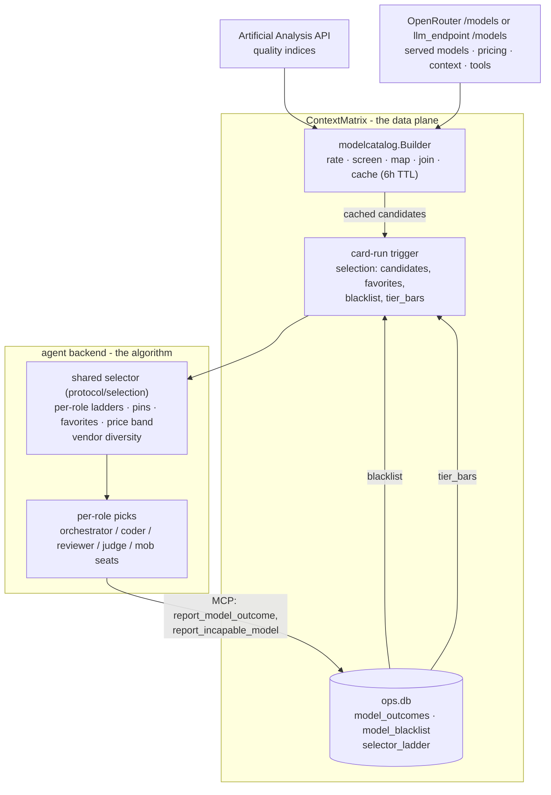

# Model Selection

How ContextMatrix decides which LLM runs each part of a card: how the
candidate catalog is built from Artificial Analysis (AA) and the served-model
list, what the trigger payload carries, how the agent backend turns task
complexity into tiers, and the order in which pins, favorites, quality bars,
and price decide a pick. Read it to configure selection, to predict a pick,
and to answer "why did it pick that model".

Two components share the work. ContextMatrix is the **data plane**: it rates
models and ships the inputs. The agent backend (the `contextmatrix-agent`
repository) is the **algorithm**: it makes every pick. Nothing in this
repository selects a model for a card run.

Chat sessions are out of scope: a chat receives a single model choice
validated against the served catalog, never a selection payload.

## Steering the selector

The operator-facing controls, most direct first:

| I want to...                          | Knob                                        | Where                                        | Notes                                                                                          |
| ------------------------------------- | ------------------------------------------- | -------------------------------------------- | ---------------------------------------------------------------------------------------------- |
| Force a model for one card            | model pin on the card                       | card detail UI / `PATCH` card                | Honored when the slug is a candidate; then it beats everything, including the blacklist        |
| Pick the most capable model for one card's tier | card `max_capability`           | card Automation UI / `PATCH` card            | Most capable in tier: ignores the price band and bypasses favorites. Tier bar, blacklist, in-run exclusion, vendor diversity and window fit still apply; equal quality still tie-breaks to the cheaper model |
| Prefer models for a complexity tier   | `favorites`                                 | `config.yaml` (global), `.board.yaml` (project) | Favorites skip the cost logic but must still clear the tier bar and not be blacklisted      |
| Restrict which vendors are eligible   | `backends.agent.model_allowlist`            | `config.yaml`                                | Vendor prefixes (`qwen`, `z-ai`); replaces the built-in list; inert on the `openai` leg        |
| Rate models AA does not know          | `backends.agent.model_priors`               | `config.yaml`                                | `openai` leg only; verbatim 0..1 priors                                                        |
| Widen or narrow the price band        | Price headroom                              | Model selection admin page                   | Default 1.5; stored in `ops.db`, sent with every run as `selection.price_headroom`; never a config-file setting |
| Raise or lower a tier's quality bar   | Tier ladders                                | Model selection admin page                   | One ladder per role (coder, reviewer), linked in the page when the saved ladders are equal; stored in `ops.db`, sent with every run as `selection.tier_bars`; never a config-file setting |
| Set the orchestrator model            | `backends.agent.default_model`              | `config.yaml`                                | Card pins override it; the selector's empty-pool fallback resolves to the trigger's `default_model` when set, else the agent's serve default, else the compiled-in `deepseek/deepseek-v4-flash`
| Clear the outcome ledger              | `DELETE /api/admin/model-outcomes`          | REST (admin)                                 | Observability data only - selection never reads it; does not touch the blacklist               |
| Blacklist a model by hand             | `POST /api/admin/model-blacklist`           | REST (admin) / right-click on the model-selection admin page | Same row an agent report writes; excluded from every automatic pick and seat until delisted |
| Delist a blacklisted model            | `DELETE /api/admin/model-blacklist/{slug...}` | REST (admin) / model-selection admin page  | Makes the model selectable again; the list itself is `GET /api/admin/model-blacklist`          |
| Control Best-of-N race size           | `best_of_n.*`                               | `config.yaml`                                | Caps the number of racing candidates, never the candidate list                                 |

Details for each: [The decision order](#the-decision-order),
[Configuration reference](#configuration-reference),
[Failure modes](#failure-modes).

## Who computes what



| ContextMatrix computes                                        | The agent backend computes                                  |
| ------------------------------------------------------------- | ----------------------------------------------------------- |
| Candidate list: rated, screened, priced, tool-capable models  | Card and subtask complexity tiers (planner LLM output)      |
| Normalized quality priors per role (coder, reviewer)          | The pick per role and tier: pin, favorite, bar, price band  |
| Favorites merge (global plus project)                         | Vendor diversity across multi-seat picks                    |
| Blacklist from `ops.db`                                       | In-run incapable-model recovery and re-selection            |
| Per-role tier ladders, edited on the admin page and stored in `ops.db` | Descent down the ladder when a rung is dry (the shared selector, also used by CM's preview) |

The agent is a pure consumer: it fetches nothing itself and holds no embedded
model knowledge. Everything it knows about models arrives in the trigger
payload. The AA API key therefore lives only in ContextMatrix, and every pick
is explainable from three inputs: the payload, the agent's serve config
(default model), and the tier the planner assigned. The
selector itself is the protocol module's `selection` package, so CM's
preview and the agent's pick are one rule.

## The candidate catalog (CM side)

The catalog is built by `modelcatalog.Builder`
(`internal/modelcatalog/catalog.go`) from two sources: a quality leaderboard
and the served-model list of the configured gateway.

### Data sources

**Artificial Analysis** supplies quality. The Builder fetches
`https://artificialanalysis.ai/api/v2/language/models/free` with the
`x-api-key` header (`backends.agent.aa_api_key`), paginated at 200 models
per page, capped at 10 pages and 60 seconds per refresh. Four fields are
consumed per model: the AA slug, the creator name, the coding index, and the
intelligence index. AA also publishes each row's list price (`price_1m_input_tokens`,
`price_1m_output_tokens`), which the `openai` leg uses to price candidates
(see [endpoint pricing](#endpoint-pricing)). The free tier's 100 requests per
day is ample: a refresh spends one request per page (the catalog is about 3
pages), and the 6-hour cache holds normal operation to about 4 refreshes per
day. Failed refreshes retry on a 60-second cooldown, so a broken AA response
spends more.

**The served catalog** supplies availability, pricing, context windows, and
tool capability. With `llm_endpoint.type: openrouter` (the default) it comes
from `https://openrouter.ai/api/v1/models`, unauthenticated, and a model is
tool-capable when `supported_parameters` lists `tools`. With
`llm_endpoint.type: openai` it comes from `GET {base_url}/models` with a
Bearer token, and tool capability is read from `capabilities.features`.

### Quality priors

Each candidate carries two priors in `[0, 1]`:

- `coder_prior` = AA coding index / the highest coding index in the response
- `reviewer_prior` = AA intelligence index / the highest intelligence index

The priors are **relative to the current best model**, not absolute scores.
When a new frontier model tops the leaderboard, every other model's priors
drop on the next refresh. The 0.65 floor therefore means "within 65% of the
current best", and floor drift after leaderboard shake-ups is expected
behavior, not a bug.

### Creator screen and the allowlist

On the OpenRouter leg, only models from trusted creators become candidates.
The built-in list of vendor prefixes:

```
openai, anthropic, google, deepseek, z-ai, moonshotai, minimax, x-ai
```

`backends.agent.model_allowlist` **replaces** this list when set (it does not
extend it). Entries are OpenRouter vendor prefixes exactly as they appear in
model slugs: `qwen`, `z-ai`, `moonshotai`.

AA identifies creators by display name, which ContextMatrix slugifies into the
vendor-prefix vocabulary, with hand overrides where the two diverge
(`Alibaba` -> `qwen`, `Kimi` -> `moonshotai`, `SpaceXAI` -> `x-ai`; see
`internal/modelcatalog/mapping.go`).

**On the `openai` leg the allowlist screens the models the automatic AA join
produces**, exactly as it screens the OpenRouter catalog. `model_priors`
entries bypass it: they are explicit operator intent.

### The quality floor

A model is dropped when **both** priors fall below the floor; clearing the
floor for either role keeps it as a candidate for that role's picks. The floor
defaults to 0.65 and is configured via `backends.agent.catalog_quality_floor`
(env `CONTEXTMATRIX_BACKEND_AGENT_CATALOG_QUALITY_FLOOR`). 0 means unset, and
the Builder's fallback keeps the effective floor at 0.65 ("within 65% of the
current best"); values outside [0, 1) are rejected at config load.

### Slug mapping (OpenRouter leg)

AA slugs and OpenRouter slugs differ, so each surviving AA row is mapped:
prefix the creator's vendor slug and rewrite version dashes to dots
(`glm-5-2` -> `z-ai/glm-5.2`). Version-ambiguous slugs the heuristic cannot
reconstruct sit in a small override table in
`internal/modelcatalog/mapping.go`. Unmapped models are logged at debug level
and skipped.

The mapped slug is then joined against the served catalog: the model must be
served **and tool-capable** (the agent drives everything through tool calls).
The join attaches per-token prompt and completion prices and the context
window. Finally, effort variants of the same served slug collapse to the
single row with the best combined priors.

### The `openai` endpoint leg

The `openai` leg builds candidates from the **endpoint's** served list
instead:

| Aspect            | `openrouter` leg                              | `openai` leg                                                  |
| ----------------- | --------------------------------------------- | ------------------------------------------------------------- |
| Eligibility       | trusted-creator allowlist                     | automatic AA family join screened by the same allowlist, or a `model_priors` entry |
| Quality source    | AA row joined by mapped slug                  | the closest scored row of the joined AA family, or verbatim `model_priors` |
| Variant handling  | best combined-prior row per served slug       | the row for the wanted effort (served suffix, else `llm_endpoint.reasoning_effort` for OpenAI families) when scored; else closest row first: the family base row when scored, else the fewest-stripped scored variant |
| Pricing / window  | OpenRouter catalog                            | window from the endpoint catalog; candidate price from the gateway, else AA, else `token_costs` |

**The automatic join.** Served ids and AA slugs are reduced to one canonical
family key: lowercase, vendor prefix dropped, dots rewritten to dashes, and
trailing reasoning-effort suffixes (`low`, `medium`, `high`, `xhigh`,
`minimal`, `reasoning`, `non-reasoning`, `thinking`, `adaptive`) and date
tokens (`0420`, `20250929`, `05-26`, `09-2025`, `2024-08-06`, `may-2024`)
stripped until nothing changes. `anthropic/claude-opus-5`, `gpt-5.2`,
`claude-sonnet-4-5-20250929` and `deepseek-v4-flash-0420-high` reduce to
`claude-opus-5`, `gpt-5-2`, `claude-sonnet-4-5` and `deepseek-v4-flash`.
Model-identity suffixes such as `mini`, `codex`, `flash` and `preview` are
never stripped. Known AA-side naming quirks are covered by built-in rewrites
in `internal/modelcatalog/mapping.go` (the 4.x Anthropic ordering flip,
`claude-4-5-sonnet` for the vendor's `claude-sonnet-4-5`, and a short
per-slug table); they ship with ContextMatrix and are not configuration.

Each tool-capable served model is looked up by the key of its id, then the key
of each `alias_names` entry the gateway lists. The first key with AA rows
wins. Within that family the scored row closest to the served id supplies the
priors: the row whose slug equals the key when it is scored, otherwise the
scored row with the fewest effort suffixes stripped, then the fewest date
tokens stripped, then the highest combined prior. A gateway serving `gpt-5.2`
is scored from AA's `gpt-5-2` row, not from `gpt-5-2-medium`; one serving
`deepseek-v4-flash` is scored from `deepseek-v4-flash-0420`. Closeness is
measured against the family key, with one refinement: when the served id names
a reasoning effort (`gpt-5.2-high`), or the gateway pins one for its OpenAI
models (`llm_endpoint.reasoning_effort: medium`; the id's own suffix wins when
both apply), the scored row carrying that effort suffix (`gpt-5-2-high`,
`gpt-5-2-medium`) beats every other row in the family. The configured effort
is an OpenAI setting: it reaches only families whose AA creator is OpenAI.
A served `anthropic/claude-opus-5` on the same gateway is scored from
`claude-opus-5`, never from `claude-opus-5-medium`, unless its own id names
the effort. When the family has no scored row for that effort, or no effort
is named or configured, the closest rule above applies and the base row wins.
A gateway that pins one effort and serves bare OpenAI ids therefore needs the
one config line; without it every OpenAI model on that gateway is rated at
whatever effort AA ran the base row at. `model_priors` remains the override
when the chosen row still under-scores a model.
The chosen row's creator must pass the allowlist. A nil index on the chosen
row yields no prior for that role (the candidate competes only on the
scored axis). A `model_priors` entry for a tool-capable slug is used
verbatim: no AA join, no allowlist screen applies. For a tool-incapable slug
the entry is excluded with the no-tools reason and never becomes a candidate.
The same floor applies to both paths.

Exclusions are loud: every tool-capable served model that does not become a
candidate is logged at WARN with its slug and the specific reason - no AA
family matches this model (with the keys tried), the family has no usable
scores (with the family's AA slugs), the creator is not in the allowlist,
below the quality floor for both roles, or the gateway reports the model
cannot use tools. For a tool-capable model the fifth reason (no tools) is a
configuration gap: remove or correct the model_priors entry. A tool-incapable
slug is logged only when a model_priors entry names it; the many embedding
and vision models the gateway serves without tool support stay silent.
For the other reasons the miss is a ContextMatrix rewrite gap or an AA gap,
not a configuration gap: report the logged keys, and use `model_priors` for
the model until a rewrite ships. The refresh also logs
the resolved candidate set: one line per served candidate with its coder
prior, reviewer prior, how it was joined (`automatic` or `model_priors`),
the AA slug it was scored from, and where its price came from.

### Endpoint pricing

The selector's price band needs a price per candidate, and an
OpenAI-compatible gateway may publish none: the OpenAI protocol has no
pricing block. An unpriced catalog is quietly expensive: every candidate
arrives at price 0, the price band (step 4 below) computes
`0 * headroom = 0`, admits the whole pool, and the best-value rule
degenerates into "highest prior wins" - the most expensive frontier model on
every pick, on every card. Nothing errors, and cost reporting still looks
right, because card costs are priced separately.

Three sources feed the price, and the candidate and the card-cost paths read
them differently.

**Both pricing dialects are read** from the gateway's `/models`. Pricing
blocks come in two shapes in the wild, and the key sets do not overlap, so
whichever the gateway populated is used:

| Dialect      | Keys                                                                          | Unit         | Type    |
| ------------ | ----------------------------------------------------------------------------- | ------------ | ------- |
| OpenRouter   | `prompt`, `completion`, `input_cache_read`, `input_cache_write`                | per token    | strings |
| per-million  | `input_per_1m`, `output_per_1m`, `cache_read_per_1m`, `cache_write_per_1m`     | per 1M tokens| numbers |

The per-token dialect wins when it prices anything; otherwise the per-million
numbers are scaled down. Cache rates resolve independently of the
prompt/completion pair, so a gateway that omits them still yields usable
input/output rates. Long-context step pricing (`tiers`) is not read - CM prices
a model with one rate pair, and the base tier is the honest choice for the
band; a run crossing a tier boundary is therefore under-costed, and
`token_costs` is the lever if that matters.

**Artificial Analysis publishes a list price** per row
(`price_1m_input_tokens`, `price_1m_output_tokens`, `price_1m_cache_hit_tokens`,
`price_1m_cache_write_tokens`, USD per million), read alongside the quality
indices. A row that prices neither the input nor the output side counts as
unpriced; the cache rates never decide that and only reach card costs.

**`token_costs` is the operator's table**, resolved per model in this order,
first hit wins: the served slug (`anthropic/claude-opus-5`), the slug with
its vendor prefix stripped (`claude-opus-5`), then each `alias_names` entry
the gateway lists - which is how a table keyed on dated model names
(`claude-sonnet-4-5-20250929`) prices a gateway serving the undated slug. A
rate row that prices neither prompt nor completion tokens counts as absent.

**The candidate** the selector sees is priced from the gateway when it
published a price, else from the joined AA row's list price, else from
`token_costs`, else 0. AA beats `token_costs` on purpose: the list price is
live, the table is whatever the operator last typed. The gateway's own price
always wins, so a gateway that does publish prices is unaffected. The
`model_priors` path has no AA row and resolves gateway, then `token_costs`,
then 0.

**Card costs** follow the same order. After the join, every served model
the gateway left unpriced adopts the list price of the AA row the join
chose for it, all four rates, on the catalog entry behind `Rate()`,
replacing a `token_costs` fill. The floor and the allowlist gate selection,
not billing: a model they exclude is priced the same way, so a pinned or
chat-picked model outside the candidate set still costs. Every cost path
(usage reports, recalculation, chat pricing) then bills the model at the
number the selector ranked it on, and a gateway without a pricing block
needs no `token_costs` table for card costs to come out. A usage report
names the model the way the gateway echoed it in the completion, which on
a gateway serving vendor-prefixed ids is the bare name (`claude-opus-5`)
or a dated snapshot (`gpt-5.4-2026-03-05`); `Rate()` resolves such a name
to the served id through the vendor-stripped id or a gateway alias, else
through the name with its date token removed (never an effort word: `sonar`
is not `sonar-reasoning`), and leaves a name two served models could claim
unpriced rather than guess. This resolution is endpoint-leg only: OpenRouter
echoes the served slug, so that leg keeps its exact lookup. What stays on
`token_costs` (or the gateway): a served model that cannot use tools, one
no AA family matches, one whose family has no scored row, and the
`model_priors` path, which has no AA row. An exact-slug `token_costs` entry
still wins over the catalog for card costs (see
[token cost rates](configuration.md#token-cost-rates)), so negotiated or
cache-aware rates remain the operator's lever. A row that omits a cache
rate leaves it unset, and the prompt-derived multipliers cover it.

The adopted row is the one the priors came from, named by `source` in the
"endpoint model scored" refresh log line. A family whose scored rows carry
different prices (dated snapshots of one served id, say) is billed at that
row's price; an exact-slug `token_costs` entry is the correction. Because
the list price is now part of the catalog's pricing, an AA outage after a
successful refresh keeps the last-good priced catalog behind `Rate()`
rather than swapping in a fresh unpriced one; only a first-ever refresh
adopts the served set unpriced so pickers and pin validation work.

Every model still unpriced for card costs after both fills is logged at
WARN, once per refresh, naming the slug: its card costs will report as 0. Every
candidate still unpriced after all three sources is logged separately: the
selector will treat it as free and it will win any price comparison it
enters. Both warnings are the tripwire for a gateway changing its pricing
schema again.

### Caching and refresh

The catalog is cached in memory for 6 hours and refreshed lazily: the first
consumer call after the TTL performs the fetch synchronously. A failed refresh
keeps serving the last good catalog and backs off for 60 seconds before the
next attempt; an AA response with zero models counts as a failure (schema
drift lands in the last-good path instead of emptying the candidate set).
There is no background refresh loop, and the TTL and cooldown are not
configurable. A restart forces a fresh fetch.

The Builder also serves three adjacent read paths from the same cache: token
pricing for cost tracking (every served model, including below-floor ones),
the model pickers in the UI, and card-pin validation. On the OpenRouter leg
the picker and validation set is vendor-screened by the allowlist, with two
exceptions that stay pickable: `openrouter/auto` and every operator favorite,
even one outside the allowlist. A favorite outside the allowlist is still not
a selection candidate. Pin validation fails open: a catalog outage never
blocks card writes.

### Builder modes

What the Builder produces depends on configuration
(`cmd/contextmatrix/main.go`):

| Condition                                                  | Mode                      | Result                                                             |
| ---------------------------------------------------------- | ------------------------- | ------------------------------------------------------------------ |
| agent backend enabled and `aa_api_key` set                 | `aa+candidates`           | full catalog: candidates, pricing, pickers, validation             |
| no AA key, `llm_endpoint.type: openai`                     | `endpoint-pricing-only`   | pricing and pickers only, no candidates                            |
| no AA key, agent enabled or chat enabled with an `api_key` | `openrouter-catalog-only` | served set and pricing only, no candidates                         |
| none of the above                                          | no Builder                | no pricing beyond `token_costs`, no pickers, no pin validation     |

The startup log line `model catalog builder initialized` names the mode.

**Without an AA key there is no `selection` block in the trigger payload at
all.** The agent then falls back to defaults for every phase - the trigger's
`default_model` for orchestrator phases, the same three-tier fallback for
selector picks (trigger `default_model` first, then the agent's serve default,
then the compiled-in `deepseek/deepseek-v4-flash`) - and no card pin is
honored (a pin resolves against the candidate catalog, which is empty).
Auto-selection requires the key.

## What the trigger carries

`runCard` (`internal/api/backend_run.go`) assembles a
`protocol.SelectionContext` into every card-run trigger whenever the catalog
is configured (see [Builder modes](#builder-modes)):

| Field           | Content                                                                                  |
| --------------- | ---------------------------------------------------------------------------------------- |
| `candidates`    | the cached catalog, cloned per trigger                                                   |
| `favorites`     | operator tier preferences, global merged with project                                    |
| `blacklist`     | slugs reported incapable (from `ops.db`)                                                 |
| `tier_bars`     | the per-role quality ladders saved on the admin page; absent when none is saved, which the agent reads as its built-in ladder |

Each `CandidateModel` carries:

| Field                                             | Content                                                        |
| ------------------------------------------------- | -------------------------------------------------------------- |
| `slug`                                            | the served model identifier the agent passes to the gateway    |
| `prompt_price_per_tok`, `completion_price_per_tok`| USD per token: the gateway's price, else the AA list price, else `token_costs` (see [endpoint pricing](#endpoint-pricing)) |
| `context_window`                                  | tokens                                                         |
| `coder_prior`, `reviewer_prior`                   | normalized quality, `[0, 1]`                                   |
| `creator`                                         | vendor prefix, drives the agent's vendor-diversity preference  |

Recorded model outcomes never ship in the trigger: selection is priors-only,
and the outcome ledger (below) exists for operators, not the selector.

Assembly rules:

- **Favorites merge**: a project's `.board.yaml` `favorites` entry for a tier
  replaces the global `backends.agent.favorites` entry for that tier
  wholesale - the merge is per tier, not per role.
- **The blacklist read is best-effort**: a failed `ops.db` read logs
  a warning and the trigger proceeds without that input rather than blocking
  the run.
- **`best_of_n` clamps the race size, never the candidate list**: the payload
  always carries the full candidate set; the card's `best_of_n` value is
  clamped to `best_of_n.max_candidates` at trigger time.
- **Mob execute wins over Best-of-N**: when a trigger carries both, mob coding
  takes priority and `best_of_n` is zeroed with a warning (see
  [remote execution](remote-execution.md#mob-sessions)).
- The payload `model` field is `backends.agent.default_model`; card pins are
  resolved agent-side, not here.

## How the agent picks

Everything in this section is **agent side** - implemented in the
`contextmatrix-agent` repository (`internal/registry` and
`internal/orchestrator`). ContextMatrix ships the inputs only; check that
repository when a constant here drifts.

### Tiers are quality floors, not buckets

A tier does not assign models to groups. It is a minimum quality bar applied
to the candidate's per-role prior at pick time. These are the built-in
defaults:

| Tier       | Bar (prior must be >=) |
| ---------- | ---------------------- |
| `simple`   | 0.65                   |
| `moderate` | 0.76                   |
| `complex`  | 0.82                   |
| `critical` | 0.90                   |

The ladder is set per role on the Model selection admin page
(`/admin/model-selection`), stored in CM's `ops.db`, and sent with every run
as `selection.tier_bars`; it is not a config-file setting on either side.
There is one ladder for coder picks and one for reviewer picks because the
two priors come from different indices with different shapes: the coding
index bunches near the top while the intelligence index spreads, so one bar
gates the two roles very differently. The page links the two whenever the
saved ladders are equal, so a drag moves the same tier in both; unlinked,
each moves alone.

The ladders reach a run only when the candidate catalog is configured: CM
attaches the `selection` block, ladders included, only with
`backends.agent.aa_api_key` set, so an instance without a catalog still
stores ladders that no run ever receives.

A ladder must be non-decreasing (`simple <= moderate <= complex <=
critical`) with every bar in `[0, 1]`; the page clamps a drag between its
neighbours and above the catalog quality floor, and the server rejects
anything else with `422`. A saved ladder that still fails the agent's
validation for one role (a mismatch between CM and agent versions) makes the
agent fall back to the built-in ladder for that role, log it on the card,
and carry on; the other role is unaffected.

#### The ladders page

The page shows every candidate as a pill at its prior, one column per role,
with the tier bands and their model counts, and the bars as draggable
handles (coder handles on the rail, reviewer handles at the reviewer
column's edge). A filled pill is the pick at its rung, a dashed outline a
panel seat, a struck-through pill a blacklisted model. Membership, bands and
counts are computed in the browser from the candidates and both ladders;
picks and the three-seat panel come from `POST /api/admin/selector/preview`,
debounced while a bar moves, and the last good preview stays visible with an
error line if a request fails. The KPI row shows the reviewers clearing
`complex`, the cheapest `complex` reviewer, the `complex` panel's price per
million tokens (orange when a seat walked), and the `moderate` coder pick.
A price marked *list* is the Artificial Analysis list price: the gateway
published none for that model (see [endpoint pricing](#endpoint-pricing)).
A pill's tooltip names the AA row the candidate was scored from, and the
panel's meta line names the reasoning effort the gateway pins for its OpenAI
models when `llm_endpoint.reasoning_effort` is set.

Right-clicking a pill, a pick name in the preview, or a panel seat opens a
one-item menu for that model: **Add to blacklist**, or **Remove from
blacklist** when it is already struck (the same confirm as the table's
delist button). Either change refetches the catalog and the blacklist
panel and re-runs the preview, so the pills, picks and seats reflect the
new blacklist at once. The ladders and headroom on screen are untouched;
the blacklist is not part of the unsaved draft.

Nothing is sent until **Save**; the status pill says whether the next run
uses what is on screen. **Discard changes** returns to the saved ladders and
headroom, **Reset to defaults** loads the built-in ladder into both roles and
the built-in headroom (still unsaved). The price headroom field on the
Ladders panel is saved with the ladders and applied by the preview. The
preview applies the backend-level favorites and the blacklist; project
favorites and in-run exclusions are not visible to it, so a run can pick
differently at a tier where those apply.

The same model serves every tier whose bar it clears. Cost never decides a
tier - it only orders models within the eligible set. The bar is compared
against the role's prior: `coder_prior` for coder picks, `reviewer_prior` for
reviewer picks, so a model can qualify for `complex` review work while only
clearing `moderate` for coding.

### How tiers are assigned

The planner LLM assigns tiers; **the LLM never names a model**. Its plan
output carries a `card_tier` for the whole card and a `tier` per subtask,
using these definitions from the planning prompt:

- `simple` - mechanical, low-risk
- `moderate` - standard feature work
- `complex` - architectural or high-risk
- `critical` - security-sensitive changes, or intricate concurrency or
  architecture work

Invalid tier strings fail plan validation and trigger a repair turn. Each
subtask's tier is persisted as an invisible `<!-- cm:tier=... -->` marker in
the subtask card body so a resumed run re-reads it; an unknown or missing tier
resolves to `moderate`.

### The decision order

For one pick - a role (`coder` or `reviewer`), a requested tier, and an
estimated prompt size - the selector runs this sequence. This is the "why did
it pick X" reference. Steps 2-5 run once per rung of the tier ladder: starting
at the requested tier, an empty rung steps down to the next configured tier
with a strictly lower bar and repeats the same steps there, until a rung
produces a model or the ladder bottoms out at step 6. Each rung's result is
exactly what a direct request at that rung would have picked, so walking down
can never hand back a worse model than asking for the lower tier directly
would have.

1. **Card pin.** If the pinned slug is present in the payload candidate list,
   it wins unconditionally - over the blacklist, over the tier bar, over the
   in-run exclude set, over cost. A pin that is *not* in the candidate list
   (below the floor, an endpoint model no AA family matches, or shipped with no
   catalog) is not honored: every resolution path logs a warning to the card
   and falls back. The orchestrator-model resolution warns on each call; the
   coder, reviewer and Best-of-N picks warn once per run per pin type, so a
   multi-subtask card cannot fill the activity log with repeats. Note the
   asymmetry: ContextMatrix validates pins against the wider *served* catalog,
   which keeps below-floor models, so a pin can pass validation in the UI and
   still fall through at run time.
2. **Favorites.** The `(tier, role)` favorite list is scanned in configured
   order, then the `(tier, any-role)` list, both evaluated against the rung
   being tried. The first favorite that is a *live candidate* wins outright,
   skipping the price logic and the vendor-diversity preference. Live
   candidate means: tool-capable, clears the rung's bar, not blacklisted, not
   excluded this run, fits the context window - favorites are preferences,
   not overrides.
3. **Filter.** Remaining candidates must be tool-capable, not in the per-run
   exclude set, not blacklisted, allowed by the vendor-diversity constraint
   (multi-seat picks only), at or above the rung's bar for the role, and have
   a context window that fits the estimated prompt.
4. **Price band.** Price is the sum of prompt and completion per-token rates.
   The band spans from the cheapest surviving candidate up to
   `cheapest x headroom` (the operator's saved headroom, built-in 1.5). An unpriced catalog makes
   this step a no-op (`0 x headroom = 0` admits everything) and step 5 then
   picks on quality alone; see [endpoint pricing](#endpoint-pricing).
5. **Best value.** Within the band, the highest-prior candidate wins; ties go
   to the cheaper model. Models outside the band never win on quality - the
   band is what keeps a frontier model from being picked for a `simple` task.
   If the rung is dry, the walk steps down to the next configured rung and
   retries from step 2.
6. **Ladder bottom: the capable default.** Once every rung is dry, the pick
   falls to the operator's capable default: the trigger's
   `backends.agent.default_model` when set, else the agent's serve-config
   default, else the compiled-in `deepseek/deepseek-v4-flash`. The default is
   not an unconditional floor - it is filtered by the same exclude set,
   blacklist, vendor bars, and window-fit check as any candidate, though never
   by the quality bar (an operator-configured default is typically absent
   from the catalog, so there is usually no measured prior to bar it on). A
   default that fails one of those filters means the whole pick refuses - the
   no-model path - and each phase answers refusal differently: the coder
   phase parks the card as blocked; a fix round parks the card back to
   review, since the code under review is already written and pushed; the
   Best-of-N judge degrades to the unjudged-winner path; a mob discussion
   falls back to the solo specialist panel; the verify-command proposer just
   skips the step, since an unproposed gate is safe.

Every pick - laddered, favorite, pinned, or the capable default - emits a
`model_selected` transcript event naming the phase, model, source, and both
the requested and met tier, so nothing a phase ran on is silent even when it
was at bar. A pick that lands below the tier it was asked for also gets a
one-time card-log advisory per `(phase, role, requested -> met)` combination
plus a `state_change` warning event - a downgrade is never inferred from
behavior alone.

To keep the upper rungs served instead of walking down, pin or favorite a
model at `complex`/`critical`, or lower the relevant bar on the Model
selection admin page's tier ladders for whichever rung keeps emptying.

`max_capability` (a per-card, human-set flag) narrows this sequence when the
card is configured for automatic selection. ContextMatrix stores the flag and
ships it in the trigger payload; the agent backend consumes it as
`registry.Selection.MaxCapability`, a run-level field set once when the registry
is built. Every automatic pick in the run inherits it: the coder, the planner's
model floor, the review-panel seats, the judge, the verify/propose step, and mob
and Best-of-N seats. Only a resolvable card pin escapes it.

- A card pin (step 1) still wins. Note that a card can carry both: the
  "Maximum capability" checkbox is *hidden* when automatic selection is off,
  but hiding is not clearing, so a card that had the flag set before pins were
  added still stores and sends it.
- Favorites (step 2) are bypassed entirely - the flag runs no favorite scan.
- The filter (step 3) is untouched.
- The price band (step 4) is neutralised - it is set to `+Inf`, so no candidate
  is excluded on price.
- Best value (step 5) then selects the **highest-prior** candidate in the
  tier outright, still tie-breaking to the cheaper model. The tier bar still
  bounds the pool, so the pick is the most capable model that clears the
  card's tier, not the most capable model available.
- Steps 5-6 are unchanged: a dry rung still steps down the ladder the same
  way, and the ladder bottom is still the hard-filtered capable default - the
  flag changes how a populated rung is picked from, not which models the
  default is checked against or whether it can refuse.
- The flag does not rescue a tier whose bar empties every rung down to the
  ladder bottom. A walk-down under `max_capability` still selects the
  *highest-prior* candidate at whichever rung it lands on, which may be a
  weaker model than the one the requested tier's bar just filtered out. The
  pick is traced like any other: a transcript event, plus a card-log advisory
  the first time that shortfall occurs on the run.

### Worked example

A `moderate` coder pick (bar 0.76) with headroom 1.5, illustrative prices as
prompt+completion USD per million tokens:

| Candidate                  | `coder_prior` | Price  | In band? |
| -------------------------- | ------------- | ------ | -------- |
| deepseek/deepseek-v4-flash | 0.78          | $0.42  | yes      |
| z-ai/glm-5.2               | 0.81          | $0.55  | yes      |
| anthropic/claude-sonnet-5  | 0.93          | $9.00  | no       |
| openai/gpt-5.5             | 0.97          | $11.00 | no       |

Cheapest survivor is $0.42, so the band tops out at $0.63. Only the first two
qualify; `z-ai/glm-5.2` has the higher prior and wins. The frontier models
never enter the comparison - at `critical` tier (bar 0.90) they would be the
only survivors, and the band would re-anchor on them.

### Multi-seat picks

Review panels, Best-of-N candidate sets, and mob discussion seats need several
distinct models. The selector repeats the single pick with a growing exclude
set, plus:

- **Soft vendor diversity**: each seat prefers vendors not yet seated, but
  only when that constraint still leaves at least one qualifying candidate;
  otherwise the pick runs vendor-blind. The price band re-anchors on the
  vendor-filtered subset, so a diverse seat can cost more than the
  vendor-blind choice would - accepted on purpose.
- **Clamp down before repeating**: each seat runs the full ladder walk against
  the growing exclude set, so a seat that cannot stay at the requested tier
  first takes a distinct model at a lower rung rather than duplicating the
  seat above it - independent judgment from a lower-bar reviewer beats a
  second copy of the higher-bar one, and costs less. Only when nothing is
  selectable at any rung - or the seat's only answer is the capable default
  repeating past the first seat - does the selector fall back to reusing the
  previous seat's pick, flagged `Duplicate: true` so a repeat is never
  presented as an independent judgment. Model scarcity never shrinks the seat
  count - a 3-model tier with a 4-candidate race runs one model twice, marked
  as the duplicate it is. If even the first seat has nothing selectable, the
  whole panel comes back empty.
- The review panel is 3 seats (correctness, design, security lenses) and
  excludes every model that wrote the code under review plus any model marked
  incapable during the run - a model does not review its own work.
- In a Best-of-N race, a card's coder pin occupies slot 1 and seeds the
  vendor-diversity walk for the remaining seats.

### Fixed tiers per role

Some seats do not use the card or subtask tier:

| Seat                                                    | Role       | Tier                |
| ------------------------------------------------------- | ---------- | ------------------- |
| Subtask coder                                           | coder      | subtask tier        |
| Review panel                                            | reviewer   | card tier           |
| Review-fix coder                                        | coder      | verdict `fix_tier`, else card tier |
| Authoritative review pass and its fix run               | reviewer / coder | forced `complex` |
| Best-of-N judge                                         | reviewer   | forced `complex`    |
| Decision phases (plan decomposition, review synthesis, mob moderator) | reviewer | `complex` floor |
| Mob discussion seats                                    | reviewer   | forced `complex`    |
| Verify-command proposer                                 | reviewer   | `simple`            |

Turn budgets for coder runs (subtask execution and review fixes) scale with
tier: `complex` gets 1.5x and `critical` 2x the base allowance. Reviewer and
orchestrator runs keep the base allowance regardless of tier.

### When a model fails mid-run

When the harness classifies a model as incapable (three consecutive turns
whose emitted tool calls all fail to parse, each turn getting an in-turn
repair prompt first; turns without tool calls are neutral), the agent:

1. adds the model to the run's exclude set,
2. reports it to ContextMatrix via the `report_incapable_model` MCP tool
   (best-effort), which lands it on the instance-wide blacklist,
3. re-selects the next-best model and re-runs the same unit of work.

A single run allows **3 re-selections total** (shared across the execute and
review paths); the fourth incapable model parks the card for a human. There is
no automatic tier escalation on failure - escalation to `complex` is policy
(the authoritative review pass), never a retry mechanism.

## Blacklist and the outcome ledger

Two data sets persist in ContextMatrix's `ops.db`. Only the blacklist feeds
back into selection; the outcome ledger is observability for operators.
Recorded win-rates never bias a pick - the sample volumes a single instance
collects are far too small to out-signal the Artificial Analysis priors, and
a solo completion is not evidence of anything comparative.

### The blacklist

`report_incapable_model` records a slug with a reason, an optional sample
card, and the reporting agent id, and increments
`contextmatrix_model_blacklists_total{model}`. Blacklisted slugs ship in
every subsequent trigger's `selection.blacklist`, and the agent's selector
filters them out of every non-pinned pick.

An operator can blacklist a model by hand through
`POST /api/admin/model-blacklist` (`{"slug", "reason"?}`) or by
right-clicking it on the admin model-selection page. A manual add writes
the same row an agent report does but never overwrites one, so an agent's
reason and sample card survive a manual add for a slug that is already
listed (the response says `created: false`). The reason defaults to
"blacklisted by operator", the reporter is the admin's username in multi
mode and "operator" in none mode, and the slug is not checked against the
catalog, so a model that is not a candidate today is still excluded the
day it becomes one. Manual adds do not increment the blacklists counter,
which counts agent reports only.

No MCP tool removes an entry - agents cannot delist. Operators delist via
`DELETE /api/admin/model-blacklist/{slug}` or the delist button on the admin
model-selection page; a card pin also beats the blacklist for one card,
provided the slug is still a candidate. Re-reporting an already-blacklisted
slug is an upsert: reason, sample card, reporter, and `last_seen` update,
`first_seen` is preserved, and nothing is duplicated - including a slug that
was delisted and fails again.

The model pickers in the UI carry the flag too: `GET /api/models` and
`GET /api/chats/models` mark blacklisted entries, and every picker surfaces
the marker at pick time - a "blacklisted" chip next to the combobox input and
on the flagged entry in its dropdown, on favorites chips, and in the option
text of plain dropdowns (where the text also states the meaning, since a
native `<option>` cannot host a tooltip). Selection stays enabled either way -
the marker is what makes a pin an informed override rather than an accident.

### The outcome ledger

After a Best-of-N race, the judge phase reports one row per candidate via
`report_model_outcome`: `win`, `loss`, or `failed` (dropped before judging),
with verify status, cost, and field size. A card that never races
(`n_candidates: 1`) still reports its own result - `win` or `failed`, no
judge model. The tool requires an active claim on the card; `n_candidates`
must be at least 1, and a solo row cannot be a `loss`. Each row increments
`contextmatrix_model_outcomes_total{model,result}`.

The rows aggregate into per-model stats served by the admin endpoint and UI,
split by kind so the two are never conflated:

- **Race stats** (`n_candidates > 1`): samples, wins, and a win rate - real
  head-to-head measurements.
- **Solo stats** (`n_candidates = 1`): run and failure counts. A solo
  completion is not a win over anything, so no solo win rate exists; only
  the failures carry signal ("this model does not finish our cards").

A `failed` row from a walked-down pick - source `auto` or `favorite`, landed
below the tier it was asked for - is not reported at all: the model was never
rated for that tier's work, so the failure is not its record to carry. Pins
and the capable default are never suppressed this way - their `failed` rows
are the only evidence that exists about that choice.

### Observability

- `GET /api/admin/model-outcomes` - the per-model ledger: race samples, race
  wins, race win rate, solo runs, solo failures, and cost; `DELETE` on the
  same path clears it and returns the deleted row count (the blacklist is
  untouched). Full schema in the
  [API reference](api-reference.md#get-apiadminmodel-outcomes).
- `GET /api/admin/model-blacklist` - every blacklisted model with reason,
  sample card, reporter, and timestamps;
  `POST /api/admin/model-blacklist` blacklists one model by hand
  (`{"slug", "reason"?}`; a listed slug is left untouched;
  `422 VALIDATION_ERROR` on a blank or malformed slug);
  `DELETE /api/admin/model-blacklist/{slug}` delists one model (`404
  MODEL_NOT_BLACKLISTED` when it is not listed). All three are admin-gated
  in multi mode and open in none mode.
- The admin UI's model-selection page (`/admin/model-selection`) is the
  ladders page: both ladders, the candidate catalog and the pick preview,
  with the blacklist panel below (per-row delist). Right-clicking a model
  in the ladders or the preview blacklists or delists it. The outcome
  ledger has no page; its endpoints remain.
- Metrics: `contextmatrix_model_outcomes_total{model,result}` and
  `contextmatrix_model_blacklists_total{model}`. There are no catalog metrics
  (no refresh counter or candidate gauge); catalog health surfaces in logs.

## Configuration reference

`config.yaml.example` is the canonical reference for shapes, comments, and env
overrides; this table maps the knobs to their effect on selection.

| Key                                  | Default              | Effect                                                                  |
| ------------------------------------ | -------------------- | ----------------------------------------------------------------------- |
| `backends.agent.aa_api_key`          | unset                | Enables the candidate catalog; without it, no auto-selection at all     |
| `backends.agent.default_model`       | unset                | Orchestrator model for the run; card pins override. The selector's empty-pool fallback: trigger `default_model` when set, else agent serve default, else compiled-in `deepseek/deepseek-v4-flash` |
| `backends.agent.model_allowlist`     | built-in vendor list | Replaces the trusted-creator list; screens the OpenRouter catalog and the `openai` leg's automatic matches |
| `backends.agent.model_priors`        | none                 | Verbatim 0..1 priors for slugs AA does not rate; bypasses the join and the allowlist (`openai` leg only) |
| `backends.agent.favorites`           | none                 | Per-tier preferred models, optionally per role                          |
| `backends.agent.catalog_quality_floor` | 0.65               | Minimum quality prior on at least one role to keep a model as a selection candidate; applies to both catalog legs. Env `CONTEXTMATRIX_BACKEND_AGENT_CATALOG_QUALITY_FLOOR` |
| `favorites` in a project `.board.yaml` | none               | Per-project override; replaces the global entry per tier; hand-edited only (see the [data model](data-model.md#project-board-config-format)) |
| `llm_endpoint.type`                  | `openrouter`         | Selects the catalog leg and the wire dialect                            |
| `llm_endpoint.reasoning_effort`      | unset                | The reasoning effort the gateway pins for its OpenAI models (`openai` leg only); the join prefers the AA row carrying it for OpenAI families and ignores it for other creators. Env `CONTEXTMATRIX_LLM_ENDPOINT_REASONING_EFFORT` |
| `best_of_n.max_candidates`           | 5                    | Hard cap on a card's race size                                          |
| `best_of_n.default_candidates`       | 3                    | UI-suggested race size                                                  |
| Price headroom (admin page, stored in `ops.db`) | 1.5        | Width of the price band; edited on the Model selection admin page with the ladders; travels as `selection.price_headroom` |
| Tier ladders (admin page, stored in `ops.db`) | built-in ladder (0.65 / 0.76 / 0.82 / 0.90) for both roles | Per-role quality bars; edited on the Model selection admin page, never in a config file; travel as `selection.tier_bars` |

**Not configurable** (compile-time constants): the 6-hour catalog TTL and
60-second failure cooldown, the AA pagination cap and fetch budget, the API
endpoints, and the equal prompt+completion price weighting.

## Failure modes

| Symptom                                        | Cause                                                                 | Behavior                                                                          |
| ---------------------------------------------- | --------------------------------------------------------------------- | --------------------------------------------------------------------------------- |
| Every phase runs on a default model            | No `aa_api_key` (no `selection` block at all) or an empty candidate set (block present, zero candidates) | The agent cannot auto-select; orchestrator phases use the trigger `default_model`, selector picks resolve with three-tier precedence (trigger `default_model`, agent serve default, compiled-in default) |
| Candidates gone after a restart during an AA outage | The cache is in-memory only - a restart loses the last-good catalog | While CM stays up, a failed refresh keeps serving the last-good catalog (60s retry cooldown); after a restart, candidates return on the first successful refresh |
| A pinned model is ignored                      | The pin is not in the candidate list (below floor, an endpoint model no AA family matches, or no catalog) | All resolution paths warn on the card and fall back: orchestrator resolution on each call, coder and reviewer picks once per run per pin type. CM validates pins against the wider served set, so the write was accepted |
| A favorite is never picked                     | Blacklisted, below the tier bar, not a candidate (outside the allowlist), or its tier entry was replaced wholesale by a project override | Favorites are preferences, not overrides; check `selection.blacklist` and the bar |
| Endpoint models served but never selected      | No AA family matches the id or its aliases, the family has no scored row, the creator is outside the allowlist, below floor, or the gateway reports the model cannot use tools and a model_priors entry names it | One WARN per excluded model at refresh time, naming the slug, the reason, and the keys tried or the family's rows; for the no-tools exclusion remove or correct the `model_priors` entry, for the other reasons add a `model_priors` entry as the workaround and report the keys |
| A preview price is marked *list*               | The gateway publishes no price for that model; the candidate carries the AA list price | Expected on an `openai` gateway without a pricing block; card costs use the same list price |
| Every OpenAI model on an `openai` gateway rates too high or too low | The gateway pins one reasoning effort and serves bare ids, so the join scores from the family base row | Set `llm_endpoint.reasoning_effort` to the pinned effort; the pill tooltip then names the effort row. Other creators' models are unaffected by the setting |
| A model keeps disappearing from selection      | It was reported incapable and blacklisted                             | Check the admin model-selection page; delist it there, or pin it for one card      |
| A saved ladder has no effect on picks          | The agent predates protocol v0.19 and ignores `tier_bars`             | Upgrade the agent; until then it runs its built-in ladder                         |
| `503 catalog not available yet` on the ladders page | No `aa_api_key`, or the first catalog refresh has not completed  | The ladders still load and save; candidates and preview appear after the first refresh |
| Recorded outcomes visibly not affecting picks  | Selection is priors-only                                              | By design - the outcome ledger is observability, never a selection input           |
| Priors dropped across the board overnight      | A new frontier model topped the AA leaderboard                        | Priors are normalized to the current best; expected drift                          |
| A newly served model is missing                | Catalog is cached                                                     | Up to 6h staleness; restart CM to force a refresh                                  |

## See Also

- [Remote execution](remote-execution.md#post-agent_urltrigger) - the trigger
  payload around the `selection` block, Best-of-N and mob run modes.
- [Running cards](running-cards.md) - the user-facing view of pins,
  favorites, Best-of-N and mob on a card.
- [Agent workflow](agent-workflow.md#model-allocation) - which phase runs
  which role.
- [API reference](api-reference.md#get-apiadminselectorladders) - the admin
  selector, model-outcomes and model-blacklist endpoints.
- [Data model](data-model.md#project-board-config-format) - project-level
  `favorites` in `.board.yaml`.
- [Configuration](configuration.md) and `config.yaml.example` - every key
  above with full comments and env names.
- The `contextmatrix-agent` repository - the selection algorithm's source
  (`internal/registry`) and its `serve.yaml.example`.
