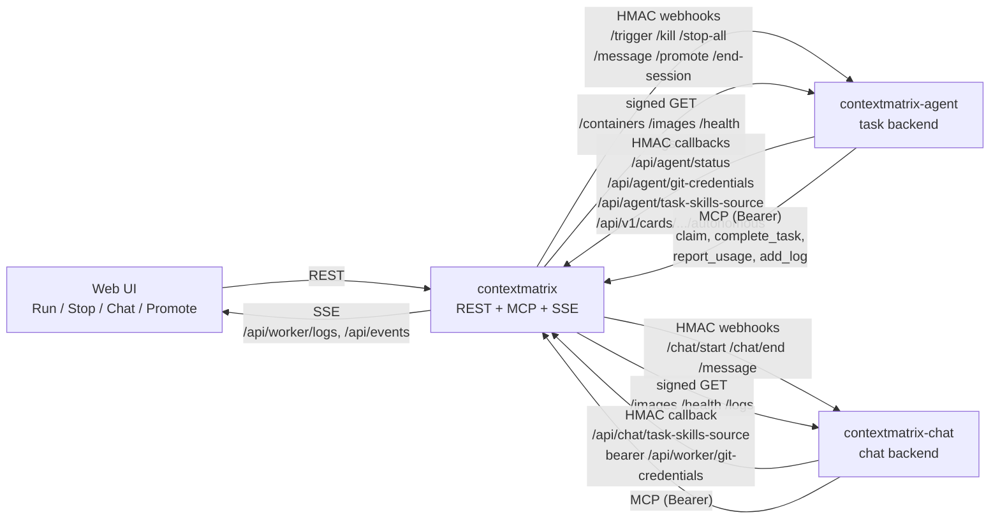
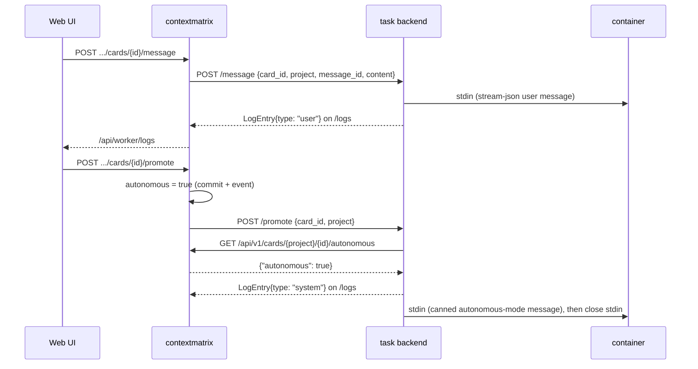
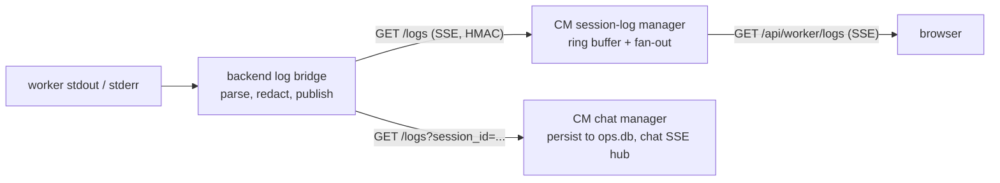

# Remote Execution

Remote execution lets a human start a worker from the ContextMatrix web UI.
Two backends carry that work over the same signed-webhook protocol
(`contextmatrix-protocol`, pinned in `go.mod`):

| Backend               | Role         | What it runs                                                                                                  |
| --------------------- | ------------ | ------------------------------------------------------------------------------------------------------------- |
| `contextmatrix-agent` | task backend | One disposable container per card run. The in-container harness claims the card over MCP and works the repo. |
| `contextmatrix-chat`  | chat backend | One long-lived container per chat session, answering over MCP.                                                |

ContextMatrix is the coordination layer: it stores cards, mints credentials,
and drives the backends over webhooks. It never clones, builds, or touches
project code repositories; the worker container does, with the repo URL and
credentials CM hands it.

This document is the CM-side contract: the webhook surface, the security
model, the worker lifecycle, and the CM configuration that wires a backend
in. Backend runtime knobs (image, resource limits, ports, drain timeouts)
live in each backend's own repository and `serve.yaml.example`. For the
user-facing view (Run buttons, status badges, guardrails) see
[running cards](running-cards.md); for the REST routes the UI calls see the
[API reference](api-reference.md#worker--backend-endpoints).

## Architecture Overview



**Message paths**

| Path                     | Flow                                                                                                                                                                                         |
| ------------------------ | -------------------------------------------------------------------------------------------------------------------------------------------------------------------------------------------- |
| Run Auto / Run HITL      | `POST .../run` sends `/trigger` to the task backend.                                                                                                                                          |
| Stop / Stop All          | `POST .../stop` and `POST .../stop-all` send `/kill` and `/stop-all`.                                                                                                                       |
| Live logs                | CM subscribes to the backend's `GET /logs` SSE stream, buffers it, and re-serves the browser as `GET /api/worker/logs`. The web UI opens that stream only while the log console is open.    |
| Chat input               | The UI POSTs to CM; CM mints a `message_id` and forwards `{card_id, project, message_id, content}` (card HITL) or `{session_id, message_id, content}` (chat) to the backend's `/message`.    |
| Promote to autonomous    | CM flips the card's `autonomous` flag first, then sends `/promote`. The backend re-reads the flag through `GET /api/v1/cards/{project}/{id}/autonomous` before acting (fail closed).          |
| Progress and usage       | Never through the webhook seams. The in-container worker reports over MCP (`complete_task`, `report_usage`, `add_log`, `report_parked`).                                                     |

**CM-side seams.** `api.TaskBackend` (`internal/api/backend.go`) is what the
operator endpoints drive: trigger, kill, stop-all, message, promote, health,
list-images. `internal/backend.Client` is its sole implementation and also
carries `EndSession` and `ListContainers`, which only the end-session
subscriber and the reconcile sweep use. The chat lifecycle (`/chat/start`,
`/chat/end`, `/message`, plus the `/logs` bridge) is driven by
`internal/chat.backendClient`.

**Long MCP calls.** `await_subtasks` deliberately holds its POST open while an
orchestrator waits on subtasks. CM clears the response write deadline for that
tool (the server's 60s `WriteTimeout` is absolute) and caps the block at
`await_max` (default 8m). Every hop between a worker and CM (proxy, ingress,
tunnel) must tolerate a response that idles that long, or `await_max` must be
lowered below the shortest such timeout.

## Webhook Protocol

### Authentication: HMAC-SHA256 Signing

Every request in both directions is signed with the per-backend shared secret
(`backends.<name>.api_key` on the CM side). The secret never travels over the
wire. The canonical implementation is `hmac.go` in `contextmatrix-protocol`.

**Signed content**

```
<METHOD>\n<URI>\n<TIMESTAMP>.<BODY>
```

| Part        | Value                                                                                                                                                        |
| ----------- | ------------------------------------------------------------------------------------------------------------------------------------------------------------ |
| `METHOD`    | Uppercase HTTP method.                                                                                                                                       |
| `URI`       | Request-target form: path plus `?<raw-query>` when present, exactly what `r.URL.RequestURI()` returns on the receiver. A proxy that rewrites either breaks auth. |
| `TIMESTAMP` | Unix seconds, decimal string.                                                                                                                                |
| `BODY`      | JSON payload bytes; empty for GET.                                                                                                                           |

**Headers:** `X-Signature-256: sha256=<hex>` and `X-Webhook-Timestamp: <ts>`.
Request headers are not part of the signed content.

**Why method and URI are bound.** `/kill` and `/end-session` carry an
identical body, so a body-only signature could be replayed across endpoints.
Binding the query keeps two same-second requests to one path (`GET
/logs?project=A` vs `?project=B`) from colliding in the replay cache.

**Verification.** The receiver recomputes the HMAC and compares in constant
time. Timestamps outside the asymmetric skew window are rejected: up to 5
minutes in the past (`DefaultMaxClockSkew`), 30 seconds in the future
(`DefaultMaxFutureSkew`). A replay cache rejects a `(timestamp, signature)`
pair it has already seen. On the CM side each callback path closes over its
own key and its own `SignatureCache` (`internal/backend/signature_cache.go`:
1024 entries, lazily pruned at twice the skew window), so the agent and chat
backends verify independently.

### CM → task backend webhooks

All POSTs carry `Content-Type: application/json` and go to
`backends.agent.url`. The task backend exposes:

| Method + path        | Purpose                                                          |
| -------------------- | ---------------------------------------------------------------- |
| `POST /trigger`      | Start a card run.                                                |
| `POST /kill`         | Stop the container for one card. Idempotent.                     |
| `POST /stop-all`     | Stop every container for a project.                              |
| `POST /message`      | Deliver a human message to a running HITL card.                  |
| `POST /promote`      | Switch a running HITL card to autonomous mode.                   |
| `POST /end-session`  | Close a HITL container's stdin so the worker sees EOF.           |
| `GET /containers`    | List the worker containers the backend manages.                  |
| `GET /images`        | List node-local worker images (filtered by the backend).         |
| `GET /logs`          | Subscribe to the live log SSE stream.                            |
| `GET /health`        | Capacity snapshot: running containers and the concurrency cap.   |
| `GET /readyz`        | Readiness probe; flips during drain.                             |

#### POST {agent_url}/trigger

Sent when a human clicks Run Auto or Run HITL on a `todo` card. CM builds the
payload in `internal/api/backend_run.go`:

```json
{
  "card_id": "ALPHA-042",
  "project": "alpha",
  "repo_url": "https://github.com/example-org/alpha-service.git",
  "mcp_api_key": "optional-bearer-token",
  "base_branch": "develop",
  "worker_image": "ghcr.io/example-org/cm-worker:2026-07-01",
  "interactive": false,
  "model": "deepseek/deepseek-v4-flash",
  "best_of_n": 3,
  "max_capability": true,
  "mob": {
    "participants": 3,
    "phases": ["plan", "review"],
    "rounds": 2,
    "budget_factor": 0.75,
    "execute_checkpoints": true,
    "checkpoint_min_tier": "simple",
    "checkpoint_rounds": 3,
    "guests": [{ "name": "laptop", "url": "http://192.168.1.50:8484", "token": "bearer-secret" }]
  },
  "task_skills": ["go-development", "documentation"],
  "selection": { "candidates": [], "favorites": [], "blacklist": [] },
  "verify": { "command": "make test", "timeout_seconds": 600, "env": ["JAVA_HOME"] },
  "git_token": "ghs_...",
  "git_token_expires_at": "2026-07-05T13:00:00Z",
  "llm_endpoint": { "type": "openrouter", "base_url": "", "api_key": "sk-..." }
}
```

| Field                  | How CM fills it                                                                                                                                                                                                                                                                                                            |
| ---------------------- | -------------------------------------------------------------------------------------------------------------------------------------------------------------------------------------------------------------------------------------------------------------------------------------------------------------------------- |
| `mcp_api_key`          | CM's `mcp_api_key`; omitted when MCP auth is off.                                                                                                                                                                                                                                                                          |
| `base_branch`          | The card's `base_branch`; omitted when unset. The agent clones and opens PRs against it instead of the repository default.                                                                                                                                                                                                 |
| `worker_image`         | The project's `remote_execution.worker_image`; omitted when unset, and the backend uses its own `base_image`. This is the language-toolchain seam for card runs. See [Worker image split](#worker-image-split).                                                                                                             |
| `interactive`          | `true` for Run HITL. Forced `false` for autonomous cards server-side, whatever the client sent.                                                                                                                                                                                                                             |
| `model`                | `backends.agent.default_model`; empty when unset, and the agent resolves its own default. Per-card pins are applied agent-side.                                                                                                                                                                                            |
| `best_of_n`            | Present only when the card's value is `>= 2`, clamped to `best_of_n.max_candidates` (a card can hold a larger value if the cap was lowered after it was set). See [Best-of-N run](#best-of-n-run).                                                                                                                       |
| `max_capability`       | Mirrors the card flag; present only when `true`. The agent honors it for every automatic pick (see [model selection](model-selection.md#the-decision-order)).                                                                                                                                                              |
| `mob`                  | Present only when `mob_participants >= 2`. See [Mob sessions](#mob-sessions) for the assembly rules.                                                                                                                                                                                                                       |
| `task_skills`          | `card.skills > project.default_skills > nil`. See [Task skills](#task-skills).                                                                                                                                                                                                                                             |
| `selection`            | `protocol.SelectionContext`: cached catalog `candidates`, global `favorites` with project entries replacing them per tier, and the `blacklist` from `ops.db`. Present only when the agent entry has `aa_api_key`. Recorded outcomes never ship. See [model selection](model-selection.md#what-the-trigger-carries).         |
| `verify`               | The card's `verify` merged over the project's field by field; omitted when nothing resolves, and the agent falls back to its own detection. The agent runs `command` via `bash -c` with `pipefail`, bounded by `timeout_seconds`, passing the named `env` variables through by name.                                       |
| `git_token`            | Minted from the project's `github_credential` binding, or the instance `github.*` credential when unbound. A broken binding rejects the run with `409` before any webhook is sent, reverts `worker_status` to `failed`, and appends a `run-rejected` activity entry. The agent fails closed without a token.               |
| `git_token_expires_at` | RFC3339; absent for PAT-backed credentials, which need no refresh. App tokens live about an hour; see [GitHub token refresh](#github-token-refresh).                                                                                                                                                                       |
| `llm_endpoint`         | CM's `llm_endpoint` block (`type`, `base_url`, `api_key`), sent whenever `type` is set, even with an empty key. Omitted only when the whole block is unset; the agent then rejects the run (fail closed, no local fallback).                                                                                                 |

Every card carries a server-generated `branch_name`, so the worker always
works on a feature branch. The card's `create_pr` (default `true` at create)
decides whether a pull request is opened, whatever the launch mode.

**Correlation id.** Every trigger attempt carries an `X-Correlation-ID`
header: a fresh random 32-character hex id minted per attempt in
`internal/backend/client.go`, never shared between two triggers of one card
nor between retries of one trigger. The agent keys per-run state
(log-redaction sessions, container labels) by it, and a timed-out attempt may
already have started a run whose retry the agent admits as a second launch.
CM logs each id with the project and card, and the agent logs the id it
admits, so a board-side trigger matches the exact run it produced. The other
webhooks do not send the header.

#### Task skills

CM resolves `card.skills > project.default_skills > nil` into `task_skills`:

| Value           | Meaning                                    |
| --------------- | ------------------------------------------ |
| omitted (`nil`) | The backend mounts its full skill set.     |
| `[]`            | Explicit none: mount nothing.              |
| `[...]`         | Exactly this subset.                       |

The skill files never travel over the webhook. The backend fetches a
`{git_remote_url, ref, token?, token_expires_at?}` pointer from `GET
/api/agent/task-skills-source` (chat: `GET /api/chat/task-skills-source`) and
clones the repo itself, so CM stays the single source of truth. CM derives the
pointer from `task_skills.dir` (origin remote plus HEAD SHA when the dir is a
checkout) or the configured `task_skills.git_remote_url` fallback (no ref).
The token is an instance-scoped git credential minted best-effort: a mint
failure omits it.

At startup, when `task_skills.dir` already holds a `.git` directory and
`task_skills.git_remote_url` is set, CM runs a fast-forward pull with a
60-second timeout before opening any listener. Success logs `task-skills
startup pull: ok`; failure logs `task-skills startup pull failed` as a
warning and does not block startup.

#### POST {agent_url}/kill

Sent by Stop, and by the end-session subscriber and reconcile sweep when a
card reaches a terminal state.

```json
{ "card_id": "ALPHA-042", "project": "alpha" }
```

Idempotent: the backend answers `200` whether it stopped a container or found
nothing to do, so CM's cleanup paths never distinguish "not found" from
"killed".

#### GET {agent_url}/containers

Signed GET, empty body. Returns the worker containers the backend manages.
The reconcile sweep consumes it as the answer to "what is the backend running
right now", independent of CM's card-level `worker_status`.

```json
{
  "ok": true,
  "containers": [
    {
      "container_id": "778fe6561d75abc...",
      "card_id": "ALPHA-042",
      "project": "alpha",
      "state": "running",
      "started_at": "2026-07-01T10:30:00Z",
      "tracked": true
    }
  ]
}
```

The agent builds the list from its in-memory tracker, so `tracked` is always
`true` and `state` is always `running`; both fields stay on the wire for
compatibility. `started_at` (RFC3339) feeds the sweep's age cap; a missing or
malformed value is non-fatal and only disables that check. Chat containers
carry `session_id` instead of `card_id`; the sweep skips entries without a
`card_id`.

#### GET {agent_url}/images

Signed GET, empty body. Returns the worker images on the backend's node and
is the source for CM's `GET /api/backends/agent/images` proxy (see
[Backend worker images](#backend-worker-images-get-apibackendsbackendimages)).

```json
{
  "ok": true,
  "images": [
    {
      "tags": ["ghcr.io/example-org/contextmatrix-agent-worker:2026-07-01"],
      "digests": ["ghcr.io/example-org/contextmatrix-agent-worker@sha256:abc123..."],
      "created": 1751328000,
      "size": 1073741824
    }
  ]
}
```

`tags` carries only the repo tags that matched the backend's
`image_list_filters`; an image with no matching tag is omitted. `digests` is
informational and empty for locally built images. A Docker daemon failure
returns `502 upstream_failure` (see
[Backend response format](#backend-response-format)).

#### POST {agent_url}/stop-all

```json
{ "project": "alpha" }
```

Stops every container for the project. The response is a `StopAllResponse`
(`{ok, total, stopped, failed, results[]}`); any per-card failure flips `ok`
to `false` and the status to `207`.

#### POST {agent_url}/message

Sent when a human submits a message while a container runs in HITL mode. CM
mints the `message_id`.

```json
{
  "card_id": "ALPHA-042",
  "project": "alpha",
  "message_id": "5a7f3c1e-9d2b-4e1a-bd8c-6f9e2a3c4d5f",
  "content": "Please focus on the authentication module first."
}
```

The chat manager sends the chat form of the same payload on every user turn:

```json
{
  "session_id": "01K8ZQH7R3VYJE9XPK4MBWN5T2",
  "message_id": "5a7f3c1e-9d2b-4e1a-bd8c-6f9e2a3c4d5f",
  "content": "Show me the diff between v1 and v2."
}
```

Exactly one of `(card_id + project)` or `session_id` is set; the backend
dispatches on which is present. CM caps `content` at 8192 bytes before
sending. The backend writes the content to the container's stdin and echoes
it as a `user` log frame so the browser console shows it.

#### POST {agent_url}/promote

Sent when a human clicks Switch to Autonomous on a running HITL card.

```json
{ "card_id": "ALPHA-042", "project": "alpha" }
```

CM has already flipped the card's `autonomous` flag before this webhook goes
out. The backend confirms it with a signed `GET
/api/v1/cards/{project}/{id}/autonomous` and fails closed on any error or on
`autonomous != true` (`502 upstream_failure`, stdin untouched). On success it
publishes a `system` log frame, writes a canned "continue autonomously"
message to stdin, and closes stdin so the worker finishes in-flight work and
exits instead of idling to its container timeout. If the webhook fails, CM
rolls the flag back (see [CM operator endpoints](#cm-operator-endpoints)).

#### POST {agent_url}/end-session

```json
{ "card_id": "ALPHA-042", "project": "alpha" }
```

Closes the container's stdin so an interactive worker sees EOF. CM sends it
from the end-session subscriber and the reconcile sweep, always followed by
an unconditional `/kill`; see [Terminal-state cleanup](#terminal-state-cleanup).
Backend answers `404` (nothing tracked), `409` (no stdin: autonomous
container) and `410` (stdin already closed) are expected and not logged as
warnings.

### Worker image split

`remote_execution.worker_image` and `remote_execution.chat_worker_image` are
a clean cut, not a shared field:

| Field               | Feeds                     | Empty means                                   |
| ------------------- | ------------------------- | --------------------------------------------- |
| `worker_image`      | `/trigger` only           | The task backend's own `base_image`.          |
| `chat_worker_image` | `/chat/start` only        | The chat backend's own `base_image`.          |

There is no fallback from one field to the other: the two image families bake
different entrypoints. Both share the same hygiene validation on `PUT
/api/projects/{project}` (`^[a-zA-Z0-9][a-zA-Z0-9._:/@-]*$`, at most 512
bytes) and the same pointer-merge semantics: an omitted field keeps the
stored value, an explicit empty string clears it. See the
[data model](data-model.md#remote_execution-optional-remoteexecutionconfig).

### CM → chat backend webhooks

The chat backend exposes `POST /chat/start`, `POST /chat/end`, `POST
/message`, and the signed GETs `/logs`, `/images`, `/health`, `/readyz`,
all under the same HMAC scheme with the chat entry's `api_key`. Chat
containers are long-lived (no per-task cleanup) and dispatch on the session
id. `GET /images` behaves as it does on the task backend, filtered by the
chat backend's own `image_list_filters`.

#### POST {chat_url}/chat/start

```json
{
  "session_id": "01K8ZQH7R3VYJE9XPK4MBWN5T2",
  "project": "contextmatrix",
  "repo_url": "https://github.com/mhersson/contextmatrix.git",
  "worker_image": "ghcr.io/example-org/contextmatrix-chat-worker:2026-07-01",
  "mcp_api_key": "<forwarded as CM_MCP_API_KEY>",
  "model": "anthropic/claude-sonnet-4",
  "resume": { "turns": [], "clipped": false, "original_seq": 0 },
  "llm_endpoint": { "type": "openrouter", "base_url": "", "api_key": "sk-..." },
  "git_credentials_token": "01K8ZQH7....<base64url mac>"
}
```

| Field                   | How CM fills it                                                                                                                                                                                                                                                                      |
| ----------------------- | ------------------------------------------------------------------------------------------------------------------------------------------------------------------------------------------------------------------------------------------------------------------------------------ |
| `project`, `repo_url`   | Optional; omitted for a cross-project chat.                                                                                                                                                                                                                                          |
| `worker_image`          | The project's `remote_execution.chat_worker_image`, never `worker_image`. Empty means the chat backend's `base_image`.                                                                                                                                                               |
| `mcp_api_key`           | Forwarded as `CM_MCP_API_KEY`; may be empty when CM's MCP listener has no auth.                                                                                                                                                                                                       |
| `model`                 | Always set: the session row's model, else `backends.chat.default_model`. The chat backend has no server-side default.                                                                                                                                                                |
| `resume`                | The rehydration payload built from the persisted transcript on every cold open (nil when there is none). The backend writes it to `/run/cm-chat/resume.jsonl` and sets `CM_CHAT_RESUME=1` so the worker restores context before the first user turn.                                  |
| `llm_endpoint`          | Same rule as `/trigger`. The chat backend rejects a start without it.                                                                                                                                                                                                                |
| `git_credentials_token` | A deterministic per-session bearer, `<session_id>.<base64url HMAC-SHA256(chat api_key, session_id)>`. CM never persists it; it re-derives and compares. The worker presents it to `GET /api/worker/git-credentials` for per-repo credentials on demand. The chat backend rejects a start without it. |

The success body is `{"ok": true, "container_id": "..."}`; CM records the
container id on the session.

The credential story differs from `/trigger` on purpose: a chat session is
long-lived and can be cross-project, so there is no single repo to mint a
token for up front. See the
[API reference](api-reference.md#get-apiworkergit-credentials) for the
worker endpoint.

#### POST {chat_url}/chat/end

```json
{ "session_id": "01K8ZQH7R3VYJE9XPK4MBWN5T2" }
```

Closes the container's stdin and stops it. A session the backend no longer
tracks answers `404 not_found`.

### Task/chat backend → CM: log stream

#### GET {backend_url}/logs

Streams `protocol.LogEntry` frames as Server-Sent Events. CM subscribes; the
browser never calls it directly. Signed GET, empty body.

| Query param  | Effect                                              |
| ------------ | --------------------------------------------------- |
| `project`    | Filter to one project. Omit to receive everything.  |
| `session_id` | Filter to one chat session (the chat log bridge).   |

```json
{
  "ts": "2026-07-01T12:34:56.789Z",
  "card_id": "ALPHA-042",
  "project": "alpha",
  "type": "text",
  "content": "[round 1] seat-1 (correctness): the parser change misses...",
  "agent": "seat-1",
  "model": "z-ai/glm-5.2"
}
```

Chat frames set `session_id` instead of `card_id`. `type` is one of:

| type        | Meaning                                                                                                                                           |
| ----------- | ------------------------------------------------------------------------------------------------------------------------------------------------- |
| `text`      | Assistant text block.                                                                                                                             |
| `thinking`  | Assistant thinking block.                                                                                                                         |
| `tool_call` | A tool call summary.                                                                                                                              |
| `stderr`    | A raw stderr line from the container.                                                                                                             |
| `system`    | Container lifecycle event (started, completed, failed, canceled, promoted).                                                                       |
| `user`      | A human message echoed by the backend's `/message` handler.                                                                                       |
| `usage`     | Per-turn token accounting; `content` is empty. `usage` carries `input_tokens`, `output_tokens`, `cache_read_tokens`, `cache_creation_tokens`.     |
| `status`    | Chat-mode run state, `content` is `working` or `idle`. Ephemeral: the chat manager turns it into presence state and never persists it.            |

`user_question` exists on the wire only for persisted entries that still
carry it; backends do not emit it.

`model` is the slug that produced the frame: set on `usage` frames and on
`text` frames (assistant responses and mob discussion utterances), absent
elsewhere. `agent` labels the speaker on mob discussion frames (`seat-1` ..
`seat-N`, `guest-<name>`, `moderator`, `human`) and is absent on every other
frame. CM threads both fields through its session-log buffer into the browser
stream, where the chat panel renders `agent` as a speaker chip and `model` as
a second pill beside it.

The backend redacts credential patterns before publishing and sends keepalive
comments to hold the connection open through proxy idle timeouts.

### Task backend → CM: callbacks

Callbacks are HMAC-signed with the backend's own `api_key` and mount at fixed
paths: `/api/agent` for the task backend, `/api/chat` for the chat backend
(`config.AgentCallbackPath` and `config.ChatCallbackPath`; the backend repos
hardcode them). Both prefixes are exempt from the CSRF guard because no
browser POSTs there. A missing or invalid signature returns `403
INVALID_SIGNATURE`. The routes are registered only when the matching backend
is configured.

#### POST /api/agent/status

The backend reports a worker-status transition.

```json
{
  "card_id": "ALPHA-042",
  "project": "alpha",
  "worker_status": "running",
  "message": "container started"
}
```

- The backend may set `running`, `failed`, or `completed`
  (`board.ValidateWorkerCallbackStatus`); anything else is `422`.
- A `failed` or `killed` status arriving after the card reached `done` or
  `not_planned` is rewritten to `completed` with the activity message
  `container cleaned up after run completed`, so a cleanup kill never flips a
  successful run to failed.
- A `completed` callback on a card whose `worker_status` is `parked` keeps it
  `parked`: the run ended, but the card waits on a human.
- Task completion is not reported here; the worker uses the MCP
  `complete_task` tool.
- On a shared board, a callback for a card claimed via another instance is
  acknowledged and ignored. A callback for a claim the remote has not
  confirmed within `lease_timeout` is refused with `403 AGENT_MISMATCH`.

#### GET /api/v1/cards/{project}/{id}/autonomous

Signed GET. Returns `{"autonomous": bool}` and nothing else, so the backend
can fail-closed confirm the flag during `/promote`. An unknown card is `404`.

#### GET /api/agent/git-credentials

Signed GET with `project` and `card_id` query parameters. Re-mints the
project-scoped git token so a long run can refresh past the GitHub App
installation-token TTL. The card must exist and be `running` (`409`
otherwise). A broken project binding fails closed with `409`; a mint failure
is `502`. PAT-backed credentials carry no `expires_at`.

#### GET /api/agent/task-skills-source

Signed GET. Serves the skills pointer described under
[Task skills](#task-skills). `GET /api/chat/task-skills-source` is the chat
backend's identical variant, verified with the chat key.

### CM operator endpoints

The CM-side handlers the web UI calls. They wrap the outbound webhooks,
enforce card-state checks, and update CM bookkeeping. All five reject a
non-`human:*` `X-Agent-ID` with `403 HUMAN_ONLY_FIELD`; an absent header
counts as human.

| Endpoint                                          | Behavior                                                                                                                                                                                                                       |
| ------------------------------------------------- | ------------------------------------------------------------------------------------------------------------------------------------------------------------------------------------------------------------------------------ |
| `POST /api/projects/{project}/cards/{id}/run`     | Body `{"interactive": bool}` (empty body OK). Requires state `todo` and `worker_status` not in `{queued, running}`. Sets `queued`, sends `/trigger`, returns `202`. A failed webhook reverts to `failed`.                        |
| `POST /api/projects/{project}/cards/{id}/stop`    | Requires `worker_status` in `{queued, running}`. Refuses a card claimed via another instance (`403 AGENT_MISMATCH`). Sends `/kill`, then sets `killed`. Returns `202`.                                                          |
| `POST /api/projects/{project}/cards/{id}/message` | Body `{"content": "..."}`, at most 8192 bytes. Requires `worker_status == running`. Mints `message_id`, forwards, returns `202 {"ok": true, "message_id": "..."}`.                                                               |
| `POST /api/projects/{project}/cards/{id}/promote` | Requires `running`. Already-autonomous cards short-circuit with `202` and no webhook (prevents verify recursion). Otherwise flips `autonomous`, sends `/promote`, and rolls the flip back with a `promote-webhook-failed` entry if the webhook fails. |
| `POST /api/projects/{project}/stop-all`           | Sends `/stop-all`, then sets `killed` on every project card in `{queued, running}` that this instance owns. Returns `200 {"affected_cards": [...]}`, or `207` with `failed_to_update` when some CM-side writes failed after the webhook succeeded. |

**Error codes** (`code` / status):

| Code                  | Status    | Meaning                                                                       |
| --------------------- | --------- | ----------------------------------------------------------------------------- |
| `BACKEND_DISABLED`    | 503       | No task backend is configured.                                                |
| `WORKER_CONFLICT`     | 409       | Card is already `queued` or `running`.                                        |
| `WORKER_NOT_RUNNING`  | 409       | Card is not being executed (stop, message, promote).                          |
| `BACKEND_UNAVAILABLE` | 502       | The outbound webhook failed.                                                  |
| `INVALID_TRANSITION`  | 409       | Run refused because the card is not in `todo`.                                |
| `HUMAN_ONLY_FIELD`    | 403       | `X-Agent-ID` was a non-human agent.                                           |
| `AGENT_MISMATCH`      | 403       | The card's worker belongs to another instance (shared boards).                |
| `CONTENT_TOO_LARGE`   | 413       | Message body exceeds 8192 bytes.                                              |
| `VALIDATION_ERROR`    | 422 / 409 | Empty message `content` (422), or an unresolvable project credential (409).   |
| `BAD_REQUEST`         | 400       | Malformed JSON body.                                                          |

### Backend response format

A 2xx webhook returns `protocol.SuccessResponse` (`{ok: true, message?,
message_id?}`); a non-2xx returns `protocol.ErrorResponse` (`{ok: false,
code, message}`). `code` is the stable enum in the protocol module's
`codes.go`; branch on it, never on `message`.

| Code               | Status | Meaning                                                                           |
| ------------------ | ------ | --------------------------------------------------------------------------------- |
| `invalid_json`     | 400    | Body could not be decoded as JSON.                                                |
| `invalid_field`    | 400    | A required field is missing or invalid; the message names the field.              |
| `unauthorized`     | 401    | HMAC signature missing, invalid, or timestamp out of window.                      |
| `not_found`        | 404    | No container tracked for `(project, card_id)` or `session_id`.                    |
| `conflict`         | 409    | State conflict: card already tracked, or wrong container mode for the operation.  |
| `limit_reached`    | 429    | The backend's `max_concurrent` is reached.                                        |
| `too_large`        | 413    | A field exceeds its size cap (the `/message` content cap).                        |
| `upstream_failure` | 502    | An upstream dependency failed (CM's autonomous check, the Docker daemon).         |
| `draining`         | 503    | Graceful shutdown started; mutating endpoints refuse new work.                    |
| `internal`         | 500    | Server-side bug; the message is fixed and never echoes the error.                 |

### Retry policy

`internal/backend.Client` retries POST webhooks:

| Rule                | Value                                                                 |
| ------------------- | --------------------------------------------------------------------- |
| Attempts            | 3 in total.                                                           |
| Backoff             | 1s, 2s, 4s (`BackoffBase` doubling) with plus or minus 25% jitter.    |
| Retried             | Network errors and HTTP 5xx.                                          |
| Not retried         | HTTP 4xx, and a 2xx body with `ok: false`.                            |
| Per-request timeout | 10 seconds.                                                           |
| Signed GETs         | Never retried; the reconcile sweep's next tick retries anyway.        |

Every retry of one trigger mints its own `X-Correlation-ID`, so a launch the
agent admits is always uniquely identified even when a timed-out earlier
attempt also started a run.

## Worker lifecycle

A `/trigger` starts one disposable container that runs the card end to end
and completes it with `complete_task`; the container exits and the backend
removes it. A `/kill` destroys the container immediately, and uncommitted
work is lost.

A run can also park instead of completing: the worker calls the MCP
`report_parked` tool right before its container exits (review or PR gates
left for a human). CM sets `worker_status: parked` with the reason in the
activity log, and the `completed` callback that follows preserves the park
while still clearing the claim. The next trigger's `queued` replaces it.

CM is the single authority on whether a container should be running. Two
mechanisms enforce that from different truths, so a bug in either cannot
silently hide a live container.

### Terminal-state cleanup

An interactive worker does not necessarily exit when its stdin closes, so a
card that reaches `done` or `not_planned` and is released must be stopped by
CM explicitly.

1. **Event subscriber (fast path).** `internal/backend/endsession.go` watches
   the event bus for `card.released` and `card.state_changed`. When the card
   is in `{done, not_planned}` with `assigned_agent == ""`, it sends
   `/end-session` followed by an unconditional idempotent `/kill`. A
   short-lived guard collapses the two events one completion publishes into
   one cleanup round. `worker_status` is deliberately not consulted: the
   backend's completion callback flips it before Docker cleanup succeeds, so
   gating on it would turn a drifted status into a permanent leak. The
   subscriber also fires on `claim.lost`, when a shared-board pull shows that
   another instance now holds the card: the local container is ended and
   killed even though the card is not terminal.
2. **Reconcile sweep (backstop).** `internal/backend/reconcile.go` runs once
   at startup, then every `backends.agent.reconcile_interval` (default 60s).
   Each tick calls `GET /containers` and kills every card container whose
   card is missing, is in `done` / `not_planned`, or is older than
   `ContainerMaxAge` (150 minutes). It reasons only from the backend's list
   and the card store, never from `worker_status`. This sweep is the agent
   backend's only reconcile mechanism. `"0s"` disables it and is not
   recommended: bus events drop on subscriber overflow and are never
   delivered during a CM restart, so without the sweep one dropped event
   leaks a container until the backend's own container timeout.

### Best-of-N run

Best-of-N is task-backend only: CM sends `best_of_n` only to the agent, only
when the card's value is `>= 2`, and clamps it to `best_of_n.max_candidates`.
Everything below happens inside the agent:

- A Best-of-N run still gets exactly one worker container. After the plan
  phase the agent adds N git worktrees on local-only branches cut from the
  plan-approved base, gives each candidate a distinct auto-selected coder
  model and its own budget ledger, and races them concurrently.
- Candidates never push and make no per-candidate board writes. The run
  claims each subtask once when the first candidate reaches it, held by a
  single heartbeater until the winner's completions replay after judging.
- A judge phase (reviewer-role selection, `complex` tier) picks the winner;
  the orchestrator adopts it onto the main clone before the run's first push
  and removes the losing worktrees. Each candidate's result lands in the
  [outcome ledger](model-selection.md#the-outcome-ledger).
- Wall-clock time is roughly the slowest candidate plus the judge pass; the
  per-card budget ceiling scales to `MaxCardCost x (N + 1)`.

### Mob sessions

Mob sessions are task-backend only: CM sends `mob` only to the agent, only
when the card's `mob_participants >= 2`. CM assembles the spec at trigger
time (`attachMob` in `internal/api/backend_run.go`):

| Field                                                            | Source                                                                                                                 |
| ---------------------------------------------------------------- | ---------------------------------------------------------------------------------------------------------------------- |
| `participants`                                                   | The card value clamped to the current `mob.max_participants`.                                                          |
| `rounds`, `budget_factor`                                        | `mob.default_rounds`, `mob.budget_factor`.                                                                             |
| `execute_checkpoints`, `checkpoint_min_tier`, `checkpoint_rounds` | The server flags.                                                                                                     |
| `phases`                                                         | The card's `mob_phases`; `execute` is dropped with a warning when `mob.execute_checkpoints_enabled` is off.             |
| `guests`                                                         | The card's `mob_guests` resolved through the `mob.guests` registry into `{name, url, token}`; unknown names are dropped. |

Every degradation appends a `mob-warning` activity entry instead of failing
the trigger. When the card selected phases and every one was filtered out,
`mob` is omitted and the run proceeds solo rather than falling into the
agent's review-only default. Mob coding wins over Best-of-N: a payload that
carries both an `execute` phase and `best_of_n >= 2` has `best_of_n` zeroed
with a warning. Guest tokens are bearer secrets; the backend stages them into
the per-run secrets file, never plain container env, and registers them with
its log redactor.

Inside the agent:

- The run still gets exactly one worker container. The orchestrator hosts
  every internal seat behind a loopback a2a-go JSON-RPC server (127.0.0.1,
  port never published, bearer-protected) and is the only A2A client, dialing
  loopback seats and registered guest URLs over the same wire.
- Plan and review phases convene a discussion: a blind round 0, then critique
  rounds up to `rounds`. The decision model synthesizes the group's answer
  into the phase's normal output format. Discussions degrade, never fail:
  quorum below 2 responding seats, engine errors, or an exhausted mob budget
  (`budget_factor x max card cost`) fall back to the solo path.
- Wire conventions shared by internal seats and guest shims: message bodies
  are markdown transcript deltas formatted `[round N] author (lens): text`;
  control metadata rides A2A `Message.metadata` under key `cm_mob` as
  `{"control": "round" | "close", "round": <n>}`, with missing or unknown
  metadata treated as `"round"`. Transcript lines reach the board as
  `discussion` JSONL events the backend's log bridge maps to `text` log
  frames with `agent` set; seat sub-run internals are debug kinds the bridge
  does not map.
- Execute checkpoints: with `execute` in the phases and the server flag on,
  the worker convenes a non-blind discussion after each committed subtask at
  or above `checkpoint_min_tier`. The seats argue over the subtask's diff
  (40 KB cap, diffstat fallback) for `checkpoint_rounds` rounds, and the
  moderator returns `proceed` or `revise` with at most 3 fixes. A revise runs
  one fix pass on the same coder before the push; the revised diff is not
  re-checkpointed. Checkpoints are best-effort. The card gets one activity
  entry per checkpoint outcome, plus `revise skipped - budget exhausted` when
  a revise then hits the card budget ceiling. Checkpoint discussions draw
  from the shared mob budget, so operators enabling `execute` on
  multi-subtask cards should consider raising `mob.budget_factor`; the fix
  pass itself spends from the card budget like any other coder run.

### GitHub token refresh

The task backend receives a short-lived `git_token` in `/trigger`. A GitHub
App installation token lives about an hour and a run can outlast it, so the
backend re-mints mid-run from `GET /api/agent/git-credentials` (card-scoped,
fail-closed). PAT-backed credentials carry no expiry and need no refresh.

The chat backend uses no upfront token: a per-session bearer fetches per-repo
credentials on demand from `GET /api/worker/git-credentials`. See the
[chat-start payload](#post-chat_urlchatstart) and the
[API reference](api-reference.md#get-apiworkergit-credentials).

## Usage reporting

Workers report token usage with the MCP `report_usage` tool. The contract for
any worker implementation, including custom worker images:

- Read the `usage` block off every model response and accumulate per card.
  Never estimate counts the gateway already measured.
- Report disjoint buckets: `prompt_tokens` must exclude cache traffic. On the
  OpenAI wire shape `prompt_tokens_details.cached_tokens` is a subset of
  `prompt_tokens`; subtract it and report it as `cache_read_tokens`. The
  Anthropic shapes (`cache_read_input_tokens`, `cache_creation_input_tokens`)
  are already disjoint.
- Pass `source: "collector"` when every count came from usage frames; omit it
  (or pass `self`) when any count is estimated. The board keeps the flag per
  bucket as `counts_source` and the UI labels the difference.
- Pass `actual_cost_usd` whenever the gateway reports a per-call cost.
  Without it CM prices the counts from `token_costs` and the served catalog.
- Pass `model` as the gateway's vendor-prefixed slug. A slug neither source
  can price costs $0, logs a warning, and increments
  `contextmatrix_report_usage_unknown_model_total`.

The full collector protocol, including transcript deduplication and
cross-reporter double counting, is in the
[agent workflow](agent-workflow.md#reporting-measured-usage-collector-protocol).

## Security Model

- **Per-backend HMAC keys.** Each backend has its own secret
  (`backends.<name>.api_key`, at least 32 characters). CM signs outbound
  webhooks and signed GETs; the backend signs its callbacks. The agent and
  chat callback paths verify with independent keys and replay caches, so one
  backend's key never authenticates against the other's endpoints.
- **Per-run MCP bearer.** When `mcp_api_key` is set, CM forwards it in the
  trigger and chat-start payloads; every MCP request from the worker carries
  `Authorization: Bearer <key>`.
- **CM-provisioned git credentials.** CM mints every git token: a card-scoped
  token per run, refreshed on demand, or a per-session bearer for chat. A
  broken project binding fails the run closed; CM never substitutes the
  instance credential.
- **CM-provisioned LLM endpoint.** The inference endpoint and key are
  administered once in `llm_endpoint` and forwarded per run, so the model key
  rotates in one place.
- **Human-only controls.** Only humans (no `X-Agent-ID`, or a `human:*`
  prefix) can trigger, stop, message, or promote a run, or set the
  run-control card fields (`autonomous`, `create_pr`, PR gates,
  `base_branch`, model pins, `best_of_n`, `max_capability`, mob fields,
  `verify`, `assignee`). A worker cannot escalate itself to autonomous mode;
  promotion is verified server-side.

### Global kill switch

Disable or remove the `agent` entry under `backends` to stop all card
execution: `GET /api/app/config` reports no task backend, the UI hides its
run controls, and the operator endpoints answer `503 BACKEND_DISABLED`.
Backends are read once at startup, so this needs a restart.

## Interactive Mode

Run HITL sends `interactive: true`. CM forces it off for autonomous cards
server-side, so a stray trigger cannot push an autonomous card down the HITL
path. In HITL mode the worker pauses at its built-in gates and waits on human
input delivered through the card's chat console.



The backend publishes the promote `system` frame before the stdin write, so
the browser shows the mode switch in order even if the write stalls. If CM's
outbound `/promote` fails, CM rolls `autonomous` back so the card's declared
mode matches the worker's actual mode.

## Log Streaming Architecture



- **Backend log bridge.** Demultiplexes each container's output into
  `protocol.LogEntry` frames, redacts secrets, and publishes them on `GET
  /logs`, filterable by `project` (card mode) or `session_id` (chat mode).
- **CM session-log manager** (`internal/backend/sessionlog`). Opens one
  long-lived signed upstream connection per card or per project (at most 64
  concurrent), buffers frames in a bounded ring (2000 events or 1 MiB,
  whichever first), and fans them out to browser subscribers snapshot-first,
  then live, so a reconnecting tab replays history including any pending HITL
  question. A dropped upstream reconnects with exponential backoff (250ms up
  to 4s, five attempts) before the session is marked errored. Sessions idle
  for 2 hours are swept and revived on the next connect.
- **Browser SSE** (`GET /api/worker/logs`, `internal/api/worker_logs.go`).
  Requires a valid `project` query parameter and selects the card-scoped path
  when `card_id` is present, the project-scoped path otherwise. It clears the
  write deadline, sends a keepalive comment every 30 seconds, and emits
  marker frames when a session ends (`{"type":"terminal"}`) or the buffer
  overflowed (`{"type":"dropped","count":n}`).
- **Chat variant.** The chat manager consumes the same `/logs` stream keyed
  by `session_id`, persists each transcript frame to `ops.db`, and
  republishes it on the per-session chat SSE hub. `usage` frames update the
  session's context-token counter and cost; `status` frames drive the
  working indicator and are never persisted.

### Backend capacity: GET /api/backend/health

The web UI's capacity meter reads `GET /api/backend/health`, which proxies
the task backend's `GET /health` and returns `{ok, running_containers,
max_concurrent}`. `internal/api/backend_health.go` caches each probe (success
or failure) for 2 seconds, bounds it at 3 seconds, and coalesces concurrent
callers through singleflight on a detached context, so many open tabs and a
backend outage never storm the backend. It returns `503 BACKEND_DISABLED`
when no task backend is configured and `502 BACKEND_UNAVAILABLE` when the
probe fails; callers fail soft and hide the meter.

### Backend worker images: GET /api/backends/{backend}/images

The project-settings image pickers read `GET /api/backends/{backend}/images`
(`backend` is `agent` or `chat`), which proxies that backend's `GET /images`.
`internal/api/backend_images.go` caches each backend's result for 30 seconds
behind singleflight, with a 5-second probe timeout on a detached context. The
30-second window is load-bearing: concurrent same-second signed GETs would
produce identical signatures and collide in the backend's replay cache.

The route is registered unconditionally and admin-gated in multi mode (the
same gate as the project-settings `PUT` the picker feeds). It returns `404
BACKEND_NOT_FOUND` for an unknown `{backend}`, `503 BACKEND_DISABLED` when
that backend is not configured, and `502 BACKEND_UNAVAILABLE` when the probe
fails; the picker degrades to "Backend default" plus any saved value. See the
[API reference](api-reference.md#get-apibackendsbackendimages).

## Card worker status

`worker_status` tracks the container lifecycle independently of the card's
workflow state:

| worker_status | Set by                    | Meaning                                                                  |
| ------------- | ------------------------- | ------------------------------------------------------------------------ |
| (empty)       | CM                        | No worker attached; also the stored value after a `completed` callback.  |
| `queued`      | CM at trigger             | Trigger sent, container not yet started.                                 |
| `running`     | backend callback          | Container is running.                                                    |
| `failed`      | backend callback, CM      | Container crashed, or CM's outbound trigger failed.                      |
| `killed`      | CM on stop / stop-all     | A human stopped the run.                                                 |
| `completed`   | backend callback          | Container finished; CM clears the stored value to empty on receipt.      |
| `parked`      | MCP `report_parked`       | The run left review or PR gates for a human; the reason is in the log.   |

Reaching `failed`, `killed`, or `completed` clears `assigned_agent` and the
heartbeat, and flushes pending deferred commits so the boards repo reflects
the final state immediately. Transitions to `done` / `not_planned` do not
touch `worker_status`. CM publishes `worker.triggered`, `worker.started`,
`worker.failed`, `worker.killed`, and `worker.parked` on its event bus as the
status changes; a `completed` callback publishes `card.updated`. These drive
the UI's SSE updates. The enum lives in
[the data model](data-model.md#worker_status-enum).

## Configuration Reference

### ContextMatrix (`config.yaml`)

`backends` is a typed map with a closed set of two entry names, `agent` and
`chat`. Roles and callback paths are fixed. Backends are read once at
startup; any change needs a restart. Decoding is strict: an unknown backend
name, a leftover `runner` entry, or an unknown per-entry key fails startup.
`config.yaml.example` carries the fully commented block; the keys are:

| Key                                    | Entry        | Default    | Notes                                                                                         |
| -------------------------------------- | ------------ | ---------- | --------------------------------------------------------------------------------------------- |
| `backends.<name>.url`                  | agent, chat  | required   | Base URL; protocol paths are appended.                                                        |
| `backends.<name>.api_key`              | agent, chat  | required   | Shared HMAC secret, at least 32 characters (`MinBackendAPIKeyLength`).                        |
| `backends.<name>.enabled`              | agent, chat  | `true`     | `false` keeps the block as an inert placeholder and skips its validation.                     |
| `backends.<name>.default_model`        | agent, chat  | unset      | Optional on `agent` (empty `model` in the trigger); required on an enabled `chat` entry.       |
| `backends.agent.reconcile_interval`    | agent        | `60s`      | Backstop sweep tick; `"0s"` disables. Rejected on the `chat` entry.                           |
| `backends.agent.aa_api_key`            | agent        | unset      | Enables the selection catalog. See [model selection](model-selection.md).                     |
| `backends.agent.model_allowlist`       | agent        | built-in   | Trusted vendor prefixes on the OpenRouter leg.                                                |
| `backends.agent.catalog_quality_floor` | agent        | `0` (0.65) | Must be in `[0, 1)`; `0` means the Builder's 0.65 default.                                    |
| `backends.agent.favorites`             | agent        | none       | Per-tier preferred models, optionally per role.                                               |
| `backends.agent.aa_model_map`          | agent        | none       | Endpoint slug to exact AA slug (`openai` leg).                                                |
| `backends.agent.model_priors`          | agent        | none       | Verbatim priors for unrated endpoint slugs (`openai` leg).                                    |
| `mcp_api_key`                          | global       | unset      | Forwarded to workers so they can reach CM's MCP endpoint.                                     |
| `llm_endpoint.{type,base_url,api_key}` | global       | unset      | Forwarded on every trigger and chat start whenever `type` is set.                             |
| `best_of_n.max_candidates`             | global       | `5`        | Hard cap on a card's race size.                                                               |
| `best_of_n.default_candidates`         | global       | `3`        | Race size the UI suggests.                                                                    |
| `mob.*`                                | global       | see example | Participant and round caps, budget factor, checkpoint flags, guest registry.                |
| `chat.idle_ttl`                        | global       | `1h`       | How long a chat container survives after the browser disconnects.                            |
| `chat.max_concurrent`                  | global       | `0`        | Cap on active plus warm-idle chat containers; `0` means unlimited.                            |
| `chat.resume_budget_tokens`            | global       | `40000`    | Rough token budget for the rehydration payload.                                               |
| `chat.rehydration_timeout`             | global       | `10m`      | Forces the rehydration phase off if the worker never signals completion.                      |
| `op_store.db_path`                     | global       | state dir  | `ops.db`: chat sessions and transcripts, the model blacklist, Best-of-N outcomes.             |

**Environment overrides** map to each entry as `CONTEXTMATRIX_BACKEND_<NAME>_*`
(`<NAME>` is `AGENT` or `CHAT`); env values win over the file, and a backend
can be configured through env alone. Unknown suffixes fail startup.

| Suffix                   | Entries      |
| ------------------------ | ------------ |
| `_URL`                   | agent, chat  |
| `_API_KEY`               | agent, chat  |
| `_ENABLED`               | agent, chat  |
| `_DEFAULT_MODEL`         | agent, chat  |
| `_RECONCILE_INTERVAL`    | agent        |
| `_AA_API_KEY`            | agent        |
| `_MODEL_ALLOWLIST`       | agent        |
| `_CATALOG_QUALITY_FLOOR` | agent        |

The related globals have their own names: `CONTEXTMATRIX_MCP_API_KEY`,
`CONTEXTMATRIX_LLM_ENDPOINT_{TYPE,BASE_URL,API_KEY}`,
`CONTEXTMATRIX_OP_STORE_DB_PATH`, `CONTEXTMATRIX_CHAT_IDLE_TTL`,
`CONTEXTMATRIX_CHAT_MAX_CONCURRENT`, `CONTEXTMATRIX_BEST_OF_N_*`, and
`CONTEXTMATRIX_MOB_*` (the guest registry is file-only because tokens are
secrets).

### Backend configuration

The task and chat backends carry their own configuration: listener ports,
container image and resource limits, secrets directory, replay-cache sizing,
idle watchdog, orphan sweep, and drain behavior. Those knobs live in each
backend's `serve.yaml.example` in its own repository. The only values that
must agree across CM and a backend are the shared `api_key` and the URL CM
uses to reach it.

### Agent backend metrics

The task backend exposes its own Prometheus surface, namespaced `cm_agent_*`,
on its admin listener; see its repository for the series. CM's own `/metrics`
(namespaced `contextmatrix_*`) is served on CM's loopback admin listener and
includes `contextmatrix_backend_webhook_total{result}` for outbound webhook
and signed-GET outcomes. Scrape both to cover the full path.

### Per-project (`.board.yaml`)

```yaml
remote_execution:
  worker_image: "my-org/go-worker:latest"
  chat_worker_image: "my-org/go-chat-worker:latest"
```

## Kill Switch Semantics

| Action                  | Scope                | Behavior                                              |
| ----------------------- | -------------------- | ----------------------------------------------------- |
| Stop (card)             | Single card          | Kills the container, sets `worker_status: killed`.   |
| Stop All                | All cards in project | Sends `/stop-all`; marks this instance's cards `killed`. |
| No task backend enabled | Global               | Disables all card execution (restart required).       |

## Graceful Shutdown

Each backend drains on `SIGTERM`: `/readyz` flips to `503 draining` so load
balancers stop routing new webhooks, in-flight requests finish, the mutating
endpoints (`/trigger`, `/message`, `/promote`, `/end-session`) answer `503
draining`, while `/kill`, `/stop-all`, `/containers`, `/images`, `/health`,
and `/readyz` stay reachable so operators can still read state and stop
work. The drain window and force-cleanup behavior are backend-internal.

## See Also

- [Running cards](running-cards.md) - the user-facing view: Run Auto and Run
  HITL, guardrails, Best-of-N, mob, PR gates, verify, status badges.
- [Model selection](model-selection.md) - the candidate catalog, tier bars,
  and the favorites / blacklist inputs behind the `selection` payload.
- [API reference](api-reference.md#worker--backend-endpoints) - the REST
  surface the web UI calls, plus the chat endpoints.
- [Architecture](architecture.md) - component responsibilities and the full
  trust model.
- [Agent workflow](agent-workflow.md) - how the in-container worker engages
  task skills, reports usage, and grounds on the repo.
- [Configuration](configuration.md) and [authentication](authentication.md).
- The `contextmatrix-agent` and `contextmatrix-chat` repositories: backend
  internals and their `serve.yaml.example`.
