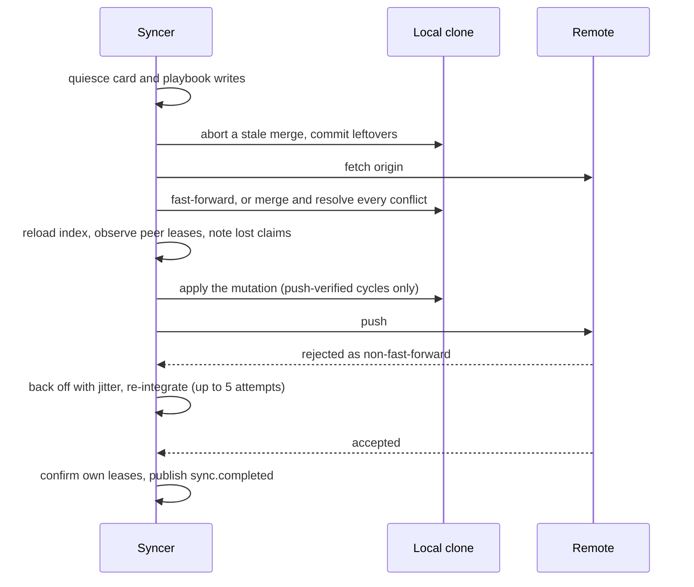

# Shared boards

Several ContextMatrix instances can work one boards repository through its
remote: one clone per developer laptop, or a laptop next to a cluster
deployment. This page covers the configuration, what `shared: true` changes
in sync and claims, images, and running several boards repositories on one
instance.

## Configuration

```yaml
instance:
  id: "" # default <hostname>-<6 hex>, generated once and persisted

boards:
  dir: ~/boards/team
  git_remote_url: https://github.com/org/boards.git
  git_clone_on_empty: true
  shared: true
  git_pull_interval: 60s
```

| Field                | Default | Meaning                                                   |
| -------------------- | ------- | --------------------------------------------------------- |
| `instance.id`        | generated | Names this instance in commits and claims. Required to match `^[a-z0-9][a-z0-9._-]{0,63}$` when any repo is shared. |
| `dir`                | -       | Clone location. Required.                                 |
| `git_remote_url`     | -       | HTTPS remote. Required when `shared` or `git_clone_on_empty`. |
| `git_clone_on_empty` | false   | Clone on first start when `dir` is empty.                 |
| `shared`             | false   | Merge-only sync, self-resolved conflicts, per-instance claims. |
| `git_pull_interval`  | 60s     | Cycle period; every tick is jittered by 25 percent.       |
| `lease_interval`     | 5m      | Shared only. How often a live claim's lease reaches the remote. |
| `lease_timeout`      | 1h      | Shared only. How long a peer's unchanged lease may stand before another instance may stall the card. |

Validation at startup:

- `shared` requires `git_remote_url` and `git_auto_commit: true`, rejects
  `git_deferred_commit`, and forces `git_auto_pull` and `git_auto_push` on.
- `lease_interval` must be shorter than `heartbeat_timeout`.
- `lease_timeout` must exceed
  `heartbeat_timeout + 2 * git_pull_interval + lease_interval`.
- A shared entry whose clone has no origin refuses to start.

Every instance needs GitHub credentials with `Contents: Read and write` on the
repo; see [GitHub auth setup](github-auth-setup.md). Every instance on the
repo must run a version with shared-board support: an older one does not know
the claim ownership fields and drops them whenever it rewrites a card.

## Sync cycle

A shared repo never rebases and never stashes. Each cycle, whether from the
timer, a commit, a manual `POST /api/sync`, or a push-verified mutation:



A failed push after the mutation ran undoes the mutation before the error is
returned. Network and auth failures surface as `remote unreachable`; five
rejected pushes surface as `sync contended`. The repository is never left
mid-merge.

## Merge rules

The resolver merges cards, project configs and playbooks three-way per field
and records every decision as a resolution in `GET /api/sync` (last 100) and
as a `system` activity entry on the card.

Cards:

- `id`, `project`, `created` and `source` are immutable.
- The claim tuple (`state`, `assigned_agent`, `claimed_via`, `claimed_at`,
  `last_heartbeat`, `worker_status`, `phase`, `claim_epoch`) is one unit: the
  higher `claim_epoch` supplies all of it. A bare stall never overrides a
  terminal state. At equal raised epochs an active claim beats a release or
  stall. Both sides claiming from an unclaimed base goes to the earlier
  `claimed_at`.
- Within the tuple at equal epochs, a terminal state absorbs a non-terminal
  one; otherwise the later `updated` wins.
- Scalars and flags (title, type, priority, parent, assignee, model pins,
  branch fields, `autonomous`, PR flags, `best_of_n`, `mob_participants`,
  `verify`, `custom`): three-way pick, later `updated` breaks a real conflict.
- `review_attempts` takes the max; token usage and usage buckets add.
- Sets (labels, skills, subtasks, depends_on, context, mob phases and
  guests): union, with a removal on either side honored.
- Body: three-way text merge; when unclean, the later `updated` wins and the
  overridden text stays in the losing commit, named in the audit entry.
- Activity logs union, then trim to 50.
- Both sides created the same card path: the remote keeps the ID and the
  local card is re-minted under a fresh ID with references renamed, unless
  both imported the same external issue, which dedupes to one card.
- Delete versus modify: the delete wins; the modification stays in history.
- One side unparseable: the parsing side is kept.
- Invariants are re-applied after the merge (`not_planned` clears the claim,
  a missing parent is cleared, subtask type follows `parent`, dangling
  references are dropped). A card that still fails validation keeps the
  remote version verbatim with an audit entry.

Project config: `next_id` takes the max; states, types, priorities and
transitions union; `name` and `prefix` are immutable and the remote is kept;
every other field prefers the remote on a real conflict. Playbooks: entries
merge by entry id, `next_entry_id` takes the max, a same-id add on both sides
keeps the remote and re-mints the local entry, and two playbooks created at
the same path re-slug the local one to `<id>-N`. Any other file: remote wins.

## Sync status

`GET /api/sync` returns one status per repo with `shared`, `remote_reachable`,
`unpushed_commits`, `resolutions`, `claims_at_risk`, `push_failing_since` and
`hidden_projects`. The board footer shows the same state as a dot and label:
aqua while syncing, red when offline, errored or claims are at risk, amber with
unpushed commits, with the details and resolution count in the hover text.
The sidebar shows a dot per repo. `claims_at_risk` turns on once pushes have
failed for longer than `lease_interval`: peers will stall this instance's
cards after `lease_timeout`.

## Claims per instance

- A claim records `claimed_via` (the granting instance), `claimed_at`, and a
  `claim_epoch` fence that rises on every claim change, so two instances
  cannot both believe they hold a card.
- Ownership is the (agent, instance) pair. The same agent ID claiming through
  another instance is refused while the holder's lease is live and takes the
  card over at a higher epoch once it expired.
- Heartbeats stay in memory; the card file's `last_heartbeat` is renewed at
  most once per `lease_interval` and is the lease peers judge by.
- Stall detection runs only on cards claimed via this instance. A card held by
  a peer is stalled only when its lease has stayed unchanged for
  `lease_timeout` on the local clock, inside a sync cycle that re-checks after
  the merge.
- Push-verified mutations (`create_card`, `claim_card`, force release, the
  foreign stall, project create / update / delete, playbook create) run inside
  a cycle: the remote holds the decision before the caller is told it landed.
- Fence: a claim this instance holds but the remote has not confirmed for
  `lease_timeout` answers release, transition and worker-status writes with
  403 `AGENT_MISMATCH` until a cycle succeeds. The fence is not persisted, so
  after a restart with the remote unreachable every own claim answers that way
  until the first cycle gets through.
- A pull that moves a claim to another instance publishes `claim.lost` with
  `previous_agent`, `claimed_via`, `claim_epoch` and `source: "sync"`. The
  backend integration ends and kills the local container.
- The UI marks a card held elsewhere with "Running on <instance>" and the
  lease age, withholds Stop and messages, renders its chat read-only, and
  excludes it from Stop All.

## Images

An image pasted into a card of a shared project is written to
`<project>/images/<id>.<ext>` and committed like a card, one commit per upload
regardless of `git_deferred_commit`, so every instance serves it. Every other
upload stays in the local `images.db`. On startup, images that shared cards
reference and only `images.db` holds are exported into the repo; the repo
image index is rebuilt after every pull.

## Several boards repositories

`boards` also accepts a list. Each entry takes the same fields plus a required
`name`; the first entry is the default for creation.

```yaml
boards:
  - name: team
    dir: ~/boards/team
    git_remote_url: https://github.com/org/boards.git
    git_clone_on_empty: true
    shared: true
  - name: private
    dir: ~/boards/private
```

- Names are unique and directories may not nest or coincide.
- Project names are unique across repos. Two repos holding the same name at
  startup refuse to start; a duplicate that arrives later through a pull is
  hidden behind the earlier repo's project and listed in that repo's
  `hidden_projects`.
- The sidebar and the dashboard group projects by repo, each with its own
  sync state.
- The New Project wizard and playbook creation ask which repo to create in;
  `boards_repo` on `POST /api/projects`, `create_project` and
  `create_playbook` does the same. URLs, the API and MCP tools are otherwise
  unchanged.
- The `CONTEXTMATRIX_BOARDS_*` environment overrides apply to the single-repo
  form only; setting one with a list is a startup error.

## See also

- [Configuration](configuration.md) - every `boards` and `instance` field
- [API reference](api-reference.md) - `GET /api/sync` and the `claim.lost`
  event
- [Data model](data-model.md) - claim fields on the card
- [Running cards](running-cards.md) - what a run looks like on another instance
- [GitHub auth setup](github-auth-setup.md) - credentials for the remote
